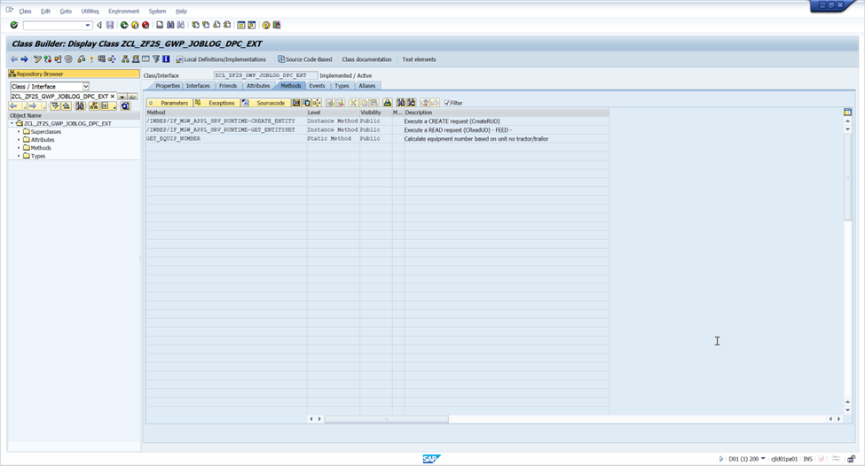

### Daily JOb

/IWBEP/IF_MGW_APPL_SRV_RUNTIME~CREATE_ENTITY	Instance Method	Public	                               	Execute a CREATE request (CreateRUD)
  method /iwbep/if_mgw_appl_srv_runtime~create_entity.

************************************************************************
* Author           : 
* Creation Date    : 22/11/2018
* PRICEFW Id       : E048
* Transaction Code : NA
* Transpost Number : 
* Description      : Daily Job Log Fiori Application
*---------------------------------------------------------------------*
*---------------------------------------------------------------------*
* CHANGE HISTORY
*---------------------------------------------------------------------*
* Revised By :
* Change Date
* Change Code :
* Transport Number :
* Description :
* Incident/Issue Number/CR Number:
*---------------------------------------------------------------------*
***********************************************************************

    constants:
      c_nr_range  type   nriv-nrrangenr value '01',
      c_object    type   tnro-object    value 'ZF2S_RTNO',
      c_update    type   procind        value 'U',
      c_djl       type   char3          value 'DJL',
      c_doc_post  type   char2          value 'NO',
      c_jobset    type   char10         value 'ETS_JobLog',
      c_repairchk type   char1           value 'X'.

    data:
      lv_error_occ          type nriv-externind,
      lit_inriv             type table of inriv,
      lit_error_iv          type table of inriv,
      lv_error              type inrer,
      lv_message            type string,
      lv_type               type bapi_mtype,
      lv_unitnumtt          type eqfnr,
      lv_unitnumtl          type eqfnr,
      lv_unitnum            type eqfnr,
      lv_number             type zbt_joblog-rptno,
      lv_equipno            type equnr,
      lv_mpoint             type imrc_point,
      lv_orderno            type aufnr,
      lwa_joblog            type zbt_joblog,
      lwa_joblog_upd        type zbt_joblog,
      lit_final_data        type zbs_tt_measuring_points,
      lit_final_update_data type table of zbt_if_meas_str,
      lwa_final_update      type zbt_if_meas_str,
      lv_equnr              type equnr.

    if iv_entity_name eq c_jobset.

*    Read enty XML

      clear: lwa_joblog.

      io_data_provider->read_entry_data( importing es_data = lwa_joblog ).

* find the existing number in number range object

      call function 'NUMBER_RANGE_INTERVAL_LIST'
        exporting
          nr_range_nr1               = c_nr_range
          object                     = c_object
        tables
          interval                   = lit_inriv
        exceptions
          nr_range_nr1_not_found     = 1
          nr_range_nr1_not_intern    = 2
          nr_range_nr2_must_be_space = 3
          nr_range_nr2_not_extern    = 4
          nr_range_nr2_not_found     = 5
          object_not_found           = 6
          subobject_must_be_space    = 7
          subobject_not_found        = 8
          others                     = 9.
      if sy-subrc <> 0.
* Implement suitable error handling here
      endif.
* Calculate next consecutive report number
      call function 'NUMBER_GET_NEXT'
        exporting
          nr_range_nr             = c_nr_range
          object                  = c_object
        importing
          number                  = lv_number
        exceptions
          interval_not_found      = 1
          number_range_not_intern = 2
          object_not_found        = 3
          quantity_is_0           = 4
          quantity_is_not_1       = 5
          interval_overflow       = 6
          buffer_overflow         = 7
          others                  = 8.
      if sy-subrc <> 0.
        message id sy-msgid type sy-msgty number sy-msgno
           with sy-msgv1 sy-msgv2 sy-msgv3 sy-msgv4.
      endif.

      " Fetch data from UI

      lwa_joblog-created_by = sy-uname. " Reported By
      lwa_joblog-rdate = lwa_joblog-rdate. "Report Date
      lwa_joblog-created_on = sy-datum. " Current date
      lwa_joblog-mandt = sy-mandt.
      lwa_joblog-rptno =  lv_number. "Report number

      lwa_joblog_upd = lwa_joblog.

      condense lwa_joblog-rptno no-gaps.

      clear: lv_number.
      refresh: lit_final_data.
      call method cl_hress_odata_ui5_utils=>convert_json_to_table
        exporting
          iv_json  = lwa_joblog-diclrrd
        changing
          ct_table = lit_final_data.

      if lit_final_data is not initial.
        loop at lit_final_data into data(lwa_final_data).

          clear: lv_mpoint.
          call function 'CONVERSION_EXIT_ALPHA_INPUT'
            exporting
              input  = lwa_final_data-zequip_no "mpobj
            importing
              output = lv_equnr.
          if lwa_final_data-zmpoint_ui is not initial.
            lwa_final_update-recdv = lwa_final_data-zmpoint_ui .
          else.
            lwa_final_update-recdv = lwa_final_data-zmpoint_prval.
          endif.

          if lwa_final_data-ztractor is not initial.
            lwa_final_update-eqfnr = lwa_joblog-tt_eqfnr .
          endif.

          if lwa_final_data-ztrailer is not initial.
            lwa_final_update-eqfnr = lwa_joblog-tl_eqfnr.
          endif.

          lwa_final_update-rptno = lwa_joblog-rptno .

          lwa_final_update-readr = sy-uname.
          lwa_final_update-idate = sy-datum.
          lwa_final_update-itime = sy-uzeit.

          clear: lv_mpoint.
          call function 'CONVERSION_EXIT_ALPHA_INPUT'
            exporting
              input  = lwa_final_data-zmpoint "mpobj
            importing
              output = lv_mpoint.
          lwa_final_update-sbeqnr = lv_equnr .
*          WRITE lwa_final_data-zequip_no to  lwa_final_update-sbeqnr.

          lwa_final_update-point =  lv_mpoint .
          lwa_final_update-posnr = lwa_final_data-zpsort_txt .
          lwa_final_update-categry = c_djl .
          lwa_final_update-valuepopulate = c_doc_post.

          append lwa_final_update to lit_final_update_data.
          clear:lwa_final_update,lv_equnr.
        endloop.

        modify zbt_if_meas_str from table lit_final_update_data.
        insert zbt_joblog   from lwa_joblog_upd.

        if lwa_joblog-chk_repairs eq c_repairchk. "Repairs needed

*        Code for corrective maintainance order *****************************************************
*          *    *    Calculate equipment number
          if lwa_joblog-tt_eqfnr is not initial.
            get_equip_number(
         exporting
           lv_unitnum  = lwa_joblog-tt_eqfnr   " Sort field
         importing
           lv_equipno  = lv_equipno    " Equipment Number
           lv_msg_type = lv_type    " Message type: S Success, E Error, W Warning, I Info, A Abort
           lv_message  = lv_message
       ).
          else.
            get_equip_number(
       exporting
         lv_unitnum  = lwa_joblog-tl_eqfnr   " Sort field
       importing
         lv_equipno  = lv_equipno    " Equipment Number
         lv_msg_type = lv_type    " Message type: S Success, E Error, W Warning, I Info, A Abort
         lv_message  = lv_message
     ).

          endif.

          clear: lv_orderno,lv_type,lv_message.

*          CONCATENATE 'DJL #'

          call function 'ZBE048_FM_MAINTAINANCE_ORDER'
            exporting
              i_equnr      = lv_equipno
              i_reportnum  = lwa_joblog-rptno
              i_repairtext = lwa_joblog-repairtext
            importing
              e_order_no   = lv_orderno
              e_type       = lv_type
              e_msg        = lv_message.
          if sy-subrc = 0.

            lwa_joblog-pm_orderno = lv_orderno.
          endif.
        endif.
        clear: lv_orderno.

*    To update the last generated number back in number range object
        read table lit_inriv into data(lwa_inriv) index 1.
        if sy-subrc eq 0.
          lwa_inriv-procind = c_update.
          lwa_inriv-nrlevel = lwa_joblog-rptno.

          refresh :lit_inriv.
          append lwa_inriv to lit_inriv.

        endif.

        call function 'HR_NUMBER_INTERVAL_CREATE'
          exporting
            object           = c_object
          importing
            error            = lv_error
            error_occured    = lv_error_occ
          tables
            interval         = lit_inriv
            error_iv         = lit_error_iv
          exceptions
            object_not_found = 1
            object_locked    = 2
            no_changes_made  = 3
            others           = 4.
        if sy-subrc <> 0.
* Implement suitable error handling here
        endif.
      endif.

      copy_data_to_ref(
        exporting
          is_data = lwa_joblog
        changing
          cr_data = er_entity
      ).

    endif.
  endmethod.

/IWBEP/IF_MGW_APPL_SRV_RUNTIME~GET_ENTITYSET	Instance Method	Public	                               	Execute a READ request (CReadUD) - FEED –

  method /iwbep/if_mgw_appl_srv_runtime~get_entityset.

************************************************************************
* Author           : 
* Creation Date    : 22/11/2018
* PRICEFW Id       : E048
* Transaction Code : NA
* Transpost Number : 
* Description      : Daily Job Log Fiori Application
*---------------------------------------------------------------------*
*---------------------------------------------------------------------*
* CHANGE HISTORY
*---------------------------------------------------------------------*
* Revised By :
* Change Date
* Change Code :
* Transport Number :
* Description :
* Incident/Issue Number/CR Number:
*---------------------------------------------------------------------*
***********************************************************************
    constants : c_getlist type char12             value 'ETS_JobLog',
                c_mpoint  type char20             value 'ETS_MPointList',
                c_equipno type  char10            value 'ZequipNo',
                c_rptno   type  char6             value 'Zrptno',
                c_tractor type  char8             value 'Ztractor',
                c_trailer type  char10           value 'Ztrailer',
                c_99      type  rihea-levdo       value '99',
                lc_error  type char10             value 'Error',
                lc_date   type datbi              value '99991231'.

*Data declaration
    data: lit_joblogs_list1         type table of zbt_if_meas_str,
          lit_joblogs_list          type table of zbt_joblog,
          lv_created                type zzb_reptno,
          lv_count                  type sy-tabix,
          lv_message                type string,
          lv_equipno                type zbs_measuring_points-zequip_no,
          lv_rptno                  type zzb_reptno,
          lv_tractor                type zzb_eqfnr,
          lv_trailer                type zzb_eqfnr,
          lwa_filter_select_options type /iwbep/s_mgw_select_option,
          lwa_select_options        type /iwbep/s_cod_select_option,
          lit_hie_tab               type table of rihequi,
          lit_hie_tab_trct          type table of rihequi,
          lit_return                type table of bapiret2,
          lit_diimpt                type table of diimpt,
          lit_final_diimpt          type table of diimpt,
          lwa_hie_tab               type rihequi,
          lv_type                   type bapi_mtype,
          lv_equnr                  type equnr,
          lv_unitnum                type eqfnr,
          lwa_mpoint                type zbs_measuring_points,
          lit_final_trct            type zbs_tt_measuring_points,
          lit_final                 type zbs_tt_measuring_points,
          lv_mulrcrds               type  i,
          ls_header                 type ihttpnvp.

    " Entity Set check for Data population

    if iv_entity_name eq c_getlist.

      refresh : lit_joblogs_list[].
      select * from zbt_joblog
                    into corresponding fields of table lit_joblogs_list
                    where created_by eq sy-uname.
      if sy-subrc = 0.
        sort lit_joblogs_list by rptno descending.           "Sort the table based on report number latest on top.
        delete adjacent duplicates from lit_joblogs_list comparing rptno.

      endif.

      copy_data_to_ref(
       exporting
         is_data = lit_joblogs_list
       changing
         cr_data = er_entityset
     ).

    elseif iv_entity_name eq c_mpoint.

      refresh : lit_joblogs_list[].
      clear: lv_equipno,lv_message,lv_tractor,lv_trailer.
      if not it_filter_select_options[] is initial.
        loop at it_filter_select_options into lwa_filter_select_options.
          if lwa_filter_select_options-property eq c_equipno.
            loop at lwa_filter_select_options-select_options into lwa_select_options.
              lv_unitnum  = lwa_select_options-low.
            endloop.
          endif.
          if lwa_filter_select_options-property eq c_rptno.
            loop at lwa_filter_select_options-select_options into lwa_select_options.
              lv_rptno  = lwa_select_options-low.
            endloop.
          endif.
          if lwa_filter_select_options-property eq c_tractor.
            loop at lwa_filter_select_options-select_options into lwa_select_options.
              lv_tractor  = lwa_select_options-low.
            endloop.
          endif.
          if lwa_filter_select_options-property eq c_trailer.
            loop at lwa_filter_select_options-select_options into lwa_select_options.
              lv_trailer   = lwa_select_options-low.
            endloop.
          endif.
        endloop.
      endif.

      if lv_tractor is not initial and
         lv_trailer is not initial and
         lv_rptno is not initial.

         CLEAR: lv_equipno.
         get_equip_number(
            exporting
              lv_unitnum  =  lv_tractor  " Sort field
            importing
              lv_equipno  = lv_equipno    " Equipment Number
              lv_msg_type = lv_type    " Message type: S Success, E Error, W Warning, I Info, A Abort
              lv_message  = lv_message
          ).

*  * Calculate Equipment Hierarchy from Equipment Number
            REFRESH:lit_hie_tab.
            CLEAR: lwa_hie_tab.
          call function 'EQUI_HIERARCHY_READ'
            exporting
              equipment  = lv_equipno
              level_down = c_99
            importing
              equi_count = lv_count
            tables
              hier_tab   = lit_hie_tab.

          if lit_hie_tab is initial.

            lwa_hie_tab-equnr = lv_equipno.
            append lwa_hie_tab to lit_hie_tab.
          endif.

          REFRESH:lit_diimpt,lit_final_diimpt.
          loop at lit_hie_tab into lwa_hie_tab.
* Get measuring points for equipment hierarchy

            call function 'GET_MEASURING_POINTS_4_EQUIPM'
              exporting
                i_equnr    = lwa_hie_tab-equnr
              tables
                et_return1 = lit_return
                et_diimpt  = lit_diimpt.

* Collect all measuring points of all equipments in one table - lit_final_diimpt
            append lines of lit_diimpt to lit_final_diimpt.
            clear:  lit_diimpt,
                    lwa_hie_tab.
          endloop.

          REFRESH:lit_final_trct.
          CLEAR:lwa_mpoint.
          select sbeqnr ,
                point,
                posnr,
                idate,
                itime,
                recdv from zbt_if_meas_str
                        into table @data(lit_meas_str_rpt_trct)
                        for all entries in @lit_final_diimpt
                        where sbeqnr = @lit_final_diimpt-equnr and
                              posnr  = @lit_final_diimpt-psort and
                              rptno  = @lv_rptno.

              loop at lit_final_diimpt into data(lwa_lit_final_diimpt_rpt_trct).

                read table lit_meas_str_rpt_trct into data(lwa_it_meas_str_rpt_trct)
                                            with key sbeqnr = lwa_lit_final_diimpt_rpt_trct-equnr
                                                     posnr  = lwa_lit_final_diimpt_rpt_trct-psort.
                if sy-subrc = 0.
                  lwa_mpoint-zmpoint_prval =  lwa_it_meas_str_rpt_trct-recdv.
                endif.
                lwa_mpoint-zpsort_txt =  lwa_lit_final_diimpt_rpt_trct-psort.
                lwa_mpoint-zequip_no  =   lwa_lit_final_diimpt_rpt_trct-equnr.
                lwa_mpoint-zmpoint    =   lwa_lit_final_diimpt_rpt_trct-point.
                  lwa_mpoint-ztractor    = c_tractor.
                append lwa_mpoint to lit_final_trct.
                clear: lwa_mpoint.
              endloop.

*              Trailer Detailes to be filled.

            CLEAR: lv_equipno.
         get_equip_number(
            exporting
              lv_unitnum  =  lv_trailer  " Sort field
            importing
              lv_equipno  = lv_equipno    " Equipment Number
              lv_msg_type = lv_type    " Message type: S Success, E Error, W Warning, I Info, A Abort
              lv_message  = lv_message
          ).

*  * Calculate Equipment Hierarchy from Equipment Number
             REFRESH:lit_hie_tab.
            CLEAR: lwa_hie_tab.
          call function 'EQUI_HIERARCHY_READ'
            exporting
              equipment  = lv_equipno
              level_down = c_99
            importing
              equi_count = lv_count
            tables
              hier_tab   = lit_hie_tab.

          if lit_hie_tab is initial.

            lwa_hie_tab-equnr = lv_equipno.
            append lwa_hie_tab to lit_hie_tab.
          endif.

            REFRESH:lit_diimpt,lit_final_diimpt.
          loop at lit_hie_tab into lwa_hie_tab.
* Get measuring points for equipment hierarchy

            call function 'GET_MEASURING_POINTS_4_EQUIPM'
              exporting
                i_equnr    = lwa_hie_tab-equnr
              tables
                et_return1 = lit_return
                et_diimpt  = lit_diimpt.

* Collect all measuring points of all equipments in one table - lit_final_diimpt
            append lines of lit_diimpt to lit_final_diimpt.
            clear:  lit_diimpt,
                    lwa_hie_tab.
          endloop.
          REFRESH:lit_final.
          CLEAR:lwa_mpoint.
          select sbeqnr ,
                point,
                posnr,
                idate,
                itime,
                recdv from zbt_if_meas_str
                        into table @data(lit_meas_str_rpt_trlr)
                        for all entries in @lit_final_diimpt
                        where sbeqnr = @lit_final_diimpt-equnr and
                              posnr  = @lit_final_diimpt-psort and
                              rptno  = @lv_rptno.

              loop at lit_final_diimpt into data(lwa_lit_final_diimpt_rpt_trlr).

                read table lit_meas_str_rpt_trlr into data(lwa_it_meas_str_rpt_trlr)
                                            with key sbeqnr = lwa_lit_final_diimpt_rpt_trlr-equnr
                                                     posnr  = lwa_lit_final_diimpt_rpt_trlr-psort.
                if sy-subrc = 0.
                  lwa_mpoint-zmpoint_prval =  lwa_it_meas_str_rpt_trlr-recdv.
                endif.
                lwa_mpoint-zpsort_txt =  lwa_lit_final_diimpt_rpt_trlr-psort.
                lwa_mpoint-zequip_no  =   lwa_lit_final_diimpt_rpt_trlr-equnr.
                lwa_mpoint-zmpoint    =   lwa_lit_final_diimpt_rpt_trlr-point.
                  lwa_mpoint-ztrailer    = c_trailer.
                append lwa_mpoint to lit_final.
                clear: lwa_mpoint.
              endloop.

             APPEND LINES OF  lit_final_trct to lit_final.

        copy_data_to_ref(
        exporting
          is_data = lit_final
        changing
          cr_data = er_entityset
      ).

      else.

        select iloan,
               eqfnr from iloa into table @data(lit_eqfnr)
                                where eqfnr = @lv_unitnum.
        if lit_eqfnr is not initial.

          select equnr,
                 datbi,
                 eqlfn from equz into table @data(lit_equz)
                                   for all entries in @lit_eqfnr
                                   where iloan = @lit_eqfnr-iloan and
                                         datbi = @lc_date.
          if sy-subrc = 0.
            delete adjacent duplicates from lit_equz comparing equnr.
            describe table lit_equz lines lv_mulrcrds.
          endif.
        endif.

        if lv_mulrcrds eq 1.
          get_equip_number(
            exporting
              lv_unitnum  = lv_unitnum   " Sort field
            importing
              lv_equipno  = lv_equipno    " Equipment Number
              lv_msg_type = lv_type    " Message type: S Success, E Error, W Warning, I Info, A Abort
              lv_message  = lv_message
          ).

*  * Calculate Equipment Hierarchy from Equipment Number
          call function 'EQUI_HIERARCHY_READ'
            exporting
              equipment  = lv_equipno
              level_down = c_99
            importing
              equi_count = lv_count
            tables
              hier_tab   = lit_hie_tab.

          if lit_hie_tab is initial.

            lwa_hie_tab-equnr = lv_equipno.
            append lwa_hie_tab to lit_hie_tab.
          endif.

          loop at lit_hie_tab into lwa_hie_tab.
* Get measuring points for equipment hierarchy

            call function 'GET_MEASURING_POINTS_4_EQUIPM'
              exporting
                i_equnr    = lwa_hie_tab-equnr
              tables
                et_return1 = lit_return
                et_diimpt  = lit_diimpt.

* Collect all measuring points of all equipments in one table - lit_final_diimpt
            append lines of lit_diimpt to lit_final_diimpt.
            clear:  lit_diimpt,
                    lwa_hie_tab.
          endloop.

          if lit_final_diimpt is not initial.

*        data : lit_meas_str TYPE TABLE OF zbt_if_meas_str.

            if lv_rptno is initial.
              select sbeqnr,
                     point,
                     idate ,
                     itime,
                     posnr,
                     recdv from zbt_if_meas_str
*                            ORDER BY idate DESCENDING
                             into table @data(lit_meas_str)
                             for all entries in @lit_final_diimpt
                             where sbeqnr = @lit_final_diimpt-equnr and
                                   posnr  = @lit_final_diimpt-psort.

              sort lit_meas_str by sbeqnr posnr idate descending itime descending.

              loop at lit_final_diimpt into data(lwa_lit_final_diimpt).

                read table lit_meas_str into data(lwa_it_meas_str)
                                         with key sbeqnr = lwa_lit_final_diimpt-equnr
                                                  posnr  = lwa_lit_final_diimpt-psort.
                if sy-subrc = 0.
                  lwa_mpoint-zmpoint_prval =  lwa_it_meas_str-recdv.
                endif.
                lwa_mpoint-zpsort_txt =  lwa_lit_final_diimpt-psort.
                lwa_mpoint-zequip_no  =   lwa_lit_final_diimpt-equnr.
                lwa_mpoint-zmpoint    =   lwa_lit_final_diimpt-point.
                append lwa_mpoint to lit_final.
                clear: lwa_mpoint.

              endloop.
            else.
              select sbeqnr ,
                point,
                posnr,
                idate,
                itime,
                recdv from zbt_if_meas_str
                        into table @data(lit_meas_str_rpt1)
                        for all entries in @lit_final_diimpt
                        where sbeqnr = @lit_final_diimpt-equnr and
                              posnr  = @lit_final_diimpt-psort and
                              rptno  = @lv_rptno.

              loop at lit_final_diimpt into data(lwa_lit_final_diimpt_rpt1).

                read table lit_meas_str_rpt1 into data(lwa_it_meas_str_rpt1)
                                            with key sbeqnr = lwa_lit_final_diimpt_rpt1-equnr
                                                     posnr  = lwa_lit_final_diimpt_rpt1-psort.
                if sy-subrc = 0.
                  lwa_mpoint-zmpoint_prval =  lwa_it_meas_str_rpt1-recdv.
                endif.
                lwa_mpoint-zpsort_txt =  lwa_lit_final_diimpt_rpt1-psort.
                lwa_mpoint-zequip_no  =   lwa_lit_final_diimpt_rpt1-equnr.
                lwa_mpoint-zmpoint    =   lwa_lit_final_diimpt_rpt1-point.
                append lwa_mpoint to lit_final.
                clear: lwa_mpoint.
              endloop.
            endif.
          endif.

          copy_data_to_ref(
           exporting
             is_data = lit_final
           changing
             cr_data = er_entityset
         ).

        elseif lv_mulrcrds gt 1.

          lv_message =  'Duplicate equipments found for entered Unit Number'.

          ls_header-name            = lc_error.
          ls_header-value           = lv_message.
          /iwbep/if_mgw_conv_srv_runtime~set_header( ls_header ).

          copy_data_to_ref(
          exporting
            is_data = lit_final
          changing
            cr_data = er_entityset
        ).

        else.
          lv_message =  'No equipments found for entered Unit Number'.

          ls_header-name            = lc_error.
          ls_header-value           = lv_message.
          /iwbep/if_mgw_conv_srv_runtime~set_header( ls_header ).

          copy_data_to_ref(
          exporting
            is_data = lit_final
          changing
            cr_data = er_entityset
        ).
        endif.
      endif.
    endif.
  endmethod.

GET_EQUIP_NUMBER	Static Method	Public	                               	Calculate equipment number based on unit no tractor/trailor

  METHOD get_equip_number.

************************************************************************
* Author           : 
* Creation Date    : 22/11/2018
* PRICEFW Id       : E048
* Transaction Code : NA
* Transpost Number : 
* Description      : Daily Job Log Fiori Application
*---------------------------------------------------------------------*
*---------------------------------------------------------------------*
* CHANGE HISTORY
*---------------------------------------------------------------------*
* Revised By :
* Change Date
* Change Code :
* Transport Number :
* Description :
* Incident/Issue Number/CR Number:
*---------------------------------------------------------------------*
***********************************************************************

    CONSTANTS: c_e TYPE char1 VALUE 'E',
               c_s TYPE char1 VALUE 'S'.

    TYPES: BEGIN OF lty_status,
             stat  TYPE j_status,
             inact TYPE j_inact,
           END OF lty_status.

    TYPES: BEGIN OF lty_equz,
             equnr TYPE equz-equnr,
             datbi TYPE equz-datbi,
           END OF lty_equz.

    TYPES: BEGIN OF lty_iloa,
             iloan TYPE iloa-iloan,
           END OF lty_iloa.

    DATA: lit_loc    TYPE TABLE OF lty_iloa,
          lit_equz   TYPE TABLE OF lty_equz,
          lit_status TYPE TABLE OF lty_status,
          lwa_loc    TYPE lty_iloa,
          lwa_equz   TYPE lty_equz,
          lwa_status TYPE lty_status,
          lv_lines   TYPE i,
          lv_objnr   TYPE j_objnr.

    IF NOT lv_unitnum IS INITIAL.

*    * Take EQFNR to ILOA to fetch ILOAN
      SELECT iloan
         FROM iloa INTO TABLE lit_loc
      WHERE eqfnr = lv_unitnum.

      IF sy-subrc EQ 0.

* Take ILOAN (multiple values) to EQUZ to fetch EQUNR
        SELECT equnr datbi FROM equz
        INTO TABLE lit_equz
        FOR ALL ENTRIES IN lit_loc WHERE iloan = lit_loc-iloan.

        CLEAR lit_loc.
        IF sy-subrc EQ 0.
* Take entry with Valid To Date (EQUZ-DATBI) > today's date for Parent Equipment number EQUNR.
          DELETE lit_equz WHERE datbi LE sy-datum.
          DESCRIBE TABLE lit_equz LINES lv_lines.

          IF lv_lines GT 1.
            lv_message = TEXT-003.
            lv_msg_type = c_e.

          ELSE.
            READ TABLE lit_equz INTO lwa_equz INDEX 1.
            CLEAR lit_equz.
            IF sy-subrc = 0.

              lv_equipno = lwa_equz-equnr.
              lv_msg_type = c_s.

*   LOGIC FOR EQUPMENT STATUS

*   Take Equipment # to EQUI to fetch Object number OBJNR
              SELECT SINGLE objnr FROM equi INTO lv_objnr
                           WHERE equnr = lv_equipno.

              IF sy-subrc EQ 0.
*      . Take OBJNR to table JEST for system status

                SELECT stat inact FROM jest INTO TABLE lit_status
                  WHERE objnr = lv_objnr.

                IF sy-subrc EQ 0.

                  LOOP AT lit_status INTO lwa_status WHERE stat = 'I0076' OR stat = 'I0320'.
                    IF sy-subrc EQ 0.
                      IF lwa_status-inact EQ ''. "Equipment current system status is inactive
                        lv_message = TEXT-005.
                        lv_msg_type = c_e.
                        EXIT.
                      ENDIF.
                    ENDIF.
                  ENDLOOP.
                ENDIF.
              ENDIF.
            ENDIF.
            CLEAR : lit_equz,lv_lines.
          ENDIF.
        ELSE.
          lv_message = TEXT-004.
          lv_msg_type = c_e.
        ENDIF.
      ELSE.
        lv_message = TEXT-004.
        lv_msg_type = c_e.
      ENDIF.
      CLEAR :lit_loc.

    ELSE.
      " Invalid unit no.
      lv_message = TEXT-004.
      lv_msg_type = c_e.

    ENDIF.

  ENDMETHOD.

