Goods Issue vs. Goods Receipt in sap

https://learning.sap.com/learning-journeys/configuring-sap-s-4hana-cloud-private-edition-asset-management/working-with-serial-numbers

https://learning.sap.com/learning-journeys/explore-integrated-business-processes-in-sap-s-4hana/posting-a-goods-receipt-for-a-purchase-order_dca5589c-4014-4387-a336-4daa51fbbf9c

https://learning.sap.com/courses/inventory-management-and-physical-inventory-in-sap-s-4hana/posting-a-goods-receipt-with-reference

In SAP, Goods Issue (GI) and Goods Receipt (GR) are two fundamental inventory movements that serve opposite purposes in the supply chain.

 Here's a clear breakdown:

### 📦 Goods Receipt (GR)
Definition: Inbound movement of goods into the warehouse or plant.

Purpose: Increases stock levels.

##### Common Scenarios:

Receiving materials from a vendor (linked to a Purchase Order).

Receiving finished goods from production (linked to a Production Order).

SAP Movement Type: Typically 101.

Impact:

Updates inventory quantities.

Triggers accounting entries (e.g., inventory valuation).

May initiate quality inspection or putaway processes.

### 🚚 Goods Issue (GI)
Definition: Outbound movement of goods from the warehouse or plant.

Purpose: Decreases stock levels.

#### Common Scenarios:

Delivering goods to a customer (linked to a Sales Order).

Issuing materials to production (linked to a Production Order).

Transferring stock to another location or cost center.

SAP Movement Type: Typically 261 (for production), 601 (for delivery).

Impact:

Reduces inventory.

Posts cost of goods sold or internal consumption.

May trigger delivery or billing processes.

#### 🔁 Key Differences
Feature	  -   Goods Receipt (GR)	- Goods Issue (GI)  
 Direction 	-   Inbound (into inventory) -	Outbound (from inventory)  
Stock Effect	-  Increases inventory -	Decreases inventory  
Typical Reference	- Purchase Order, Production Order	  -  Sales Order, Cost Center, Project  
 Movement Type	101, 103, 105	   -   261, 601, 201  
  Financial Impact - 	Adds to asset value	- Posts expense or revenue. 

#### Material in SAP :

In SAP, a Material refers to anything that a company procures, produces, stores, or sells. It could be raw materials, semi-finished goods, finished products, packaging, or even services.

Every material is represented by a Material Master Record, which is the central source of truth for all modules – MM, SD, PP, WM/EWM, and FI/CO.

🏷️ Material Master in SAP
The Material Master integrates information across modules so that procurement, sales, production, storage, and finance all run on the same data.

 Structure or views of Material Master Data

Material Master is divided into views:
Basic Data → Description, unit, dimensions
Purchasing → Vendor, order unit, procurement data
Sales → Sales org, tax, distribution channel
Accounting → Valuation, G/L accounts
MRP → Reorder point, lot size, planning data
Warehouse/Storage → Storage conditions, bin info
Work Scheduling → Production-related info

 Material Types in SAP
Some common material types include:
ROH → Raw Materials
FERT → Finished Goods
HALB → Semi-Finished Goods
NLAG → Non-stock Materials
VERP → Packaging Material
SERV → Services

These types define number ranges, views, and control fields.

🛠️ Material Lifecycle
MM01 → Create Material
MM02 → Change Material
MM03 → Display Material

Materials flow through procurement (PO, GR, Invoice), sales (Order, Delivery, Billing), production (BOM, Routing), and valuation (Accounting, Inventory).

Why is Material Master Important?
-One single source of truth
-Eliminates duplication & errors
-Seamless integration across modules
-Backbone of logistics in SAP

 Real-World Example

Imagine a mobile phone company:
Raw materials (ROH) → Glass, metals, plastic
Semi-finished goods (HALB) → Circuit boards, display units
Finished goods (FERT) → The mobile phone itself
Packaging materials (VERP) → Boxes, covers
Services (SERV) → Repair, maintenance contracts

All these are defined as Materials in SAP, each with its own views and lifecycle, ensuring every department (procurement, production, sales, accounting) works seamlessly on one single source of truth.

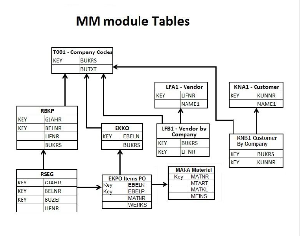

### GI app

The SAP goods issue process involves recording the removal of materials from inventory, which reduces stock levels and creates both a material and an accounting document. A common method is using transaction code MIGO for unplanned issues or posting goods issue on an outbound delivery document for planned issues, such as shipping to a customer. The process can involve various scenarios, like issuing to a production order (movement type 261), a cost center (movement type 201), or for a stock transfer. 

#### Key steps and scenarios
Create document: This can be an outbound delivery for a customer order or a reservation for an internal consumption like a production order.  
Picking: The physical picking of the goods occurs based on the document. In more advanced systems like SAP EWM, this involves creating a warehouse task. 
Goods Issue posting: A material document is created to confirm the removal of goods from the warehouse, which can be done in the MIGO transaction for unplanned issues or directly on the delivery document.
Financial posting: The system automatically posts financial transactions to reflect the reduction in inventory value. 
##### Stock reduction:
 The physical inventory is reduced in the system, and the goods are now considered "out of stock" from the originating warehouse.  
Example: Goods issue to a production order  
##### Create a production order:
 In the Production Planning (PP) module, create a production order to manufacture a product. The system automatically reserves the raw materials needed for the order.  
Go to MIGO: Enter transaction code MIGO in the SAP system. 
Select action: Choose "Goods Issue" and "Production Order" as the reference document. 
Enter details: Enter the production order number. 
Post the goods issue: Press Enter and then "Save" or "Post" to confirm the goods issue. The system will create a material document and reduce the stock of the raw materials in the warehouse. 

The SAP goods issue process involves removing materials from inventory for a specific purpose, like a sales order, production order, or cost center. The process can be initiated through a transaction code like MIGO or VL02N, and often references a preceding document, such as an outbound delivery or production order. This posting decreases stock, updates reservations, and generates a material document that reflects the consumption. 

#### Key steps in the goods issue process

Trigger the process: Start the goods issue from a reference document (like an outbound delivery or production order) using the appropriate transaction code.  
For sales orders: Use transaction VL02N to post goods issue from an outbound delivery. 
For production orders: Use MIGO or MB1A with movement type 261.  
For cost centers/projects: Use MIGO with movement type 201.  
Enter reference document: If a reference document exists, enter the order or reservation number. This is crucial because the system will then suggest the components and quantities, which simplifies data entry and ensures accuracy. 
Enter quantities: The system will likely propose the full quantity required by the reference document. You can then enter the actual quantities being issued. 
Post the goods issue: Execute the posting. This will trigger various subsequent actions.  

### Example: Goods issue for a production order
Let's say you need to issue raw materials to a production order.  
Start in SAP: Open transaction MIGO.  
Select action: Choose Goods Issue and Goods and Services Movement.  
Enter reference: Enter the production order number in the relevant field. Press To Order to have the system propose the components from the production order. 
Enter quantities: The system will display the components with their required quantities. Enter the actual quantity of the material you are issuing from the warehouse. For example, if the order requires 10 units of "Raw Material X" and you are issuing 10, enter 10 in the "Quantity" field for "Raw Material X".  
Post: Click the Post button. This will:  
Decrease the stock of "Raw Material X".  
Update the production order and reduce the reservation quantity. 
Generate a material document that you can use to track the movement.  

#### Example in SAP MIGO Transaction

### GI process

https://fioriappslibrary.hana.ondemand.com/sap/fix/externalViewer/#/detail/Apps('F1062')/S31PCE

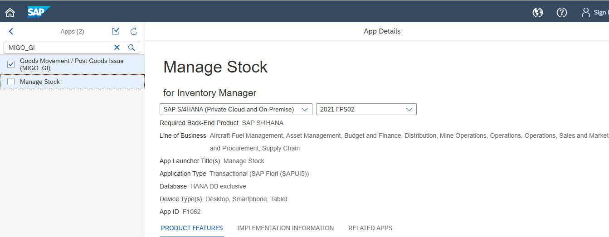

SAP Fiori screen in sap S/4 HANA 2021

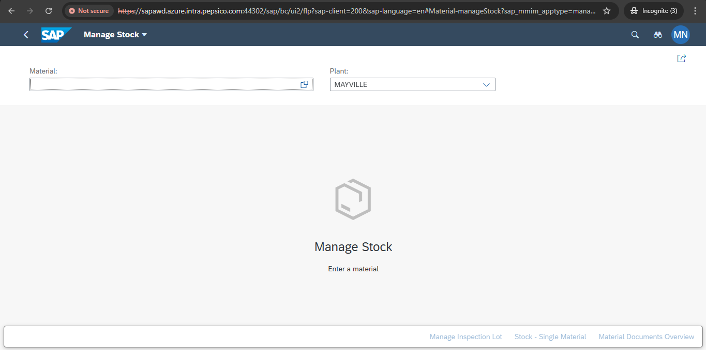

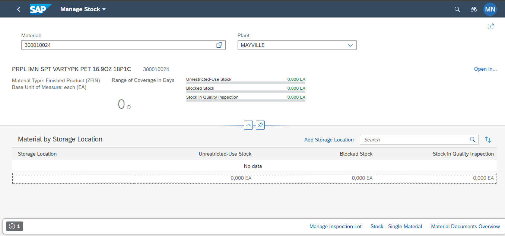

https://help.sap.com/docs/SAP_ERP/56f7319a9048445eb86221af73cab72b/1ef1d353ca9f4408e10000000a174cb4.html

In SAP, a goods issue is a transaction that reduces the inventory of a material in the system, creating a material document and an accounting document.  
This process is used when materials are shipped to customers, used in production, or moved for other purposes like scrapping or internal consumption.  
Example: Issuing a raw material for a production order 
This example illustrates a common goods issue scenario in SAP for Production Planning (PP). 
Scenario: A company uses raw material 'X' to produce finished goods. 
Reference Document: A production order is created in SAP for the finished product. This production order has a Bill of Materials (BOM) that lists 'X' as a component. 
Check Stock: Before issuing, you would check the stock of material 'X' to confirm its availability. 
 A common transaction for this is {Link: MMBE https://www.youtube.com/watch?v=r8mjAAh_dZk} (Stock Overview).  
Initiate Goods Issue: You use the transaction code MIGO (or the older MB1A) to post the goods issue.  
Enter Details: 
Select the movement type 261, which is used for goods issues against a production order. 
Enter the production order number. The system will automatically populate the component 'X' and the required quantity from the BOM. 
Confirm the quantity to be issued. 
Specify the plant and storage location from which the material will be issued. 
Post: 
Post the transaction. 
The system performs the following actions: 
Decreases the inventory of raw material 'X' in the specified storage location. 
Updates the stock of the finished product (as raw material is consumed). 
Creates a material document (e.g., M-12345) and a corresponding accounting document. 
Updates the production order to reflect the consumption of the component.  

T-Code MiGO

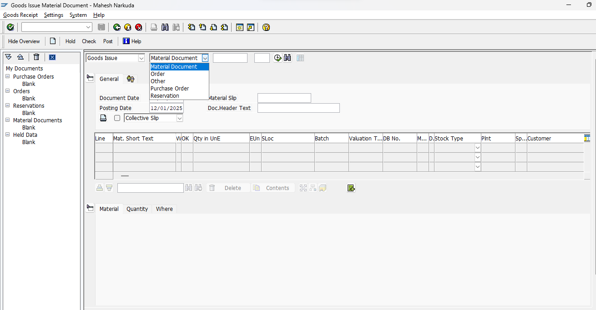

MMBE

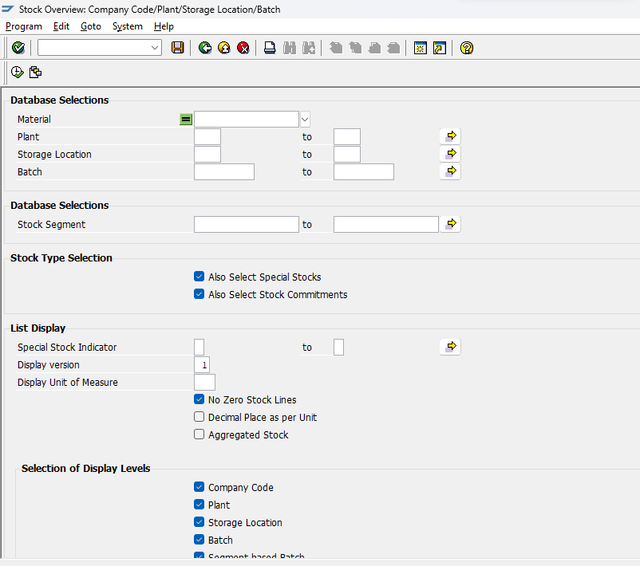

In SAP, serial numbers are associated with a material through a Serial Number Profile assigned in the material master record, which dictates when and how serialization occurs in business transactions like goods movements. Barcodes are then used as a practical tool to scan and capture these unique serial numbers efficiently during physical inventory processes. 
Association Process
The association process in SAP involves configuration and master data setup: 
Define Serial Number Profile: In customization (transaction OIS2), a serial number profile is created. This profile is the central control, defining rules like:
Serialization Procedure: Specifies for which business transactions (e.g., Goods Receipt in Materials Management (MMSL), Production Orders (PPAU)) the serial number is relevant and whether its entry is optional, mandatory, or automatic.
Equipment Requirement: Determines if an equipment master record should be created automatically in the background for each serial number, which is useful for asset management and maintenance tracking.
Stock Check: Defines whether the system should check the stock status of the serial number during movements.
Assign Profile to Material Master: The created serial number profile is assigned to the material master record in the Plant data/Storage 2 view (transaction MM01/MM02). This step flags the material as a serialized material.
Serial Number Creation and Assignment: During relevant business transactions (e.g., Goods Receipt in MIGO, production order creation/release), the system prompts the user to enter or automatically generate serial numbers for each individual quantity of the material. The combination of material number and serial number is unique across the SAP client. 
Integration with Barcodes
Barcodes serve as the physical representation of the serial numbers, streamlining data entry and improving accuracy: 
Scanning Efficiency: Instead of manually typing long serial numbers into SAP during transactions like goods receipt or goods issue, warehouse personnel use handheld scanners (often RF guns in a Warehouse Management (WM) environment) to scan the barcode label on the physical item.
Data Capture: The scanned barcode data is automatically captured by the SAP system, populating the serial number fields in the transaction screens. This ensures the correct, unique number is recorded against the specific material movement or stock entry.
Label Printing: SAP can be configured to print labels with barcodes for each serial number, typically during production or packaging processes.
Tracking and Verification: The physical barcode allows for easy verification of the item in stock. Transaction codes like IQ09 can be used to display a list of serial numbers, and physical items can be matched to their digital records via scanning. 
In essence, SAP manages the logic and data association, while barcodes facilitate the efficient physical interaction with the serialized items in the real world. 

/IWBEP/IF_MGW_APPL_SRV_RUNTIME~CREATE_DEEP_ENTITY	Instance Method	Public	                               	Execute a deep insert CREATE request (CreateRUD)

  METHOD /iwbep/if_mgw_appl_srv_runtime~create_deep_entity.
*----------------------------------------------------------------------*
*  Object Name         : CREATE_DEEP_ENTITY
*  Description         : Method to create movement order in S/4 system
*  Created By          : 
*  Created On          : 26-Nov-2018
*  Version             : S/4 HANA 1709
*  Purpose             : Odata method to create movement order in backend system
*  Project Name        : CJE
*  RICEFW              : F2SE029
*  Business Contact    : 
*  Transport Request   : DEV_F2SE029_OR-IM Barcode Enabled Goods Issue
*  Misc Notes          : NA
*----------------------------------------------------------------------*
*  Object Name         : CREATE_DEEP_ENTITY
*  Description         : Method to create movement order in S/4 system
*  Changed By          : 
*  Changed On          : 12-March-2019
*  Version             : S/4 HANA 1709
*  Purpose             : Include Serialization changes
*  Project Name        : CJE
*  RICEFW              : F2SE029
*  Business Contact    : 
*  Transport Request   : D01K902925
*  Misc Notes          : NA
*  Change Number       : 588958
*----------------------------------------------------------------------*

**Data declaration for item and serial data
    TYPES: ty_t_goods_issue  TYPE STANDARD TABLE OF zcl_zf2s_gwp_barcode_mpc=>ts_ety_goods_issue WITH DEFAULT KEY,
           ty_t_serialnumber TYPE STANDARD TABLE OF zcl_zf2s_gwp_barcode_mpc=>ts_ety_serialnumber WITH DEFAULT KEY.

**Deep Structure for header, item and serial data
    TYPES: BEGIN OF ty_deep_entity.
        INCLUDE TYPE zcl_zf2s_gwp_barcode_mpc=>ts_ety_header.
    TYPES: nav_goods  TYPE ty_t_goods_issue,
           nav_serial TYPE ty_t_serialnumber,
           END OF ty_deep_entity.

**Local constant declaration
    CONSTANTS: lc_code  TYPE bapi2017_gm_code VALUE '03',
               lc_check TYPE char1 VALUE 'X',
               lc_error TYPE char1 VALUE 'E'.

    DATA: lwa_finaldata        TYPE ty_deep_entity,
          lwa_item             TYPE bapi2017_gm_item_create,
          lwa_serial           TYPE bapi2017_gm_serialnumber,
          lit_item             TYPE STANDARD TABLE OF bapi2017_gm_item_create,
          lit_serial           TYPE STANDARD TABLE OF bapi2017_gm_serialnumber,
          lwa_nav_goods        TYPE  zmatdoc,
          lwa_nav_serial       TYPE  zmatdoc,
          lwa_head             TYPE bapi2017_gm_head_01,
          lv_doc_no            TYPE bapi2017_gm_head_ret-mat_doc,         " Material Document No.
          lit_bapiret2         TYPE STANDARD TABLE OF bapiret2,
          lv_spclstock         TYPE sobkz,
          lv_movementtype      TYPE bwart,
          lwa_bapiret2         TYPE bapiret2,
          lv_message           TYPE bapi_msg,
          lo_message_container TYPE REF TO /iwbep/if_message_container,
          lv_movement          TYPE mblnr,
          lv_date              TYPE char2,
          lv_month             TYPE char2,
          lv_year              TYPE char4,
          lv_itemno            TYPE numc3,
          lv_counter           TYPE numc4.

    TYPES: BEGIN OF ty_fi_indicator,
             matnr TYPE matnr,
             bdmng TYPE bdmng,
             rsnum TYPE rsnum,
             rspos TYPE rspos,
           END OF ty_fi_indicator.

DATA : lit_fi_indicator TYPE TABLE OF ty_fi_indicator,
           lwa_fi_indicator TYPE ty_fi_indicator.

**Read data sent from UI
    io_data_provider->read_entry_data( IMPORTING es_data = lwa_finaldata ).

**Get required quantity for all materials based on order number
    SELECT matnr bdmng rsnum rspos INTO TABLE lit_fi_indicator
                       FROM resb
                       WHERE aufnr = lwa_finaldata-zorder_no.
    IF sy-subrc = 0.
    ENDIF.
    lv_spclstock = lwa_finaldata-zsobkz.
    lv_movementtype = lwa_finaldata-zbwart.
**Pass all item data sent from UI into local internal table
    LOOP AT lwa_finaldata-nav_goods INTO lwa_nav_goods.
      lwa_item-s_ord_item = lwa_nav_goods-zzeile.
      lwa_item-material = lwa_nav_goods-zmatnr.
      lwa_item-entry_qnt = lwa_nav_goods-zerfmg.
      lwa_item-entry_uom = lwa_nav_goods-zerfme.
      lwa_item-plant = lwa_nav_goods-zwerks.
      lwa_item-stge_loc = lwa_nav_goods-zlgort.
      lwa_item-val_type = lwa_nav_goods-zlbbsa.
      lwa_item-spec_stock = lv_spclstock.
      lwa_item-move_type = lv_movementtype.
      lwa_item-orderid = lwa_nav_goods-zorder_no.

**If Final Issue Indicator is checked ( Complete GI ), pass its value to backend.
      IF lit_fi_indicator IS NOT INITIAL.
**Comment added as part of review process
        READ TABLE lit_fi_indicator INTO lwa_fi_indicator WITH KEY matnr = lwa_nav_goods-zmatnr."No binary search needed due to less entries.
        lwa_item-reserv_no = lwa_fi_indicator-rsnum.
        lwa_item-res_item  = lwa_fi_indicator-rspos.
        IF lwa_nav_goods-zkzear IS INITIAL.
          IF lwa_nav_goods-zerfmg >= lwa_fi_indicator-bdmng.
            lwa_item-withdrawn = lc_check.
          ENDIF.
        ELSE.
          lwa_item-withdrawn = lwa_nav_goods-zkzear.
        ENDIF.
      ENDIF.

      IF lwa_nav_goods-zcheck IS NOT INITIAL.
        APPEND lwa_item TO lit_item.
      ENDIF.
      CLEAR: lwa_nav_goods,
             lwa_item,
             lwa_fi_indicator.
    ENDLOOP.
*** Start of change for Serial number change : CR 588958
**Read serial number data sent for serialized materials from UI
    LOOP AT lwa_finaldata-nav_serial INTO lwa_nav_serial.
**Comment added as part of review process
      READ TABLE lit_item INTO lwa_item WITH KEY material = lwa_nav_serial-zmatnr. "Binary search not needed as there will be less entries
      IF sy-subrc = 0.
        IF lwa_nav_serial-zqtychange NE lc_check.
          IF lwa_nav_serial-zzeile NE lv_itemno.
            lv_itemno = lwa_nav_serial-zzeile.
            lv_counter = lv_counter + 1.
          ENDIF.

          lwa_serial-matdoc_itm = lv_counter.
          lwa_serial-serialno = lwa_nav_serial-zserialnumber.

          APPEND lwa_serial TO lit_serial.
        ENDIF.
      ENDIF.
      CLEAR: lwa_nav_serial,
             lwa_serial,
             lwa_item.
    ENDLOOP.
*** End of change for Serial number change : CR 588958

**Pass UI Header data into local header structure
    lwa_head-pstng_date = lwa_finaldata-zbudat.
    lwa_head-doc_date = lwa_finaldata-zbldat.
    lwa_head-header_txt    = lwa_finaldata-zbktxt.
    lwa_head-pr_uname      = sy-uname.
    lwa_head-ref_doc_no_long = lwa_finaldata-zmtsnr.

    IF lwa_head-pstng_date IS NOT INITIAL AND lwa_head-doc_date IS NOT INITIAL.

      lv_year = lwa_head-pstng_date+4(4).
      lv_month = lwa_head-pstng_date+0(2).
      lv_date = lwa_head-pstng_date+2(2).
      CONCATENATE   lv_year lv_month lv_date INTO lwa_head-pstng_date.

      CLEAR : lv_year , lv_month , lv_date.

      lv_year = lwa_head-doc_date+4(4).
      lv_month = lwa_head-doc_date+0(2).
      lv_date = lwa_head-doc_date+2(2).
      CONCATENATE   lv_year lv_month lv_date INTO lwa_head-doc_date.

      IF sy-subrc = 0.
***Call BAPI to do the document posting and create a Material Document Number
        REFRESH lit_bapiret2.
        CALL FUNCTION 'BAPI_GOODSMVT_CREATE'
          EXPORTING
            goodsmvt_header       = lwa_head
            goodsmvt_code         = lc_code
          IMPORTING
            materialdocument      = lv_doc_no
          TABLES
            goodsmvt_item         = lit_item
            goodsmvt_serialnumber = lit_serial
            return                = lit_bapiret2.

        IF lv_doc_no IS NOT INITIAL.

          CALL FUNCTION 'BAPI_TRANSACTION_COMMIT'
            EXPORTING
              wait = abap_true.
        ENDIF.

        lwa_finaldata-zmblnr = lv_doc_no. "Material document Number

        IF lv_doc_no IS  INITIAL.

** Read BAPI return table for any BAPI error's
**Comment added as part of review process
          READ TABLE lit_bapiret2 INTO lwa_bapiret2  WITH KEY type = lc_error."Binary search not needed due to less entries
          IF sy-subrc = 0.
            lwa_finaldata-zerror = lwa_bapiret2-message.
            copy_data_to_ref( EXPORTING is_data = lwa_finaldata
                                  CHANGING  cr_data = er_deep_entity ).
          ENDIF.

        ELSEIF lv_doc_no IS NOT INITIAL.
**Success Message passed to UI when successful posting is done
          CONCATENATE lwa_finaldata-zmblnr TEXT-001 INTO lv_message SEPARATED BY space.
          lwa_finaldata-zsuccess = lv_message.
          copy_data_to_ref( EXPORTING is_data = lwa_finaldata
                               CHANGING  cr_data = er_deep_entity ).

        ELSEIF lv_doc_no IS INITIAL AND lit_bapiret2 IS INITIAL.
** When Material document not generated and BAPI return table doesnt have any
** error messages , pass custom error message to UI.
          lwa_finaldata-zerror = TEXT-003.
          copy_data_to_ref( EXPORTING is_data = lwa_finaldata
                               CHANGING  cr_data = er_deep_entity ).

        ENDIF.

      ELSE.
**Error message passed to UI when date fields are blank
        lv_message = TEXT-002.
        lwa_finaldata-zerror = lv_message.
        copy_data_to_ref( EXPORTING is_data = lwa_finaldata
                       CHANGING  cr_data = er_deep_entity ).
      ENDIF.
    ENDIF.

REFRESH : lit_bapiret2 , lit_item , lit_serial.
  ENDMETHOD.

ETS_GOODS_ISSUE_GET_ENTITYSET	Instance Method	Protected	                               	Related EntitySet Name: ETS_GOODS_ISSUE

  METHOD ets_goods_issue_get_entityset.
*----------------------------------------------------------------------*
*  Object Name         : ETS_GOODS_ISSUE_GET_ENTITYSET
*  Description         : Method to read data from S/4 system
*  Created By          : Shallu Chhabra
*  Created On          : 26-Nov-2018
*  Version             : S/4 HANA 1709
*  Purpose             : Odata method to read data from backend system
*  Project Name        : CJE
*  RICEFW              : F2SE029
*  Business Contact    : 
*  Transport Request   : DEV_F2SE029_OR-IM Barcode Enabled Goods Issue
*  Misc Notes          : NA
*----------------------------------------------------------------------*
*  Object Name         : ETS_GOODS_ISSUE_GET_ENTITYSET
*  Description         : Method to read data from S/4 system
*  Changed By          : Shallu Chhabra
*  Changed On          : 12-March-2019
*  Version             : S/4 HANA 1709
*  Purpose             : Include Serialization changes
*  Project Name        : CJE
*  RICEFW              : F2SE029
*  Business Contact    : 
*  Transport Request   : D01K902925
*  Misc Notes          : NA
*  Change Number       : 588958
*----------------------------------------------------------------------*

**Local constant declaration
    CONSTANTS: lc_orderobject TYPE bapi_pp_order_objects VALUE 'XXXXXXXX',
               lc_order       TYPE string VALUE 'ZorderNo',
               lc_error       TYPE char10 VALUE 'Error',
               lc_closed      TYPE char5 VALUE 'I0046',
               lc_delet       TYPE char5 VALUE 'I0076',
               lc_deletflag   TYPE char5 VALUE 'I0013',
               lc_locked      TYPE char5 VALUE 'I0043',
               lc_techcmplt   TYPE char5 VALUE 'I0045',
               lc_released    TYPE char5 VALUE 'I0002',
               lc_bwtty       TYPE char1 VALUE 'Z',
               lc_check       TYPE char1 VALUE 'X',
               lc_checkneg    TYPE char1 VALUE '-',
**Code change start for Review Process
               lc_space       TYPE char1 VALUE ' '.
**Code change end for Review Process

    TYPES : BEGIN OF tt_valcat ,
              matnr TYPE matnr,
              bwtty TYPE bwtty_d,
              bwtar TYPE bwtar_d,
              plant TYPE bwkey,
            END OF tt_valcat,

            BEGIN OF tt_material,
              matnr TYPE matnr,
              bwkey TYPE bwkey,
            END OF tt_material,

            BEGIN OF tt_stoloc,
              plant TYPE werks_d,
              lgort TYPE lgort_d,
              lgobe type lgobe, " added to be in Sync with E028 Storage Location Changes
            END OF tt_stoloc,

            BEGIN OF tt_storageloc,
              lgort TYPE lgort_d,
              plant TYPE werks_d,
              lgobe TYPE lgobe, " added to be in Sync with E028 Storage Location Changes
            END OF tt_storageloc,

            BEGIN OF tt_serialcheck,
              matnr  TYPE matnr,
              plant  TYPE werks_d,
              serial TYPE serail,
            END OF tt_serialcheck.

    DATA : lv_temp                   TYPE aufnr,
           lv_order                  TYPE aufnr,
           lv_aufnr                  TYPE aufnr,
           lwa_keytab                TYPE /iwbep/s_mgw_name_value_pair,
           lit_position              TYPE TABLE OF bapi_order_item,
           lit_header                TYPE TABLE OF bapi_order_header1,
           lit_sequence              TYPE TABLE OF bapi_order_sequence,
           lit_component             TYPE TABLE OF bapi_order_component,
           lit_component_temp        TYPE TABLE OF bapi_order_component,
           lit_component_alm         TYPE TABLE OF bapi_alm_order_component_e,
           lit_component_alm_temp    TYPE TABLE OF bapi_alm_order_component_e,
           lwa_component             TYPE bapi_order_component,
           lwa_component_alm         TYPE bapi_alm_order_component_e,
           lwa_entityset             TYPE zmatdoc,
           lwa_filter_select_options TYPE /iwbep/s_mgw_select_option,
           lwa_select_options        TYPE /iwbep/s_cod_select_option,
           lit_return                TYPE TABLE OF bapiret2,
           lv_message                TYPE string,
           lv_objnr                  TYPE j_objnr,
           lv_stat                   TYPE j_status,
           lwa_header                TYPE ihttpnvp,
           lit_valcat                TYPE TABLE OF tt_valcat,
           lwa_valcat                TYPE tt_valcat,
           lit_valtype               TYPE TABLE OF tt_valcat,
           lwa_valtype               TYPE tt_valcat,
           lit_material              TYPE TABLE OF tt_material,
           lwa_material              TYPE tt_material,
           lit_stoloc                TYPE TABLE OF tt_stoloc,
           lwa_stoloc                TYPE tt_stoloc,
           lit_storageloc            TYPE TABLE OF tt_storageloc,
           lwa_storageloc            TYPE tt_storageloc,
           lv_storageloc             TYPE string,
           lit_serialcheck           TYPE TABLE OF tt_serialcheck,
           lwa_serialcheck           TYPE tt_serialcheck,
           lv_fi                     TYPE kzear,
           lv_valtype                TYPE string.

**Read data sent from UI (Order Number)
    IF NOT it_filter_select_options[] IS INITIAL.
      READ TABLE it_filter_select_options INTO lwa_filter_select_options WITH KEY property = lc_order."Binary search not needed due to less entries
      IF sy-subrc = 0.
        IF lwa_filter_select_options-select_options IS NOT INITIAL.
          READ TABLE lwa_filter_select_options-select_options INTO lwa_select_options INDEX 1."Binary search not needed due to less entries
          IF sy-subrc = 0.
            lv_temp = lwa_select_options-low.
          ENDIF.
        ENDIF.
      ENDIF.
    ENDIF.

**When reservation number is passed from UI , get order number first then proceed.
    SELECT SINGLE aufnr FROM resb
                        INTO lv_aufnr
                        WHERE rsnum = lv_temp.
    IF lv_aufnr IS NOT INITIAL.
      lv_temp = lv_aufnr.
    ENDIF.

    CALL FUNCTION 'CONVERSION_EXIT_ALPHA_INPUT'
      EXPORTING
        input  = lv_temp
      IMPORTING
        output = lv_order.

    SELECT SINGLE objnr FROM aufk
                        INTO lv_objnr
                        WHERE aufnr = lv_order.

**Check Order Status in the system for validation order status.
    IF lv_objnr IS NOT INITIAL.
      SELECT stat FROM jest
                         INTO TABLE @DATA(lit_stat)
                         WHERE objnr = @lv_objnr
**Code change start for Review Process : Removing hardcode
*                         AND   inact = ' '.
                         AND   inact = @lc_space.
**Code change end for Review Process
      IF sy-subrc EQ 0.
        SORT lit_stat.
      ENDIF.
    ENDIF.
    IF lit_stat IS NOT INITIAL.
      READ TABLE lit_stat ASSIGNING FIELD-SYMBOL(<fs_stat>)
        WITH KEY stat = lc_closed.
      IF sy-subrc EQ 0.
        CONCATENATE TEXT-010 lv_order TEXT-011 INTO lv_message SEPARATED BY space. "Message thrown when order is in closed status
      ELSE.
        READ TABLE lit_stat ASSIGNING <fs_stat>
        WITH KEY stat = lc_deletflag.
        IF sy-subrc EQ 0.
          CONCATENATE TEXT-006 lv_order TEXT-007 INTO lv_message SEPARATED BY space." Message thrown when order is deleted
        ELSE.
          READ TABLE lit_stat ASSIGNING <fs_stat>
          WITH KEY stat = lc_techcmplt.
          IF sy-subrc EQ 0.
            CONCATENATE TEXT-008 lv_order TEXT-009 INTO lv_message SEPARATED BY space."Message thrown when order is completed
          ELSE.
            READ TABLE lit_stat ASSIGNING <fs_stat>
            WITH KEY stat = lc_locked.
            IF sy-subrc EQ 0.
              CONCATENATE TEXT-010 lv_order TEXT-011 INTO lv_message SEPARATED BY space."Message thrown when order is locked.
            ELSE.
              READ TABLE lit_stat ASSIGNING <fs_stat>
              WITH KEY stat = lc_delet.
              IF sy-subrc EQ 0.
                CONCATENATE TEXT-006  lv_order TEXT-007  INTO lv_message SEPARATED BY space."Message thrown when order is deleted

ELSE.
                READ TABLE lit_stat ASSIGNING <fs_stat>
                WITH KEY stat = lc_released.
                IF sy-subrc NE 0.
**Code change start for Review Process : Removing Hard Code
*                  CONCATENATE TEXT-010 ' ' lv_order ' ' TEXT-011 INTO lv_message SEPARATED BY space.
                   CONCATENATE TEXT-010 lc_space lv_order lc_space TEXT-011 INTO lv_message SEPARATED BY space.
**Code change end for Review Process : Removing Hard Code
                ENDIF.
              ENDIF.
            ENDIF.
          ENDIF.
        ENDIF.
      ENDIF.
    ENDIF.

**Pass the message back to UI
    IF lv_message IS NOT INITIAL.
      lwa_header-name            = lc_error.
      lwa_header-value           = lv_message.
      /iwbep/if_mgw_conv_srv_runtime~set_header( lwa_header ).

    ELSE.

** Call BAPI to get order detail based on order number
      CALL FUNCTION 'BAPI_PRODORD_GET_DETAIL'
        EXPORTING
          number        = lv_order
          order_objects = lc_orderobject
        TABLES
          component     = lit_component.

      IF lit_component IS NOT INITIAL.
***Code change start for Storage location F4 help : CR 588958
        lit_component_temp = lit_component.
        SORT lit_component_temp BY prod_plant.
        DELETE ADJACENT DUPLICATES FROM lit_component_temp COMPARING prod_plant.

        SELECT werks lgort lgobe FROM t001l INTO TABLE lit_stoloc
          FOR ALL ENTRIES IN lit_component_temp
          WHERE werks = lit_component_temp-prod_plant.
        IF sy-subrc = 0.
          SORT lit_stoloc BY plant lgort.
        ENDIF.

***Code change end for Storage location F4 help : CR 588958

        LOOP AT lit_component INTO lwa_component.
          lwa_material-matnr = lwa_component-material.
          lwa_material-bwkey = lwa_component-prod_plant.
          APPEND lwa_material TO lit_material.
          CLEAR: lwa_component ,
                 lwa_material.
        ENDLOOP.

**Get valuation category based on material
        SELECT matnr bwtty bwtar bwkey FROM mbew  INTO TABLE lit_valcat
                            FOR ALL ENTRIES IN lit_material
                            WHERE matnr = lit_material-matnr
                            AND   bwkey = lit_material-bwkey.
        IF sy-subrc = 0.
          SORT lit_valcat BY matnr plant.
        ENDIF.

*** Code change start for Serial number field enable/disable : CR 588958

        SELECT matnr werks sernp FROM marc INTO TABLE lit_serialcheck
                            FOR ALL ENTRIES IN lit_material
                            WHERE matnr = lit_material-matnr.
        IF sy-subrc = 0.
          SORT lit_serialcheck BY matnr plant.
        ENDIF.

*** Code change end for Serial number field enable/disable : CR 588958

***Code change start for FI indicator- qty field should be blank when FI is checked: CR 588958

        SELECT aufnr, kzear, matnr FROM resb
                                 INTO TABLE @DATA(lit_fi)
                                 FOR ALL ENTRIES IN @lit_component
                                 WHERE rsnum = @lit_component-reservation_number
                                  AND    aufnr = @lit_component-order_number.

        IF sy-subrc = 0.
          SORT lit_fi BY matnr.
        ENDIF.
***Code change end for FI indicator-qty field should be blank when FI is checked: CR 588958

**Pass item details to structure which will be passed to UI
        LOOP AT lit_component INTO lwa_component.
          lwa_entityset-zorder_no = lwa_component-order_number.
          lwa_entityset-zmatnr = lwa_component-material.
          lwa_entityset-zzeile = lwa_component-item_number.
          IF lwa_component-withdrawn_quantity IS INITIAL.
            lwa_entityset-zerfmg = lwa_component-req_quan.
            lwa_entityset-zerfmg_final = lwa_component-req_quan.
          ELSE.
            lwa_entityset-zerfmg = lwa_component-req_quan - lwa_component-withdrawn_quantity.
            lwa_entityset-zerfmg_final = lwa_component-req_quan - lwa_component-withdrawn_quantity.
          ENDIF.

          lwa_entityset-zerfme = lwa_component-base_uom.
          lwa_entityset-zwerks = lwa_component-prod_plant.
          lwa_entityset-zlgort = lwa_component-storage_location.
          READ TABLE lit_valcat INTO lwa_valcat WITH KEY matnr = lwa_component-material
                                                         bwtty = lc_bwtty
                                                         BINARY SEARCH."Binary search added as part of Review Process
          IF sy-subrc = 0.
            lwa_entityset-zvalcatcheck = lc_check.
            LOOP AT lit_valcat INTO lwa_valcat WHERE matnr =   lwa_component-material
                                               AND   plant = lwa_component-prod_plant
                                               AND    bwtar IS NOT INITIAL.

              lwa_valtype-plant = lwa_valcat-plant.
              lwa_valtype-matnr = lwa_valcat-matnr.
              lwa_valtype-bwtar    = lwa_valcat-bwtar.
              lwa_valtype-bwtty = lwa_valcat-bwtty.
              APPEND lwa_valtype TO lit_valtype.
              CLEAR: lwa_valtype,
                    lwa_valcat.
            ENDLOOP.

***Convert the data into json format to pass it to UI for F4 help
            CALL METHOD cl_hress_odata_ui5_utils=>convert_table_to_json
              EXPORTING
                it_data = lit_valtype
              IMPORTING
                ev_json = lv_valtype.

            IF lv_valtype IS NOT INITIAL.
              lwa_entityset-zvaltype = lv_valtype.
            ENDIF.
            CLEAR lv_valtype.
            REFRESH: lit_valtype.
          ELSE.
            lwa_entityset-zvalcatcheck = lc_checkneg.
          ENDIF.
*** Code change start for serial number field enable/disable : CR 588958
          IF lit_serialcheck IS NOT INITIAL.
            READ TABLE lit_serialcheck INTO lwa_serialcheck WITH KEY matnr = lwa_component-material
                                                                     plant = lwa_component-prod_plant
                                                                     BINARY SEARCH.
            IF lwa_serialcheck-serial IS NOT INITIAL.
              lwa_entityset-zserialcheck = lc_check.
ELSE.
              lwa_entityset-zserialcheck = lc_checkneg.
            ENDIF.
          ENDIF.
*** Code change end for serial number field enable/disable : CR 588958

*** code change start for storage location : CR 588958
          LOOP AT lit_stoloc INTO lwa_stoloc WHERE plant = lwa_component-prod_plant.
            lwa_storageloc-lgort = lwa_stoloc-lgort.
            lwa_storageloc-plant = lwa_stoloc-plant.
            lwa_storageloc-lgobe = lwa_stoloc-lgobe. " added for, to be in Sync with E028 Storage loc changes
            APPEND lwa_storageloc TO lit_storageloc.
            CLEAR : lwa_stoloc,
                    lwa_storageloc.
          ENDLOOP.

***Convert the data into json format to pass it to UI for F4 help
          CALL METHOD cl_hress_odata_ui5_utils=>convert_table_to_json
            EXPORTING
              it_data = lit_storageloc
            IMPORTING
              ev_json = lv_storageloc.

          IF lv_storageloc IS NOT INITIAL.
            lwa_entityset-zstoloc = lv_storageloc.
          ENDIF.
*** code change end for storage location : CR 588958

          READ TABLE lit_fi INTO DATA(lwa_fi) WITH KEY matnr = lwa_component-material
                                              BINARY SEARCH.
          IF sy-subrc IS INITIAL.
            lv_fi = lwa_fi-kzear.
          ENDIF.

          IF lwa_entityset-zerfmg GT 0.
***code change start fi indicator qty blank : CR 588958
            IF lv_fi IS NOT INITIAL.
              lwa_entityset-zfichange = lc_check.
              CLEAR lwa_entityset-zerfmg .
              APPEND lwa_entityset TO et_entityset.
***code change end fi indicator qty blank : CR 588958
            ELSE.

              APPEND lwa_entityset TO et_entityset.
            ENDIF.
          ENDIF.
          CLEAR: lwa_entityset ,
                lwa_component,
                lwa_storageloc,
                lwa_stoloc,
                lwa_storageloc,
                lwa_fi,
                lv_fi,
                lv_storageloc.

          REFRESH : lit_storageloc.
        ENDLOOP.

      ELSE.

**It could be a Plant maintainance order
        CALL FUNCTION 'BAPI_ALM_ORDER_GET_DETAIL'
          EXPORTING
            number        = lv_order
          TABLES
            et_components = lit_component_alm
            return        = lit_return.

        IF lit_component_alm IS NOT INITIAL.
***Code change start for valuation type : CR 588958
          LOOP AT lit_component_alm INTO lwa_component_alm.
            lwa_material-matnr = lwa_component_alm-material.
            lwa_material-bwkey = lwa_component_alm-plant.
            APPEND lwa_material TO lit_material.
            CLEAR: lwa_component ,
                   lwa_material.
          ENDLOOP.

**Get valuation category based on material
          SELECT matnr bwtty bwtar bwkey FROM mbew  INTO TABLE lit_valcat
                              FOR ALL ENTRIES IN lit_material
                              WHERE matnr = lit_material-matnr
                            AND   bwkey = lit_material-bwkey.
          IF sy-subrc = 0.
            SORT lit_valcat BY matnr plant.
          ENDIF.
***Code change end for valuation type : CR 588958

***Code change start for Storage location F4 help : CR 588958
          lit_component_alm_temp = lit_component_alm.
          SORT lit_component_alm_temp BY plant.
          DELETE ADJACENT DUPLICATES FROM lit_component_alm_temp COMPARING plant.

          SELECT werks lgort lgobe FROM t001l INTO TABLE lit_stoloc
            FOR ALL ENTRIES IN lit_component_alm
            WHERE werks = lit_component_alm-plant.
          IF sy-subrc = 0.
            SORT lit_stoloc BY plant lgort.
          ENDIF.

***Code change end for Storage location F4 help : CR 588958

*** Code change start for Serial number field enable/disable : CR 588958

          SELECT matnr werks sernp FROM marc INTO TABLE lit_serialcheck
                              FOR ALL ENTRIES IN lit_material
                              WHERE matnr = lit_material-matnr.
          IF sy-subrc = 0.
            SORT lit_serialcheck BY matnr plant.
          ENDIF.

*** Code change end for Serial number field enable/disable : CR 588958

***Code change start for FI indicator- qty field should be blank when FI is checked: CR 588958

          SELECT aufnr, kzear, matnr FROM resb
                                   INTO TABLE @lit_fi
                                   FOR ALL ENTRIES IN @lit_component_alm
                                   WHERE rsnum = @lit_component_alm-reserv_no
                                    AND    aufnr = @lit_component_alm-orderid.

          IF sy-subrc = 0.
            SORT lit_fi BY matnr.
          ENDIF.
***Code change end for FI indicator-qty field should be blank when FI is checked: CR 588958

**Pass Item data to structure which will be passed to UI
          LOOP AT lit_component_alm INTO lwa_component_alm.
            lwa_entityset-zorder_no = lwa_component_alm-orderid.
            lwa_entityset-zmatnr = lwa_component_alm-material.
            lwa_entityset-zzeile = lwa_component_alm-item_number.
            IF lwa_component_alm-withd_quan IS INITIAL.
              lwa_entityset-zerfmg = lwa_component_alm-requirement_quantity.
            ELSE.
              lwa_entityset-zerfmg = lwa_component_alm-requirement_quantity - lwa_component_alm-withd_quan.
            ENDIF.
            lwa_entityset-zerfme = lwa_component_alm-requirement_quantity_unit.
            lwa_entityset-zwerks = lwa_component_alm-plant.
            lwa_entityset-zlgort = lwa_component_alm-stge_loc.

***Code change start for Valuation type : CR 588958
            READ TABLE lit_valcat INTO lwa_valcat WITH KEY matnr = lwa_component_alm-material
                                                           bwtty = lc_bwtty BINARY SEARCH. "Binary search added as part of Review Process
            IF sy-subrc = 0.
              lwa_entityset-zvalcatcheck = lc_check.
              LOOP AT lit_valcat INTO lwa_valcat WHERE matnr =   lwa_component-material
                                             AND   plant = lwa_component-prod_plant
                                             AND    bwtar IS NOT INITIAL.

                lwa_valtype-plant = lwa_valcat-plant.
                lwa_valtype-matnr = lwa_valcat-matnr.
                lwa_valtype-bwtar    = lwa_valcat-bwtar.
                lwa_valtype-bwtty = lwa_valcat-bwtty.
                APPEND lwa_valtype TO lit_valtype.
                CLEAR: lwa_valtype,
                      lwa_valcat.
              ENDLOOP.

***Convert the data into json format to pass it to UI for F4 help
              CALL METHOD cl_hress_odata_ui5_utils=>convert_table_to_json
                EXPORTING
                  it_data = lit_valtype
                IMPORTING
                  ev_json = lv_valtype.

              IF lv_valtype IS NOT INITIAL.
                lwa_entityset-zvaltype = lv_valtype.
              ENDIF.
              CLEAR lv_valtype.
              REFRESH: lit_valtype.

            ELSE.
              lwa_entityset-zvalcatcheck = lc_checkneg.
            ENDIF.
***Code change end for valuation type : CR 588958

*** Code change start for serial number field enable/disable : CR 588958
            IF lit_serialcheck IS NOT INITIAL.
              READ TABLE lit_serialcheck INTO lwa_serialcheck WITH KEY matnr = lwa_component_alm-material
                                                                       plant = lwa_component_alm-plant
                                                                       BINARY SEARCH.
              IF lwa_serialcheck-serial IS NOT INITIAL.
                lwa_entityset-zserialcheck = lc_check.
              ELSE.
                lwa_entityset-zserialcheck = lc_checkneg.
              ENDIF.
            ENDIF.
*** Code change end for serial number field enable/disable : CR 588958

*** code change start for storage location : CR 588958
            LOOP AT lit_stoloc INTO lwa_stoloc WHERE plant = lwa_component_alm-plant.
              lwa_storageloc-lgort = lwa_stoloc-lgort.
              lwa_storageloc-plant = lwa_stoloc-plant.
              lwa_storageloc-lgobe = lwa_stoloc-lgobe.
              APPEND lwa_storageloc TO lit_storageloc.
              CLEAR : lwa_stoloc,
                      lwa_storageloc.
            ENDLOOP.

***Convert the data into json format to pass it to UI for F4 help
            CALL METHOD cl_hress_odata_ui5_utils=>convert_table_to_json
              EXPORTING
                it_data = lit_storageloc
              IMPORTING
                ev_json = lv_storageloc.

            IF lv_storageloc IS NOT INITIAL.
              lwa_entityset-zstoloc = lv_storageloc.
            ENDIF.
*** code change end for storage location : CR 588958

            IF lwa_entityset-zerfmg GT 0.
***code change start fi indicator qty blank : CR 588958
              IF lv_fi IS NOT INITIAL.
                lwa_entityset-zfichange = lc_check.
                CLEAR lwa_entityset-zerfmg .
                APPEND lwa_entityset TO et_entityset.
***code change end fi indicator qty blank : CR 588958
              ELSE.
                APPEND lwa_entityset TO et_entityset.
              ENDIF.
            ENDIF.
            CLEAR: lwa_entityset ,
                  lwa_component.
          ENDLOOP.
        ENDIF.
      ENDIF.
    ENDIF.
  ENDMETHOD.

ETS_VALTYPESET_GET_ENTITYSET	Instance Method	Protected	                               	Related EntitySet Name: ETS_ValtypeSet

## GR App
https://fioriappslibrary.hana.ondemand.com/sap/fix/externalViewer/#/detail/Apps('F0843')/S23OP

https://help.sap.com/docs/SAP_S4HANA_ON-PREMISE/91b21005dded4984bcccf4a69ae1300c/dcc5840b808f4de989a93a02ece18e1b.html

/sap/bc/ui2/flp?sap-client=200&sap-language=en#Material-manageStock?sap_mmim_apptype=manage&/?sap-iapp-state=ASGXIVPMX60QJCDMXS2WU122EN79PVLG8D2FC93E

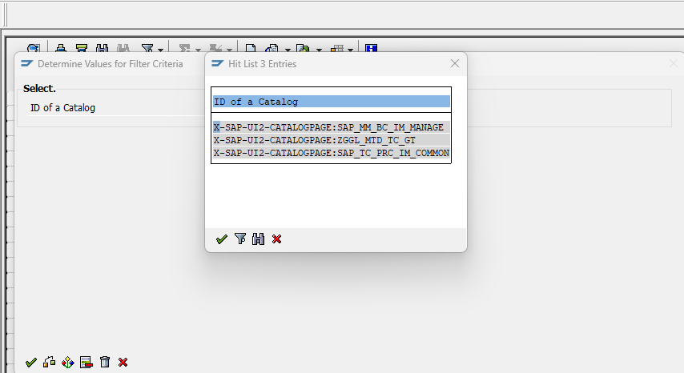

s2p.mm.im.goodsreceipt.purchaseorder.GR4POS1-ext

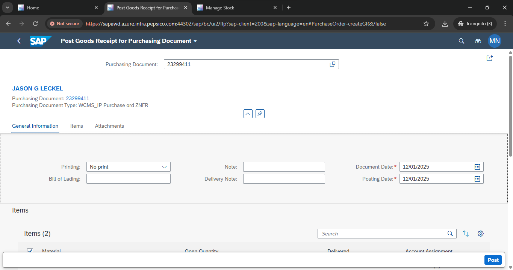

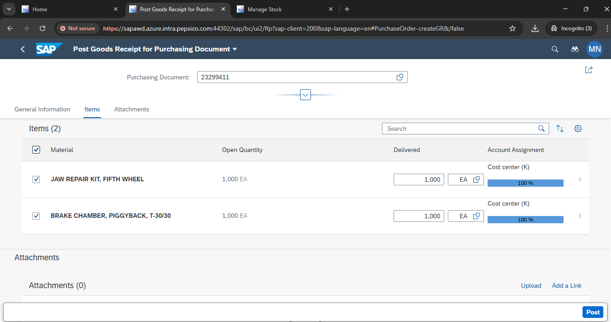

The SAP transaction code for a goods receipt with a purchase order is MIGO.  
 To use it, select "Goods Receipt" and "Purchase Order" as the reference, enter the PO number and movement type \(101\), and then post the document.  
 Step-by-step example using T-code MIGO Start the transaction:  
 Enter MIGO in the SAP command field and press Enter.Set the transaction and reference: 
 In the initial screen, select Goods Receipt (or GR).
 Change the reference document to Purchase Order (or PO).Enter purchase order details:Enter the Purchase Order number from the delivery note. 
 Enter the movement type $101$ (GR for PO).The system will default the document and posting dates to the current date.  
 You can change them if needed.Check the details:Press Enter.  
 The system will populate the details from the purchase order.Check that the correct items are selected (e.g., by clicking the "Item OK" check box). 
 Verify the quantities and storage locations. 
  You can change the quantity if the received amount differs. 
  Post the goods receipt: 
  Click the Post button to finalize the transaction. 
  The system will generate a material document and update the inventory. 
   Example scenario Scenario:  
  A company receives 50 units of material R-1000 against purchase order 5000012345.Steps in MIGO:Execute MIGO.Select Goods Receipt and Purchase Order. 
  Enter 5000012345 in the PO field and 101 in the Movement type field.Press Enter.Select the item line for material R-1000.Post the document. 

************************************************************************************************

SAP Goods Receipt Process for Beginners ✔️

The SAP Goods Receipt (GR) process confirms that ordered materials or services have been received at the plant or warehouse. 

Below is a beginner-friendly, step-by-step breakdown of the process, including the main transaction codes (T-codes).

[Create Purchase Requisition]
ME51N
        ↓
[Create Purchase Order]
     ME21N
        ↓
[Goods Receipt Posting]
   (Material Arrives)
     MIGO
        ↓
[Quality Inspection]
   (If Required)
     QA32
        ↓
[Stock Update]
(Automatic)
        ↓
[Invoice Receipt]
     MIRO

Step-by-Step Explanation✔️ 

Purchase Requisition [ME51N]:
The process starts with a requisition raised by a department requesting certain materials.

Purchase Order [ME21N]
The requisition is reviewed and converted into a Purchase Order (PO), which is sent to the supplier.

Goods Receipt Posting [MIGO]
When materials arrive, the warehouse/plant confirms receipt in SAP using MIGO. You select "Goods Receipt" and reference the PO.

Quality Inspection [QA32] (Optional)
If quality checks are required (defined by material master/settings), goods go through inspection.

Stock Update
Upon successful posting, SAP automatically updates inventory.

Invoice Receipt [MIRO]
Accounts Payable validates the supplier invoice against both the PO and Goods Receipt, then processes payment.

Additional Notes ✔️ 

Movement Type 101 is usually used for Goods Receipt against a PO in MIGO.
After posting the GR, SAP generates both a material document and (if valuated) an accounting document.

GR posting updates the Purchase Order History, helping procurement track open versus received quantities.

Mistakes in Goods Receipt (e.g., wrong quantity) can be reversed using MIGO (with reference to the original document).

This flow helps SAP beginners visualize and execute the standard Goods Receipt process, making it easy to follow and understand each step with the T-codes used at each stage.

 
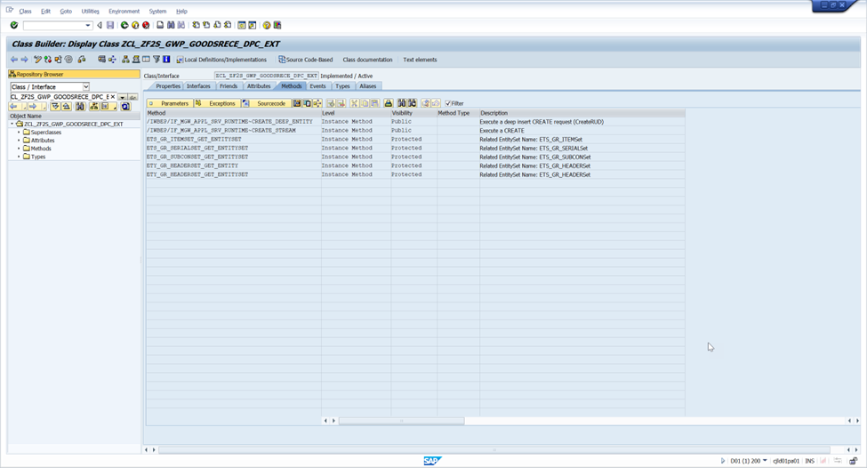
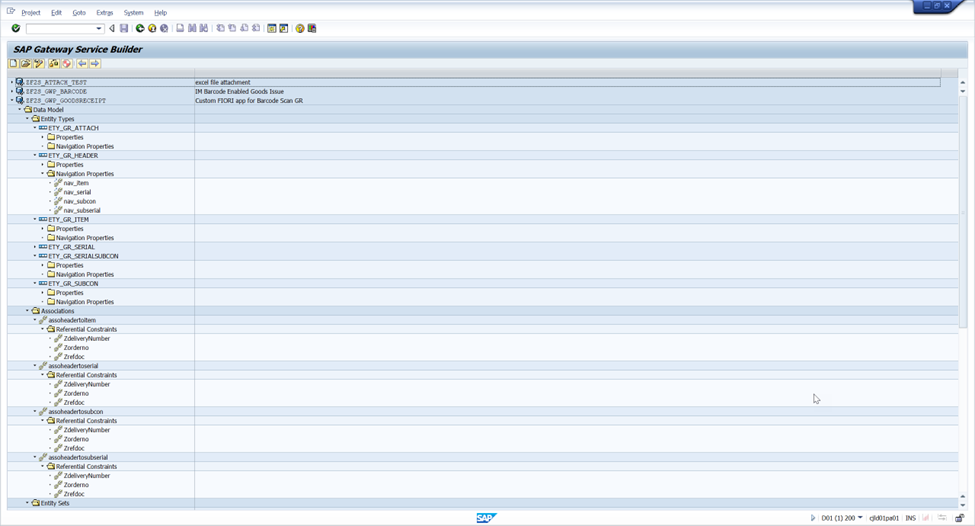

/IWBEP/IF_MGW_APPL_SRV_RUNTIME~CREATE_DEEP_ENTITY	Instance Method	Public	                               	Execute a deep insert CREATE request (CreateRUD)

  method /iwbep/if_mgw_appl_srv_runtime~create_deep_entity.
*----------------------------------------------------------------------*
*  Object Name         : CREATE_DEEP_ENTITY
*  Description         : Method to create movement order in S/4 system
*  Created By          : 
*  Created On          : 
*  Version             : S/4 HANA 1709
*  Purpose             : Odata method to create movement order in backend system
*  Project Name        : CJE
*  RICEFW              : F2SE028
*  Business Contact    : 
*  Transport Request   : DEV_F2SE029_OR-IM Barcode Enabled Goods Issue
*  Misc Notes          : NA
*----------------------------------------------------------------------*

    types: ty_t_item               type standard table of zcl_zf2s_gwp_goodsrece_mpc=>ts_ety_gr_item with default key,
           ty_t_serialnumber       type standard table of zcl_zf2s_gwp_goodsrece_mpc=>ts_ety_gr_serial with default key,
           ty_t_subconitem         type standard table of zcl_zf2s_gwp_goodsrece_mpc=>ts_ety_gr_subcon with default key,
           ty_t_subconserialnumber type standard table of zcl_zf2s_gwp_goodsrece_mpc=>ts_ety_gr_serialsubcon with default key.

    types: begin of ty_deep_entity.
        include type zcl_zf2s_gwp_goodsrece_mpc=>ts_ety_gr_header.
    types: nav_item      type ty_t_item,
           nav_serial    type ty_t_serialnumber,
           nav_subcon    type ty_t_subconitem,
           nav_subserial type ty_t_subconserialnumber,
           end of ty_deep_entity.

    types : begin of ty_cestatus,
              zcestatus type char1,
              itemno    type ebelp,
              matnr     type matnr,
            end of ty_cestatus.
    types: begin of ty_fi_indicator,
             matnr type matnr,
             bdmng type bdmng,
             rsnum type rsnum,
             rspos type rspos,
           end of ty_fi_indicator,

           begin of ty_subcomp,
             zorderno     type aufnr,
             zwerks       type werks_d,
             zzeile       type ebelp,
             zrefdoc      type refdoc,
             zcompitem    type rspos,
             zlgort       type lgort_d,
             zbwtar       type bwtar_d,
             zdelcomplete type elikz,
             zstocktype   type migo_insmk,
             zserialcheck type char1,
             zvalcatcheck type char1,
             zvaltype     type zvaltype,
             zerfme       type erfme,
             zstoloc      type zstoloc,
             zzeilesub    type numc3,
             zerfmg       type erfmg,
             zmatnr       type matnr18,
           end of ty_subcomp.

    constants: lc_code         type bapi2017_gm_code value '01',
               lc_code2        type bapi2017_gm_code value '02',
               lc_check        type char1 value 'X',
               lc_certcheck    type char1 value 'Y',
               lc_error        type char1 value 'E',
               lc_mvt_ind      type kzbew value 'B', "Purchase Order
               lc_mvt_ind2     type kzbew value 'F', "Production Order
               lc_upd          type vbkz value 'U',
               lc_certstatus_2 type qcstatus value '2',
               lc_mvty_543     type bwart value '543', " added by NARKUDAM for Defect 1007
               lc_mvty_ind     type kzbew value 'O'. " added by NARKUDAM for Defect 1007

    data: lwa_finaldata        type ty_deep_entity,
          lwa_item             type bapi2017_gm_item_create,
          lwa_serial           type bapi2017_gm_serialnumber,
          lit_item             type standard table of bapi2017_gm_item_create,
          lit_serial           type standard table of bapi2017_gm_serialnumber,
          lwa_nav_item         type  zf2st_gr_item,
          lwa_nav_serial       type  zf2st_gr_serial,
          lwa_nav_subcon       type  zbt_gr_subcon,
          lwa_nav_subserial    type  zf2st_gr_serial,
          lwa_head             type bapi2017_gm_head_01,
          lv_doc_no            type bapi2017_gm_head_ret-mat_doc,         " Material Document No.
          lit_bapiret2         type standard table of bapiret2,
          lv_spclstock         type sobkz,
          lv_movementtype      type bwart,
          lwa_bapiret2         type bapiret2,
          lv_message           type bapi_msg,
          lo_message_container type ref to /iwbep/if_message_container,
          lv_movement          type mblnr,
          lv_date              type char2,
          lv_month             type char2,
          lv_year              type char4,
          lv_itemno            type numc3,
          lv_counter           type numc4,
          lit_cestatus         type table of ty_cestatus,
          lwa_cestatus         type ty_cestatus,
          lv_doc_year          type mjahr,
          lv_line_counter      type char6,
          lwa_subcomp          type ty_subcomp,
          lit_subcomp          type table of ty_subcomp,
          lv_matnr             type matnr18,
          lit_qcpr             type table of qcprd.

    data : lit_fi_indicator type table of ty_fi_indicator,
           lwa_fi_indicator type ty_fi_indicator,
           lv_ebelp         type ekpo-ebelp. " added by NARKUDAM for defect#985

    io_data_provider->read_entry_data( importing es_data = lwa_finaldata ).

    if lwa_finaldata-zrefdoc ne 'R08'.
**Get required quantity for all materials based on order number
      select matnr bdmng rsnum rspos into table lit_fi_indicator
                         from resb
                         where aufnr = lwa_finaldata-zorderno.
      if sy-subrc = 0.
      endif.
      lv_spclstock = lwa_finaldata-zsobkz.
      lv_movementtype = lwa_finaldata-zbwart.

      clear lv_line_counter .
      loop at lwa_finaldata-nav_item into lwa_nav_item.
        lwa_item-po_item = lwa_nav_item-zzeile.
        lwa_item-material = lwa_nav_item-zmatnr.
        lwa_item-entry_qnt = lwa_nav_item-zerfmg.
        lwa_item-entry_uom = lwa_nav_item-zerfme.
        lwa_item-plant = lwa_nav_item-zwerks.
        lwa_item-stge_loc = lwa_nav_item-zlgort.
        lwa_item-val_type = lwa_nav_item-zlbbsa.
        lwa_item-spec_stock = lv_spclstock.
        lwa_item-move_type = lv_movementtype.
        lwa_item-po_number = lwa_nav_item-zorderno.
        lwa_item-stck_type = lwa_nav_item-zstocktype.
        lwa_item-mvt_ind = lc_mvt_ind.
        lwa_item-serialno_auto_numberassignment = lwa_nav_item-zserial_auto.
        lwa_item-no_more_gr = lwa_nav_item-zdelivery_complt.
        lwa_item-line_id = lv_line_counter + 1.  "Filling line_id for main item for subcontracting scenario
        lv_line_counter = lwa_item-line_id.
        if lwa_nav_item-zcert_encl is not initial.
          lwa_cestatus-zcestatus = lwa_nav_item-zcert_encl.
          lwa_cestatus-itemno = lwa_nav_item-zzeile.
          lwa_cestatus-matnr = lwa_nav_item-zmatnr.
          append lwa_cestatus to lit_cestatus.
        endif.

        if lit_fi_indicator is not initial.
          read table lit_fi_indicator into lwa_fi_indicator with key matnr = lwa_nav_item-zmatnr.
          lwa_item-reserv_no = lwa_fi_indicator-rsnum.
          lwa_item-res_item  = lwa_fi_indicator-rspos.
*      IF lit_fi_indicator IS NOT INITIAL.
          if lwa_nav_item-zkzear is initial.
            if lwa_nav_item-zerfmg >= lwa_fi_indicator-bdmng.
              lwa_item-withdrawn = lc_check.
            endif.
          else.
            lwa_item-withdrawn = lwa_nav_item-zkzear.
          endif.
        endif.

        if lwa_nav_item-zcheck is not initial.
          append lwa_item to lit_item.
        endif.
        clear: lwa_nav_item,
               lwa_item,
               lwa_fi_indicator.
      endloop.
*begin of changes NARKUDAM for Defect#985
      sort :lwa_finaldata-nav_serial by  zzeile.
      sort :lit_item by  po_item.
*end of changes by NARKUDAM for defect#985

*** Start of change for Serial number change : CR 588958
      loop at lwa_finaldata-nav_serial into lwa_nav_serial.

        call function 'CONVERSION_EXIT_ALPHA_INPUT'
          exporting
            input  = lwa_nav_serial-zzeile
          importing
            output = lv_ebelp.

        read table lit_item into lwa_item with key material = lwa_nav_serial-zmatnr po_item = lv_ebelp .

        if sy-subrc = 0.
*        IF lwa_nav_serial-zserialnumber IS NOT INITIAL.
          if lwa_nav_serial-zqtychange ne lc_check.
            if lwa_nav_serial-zzeile ne lv_itemno.
              lv_itemno = lwa_nav_serial-zzeile.
              lv_counter = lv_counter + 1.
            endif.

            lwa_serial-matdoc_itm = lv_counter.
            lwa_serial-serialno = lwa_nav_serial-zserialnumber.

            append lwa_serial to lit_serial.
          endif.
*        ENDIF.
          clear: lwa_nav_serial,
                 lwa_serial,
                 lwa_item.
        endif.
      endloop.
*** End of change for Serial number change : CR 588958

*****Add Component data in case of subcontracting PO ****
      select matnr, baugr,rspos from resb into table @data(lit_resb) where ebeln = @lwa_finaldata-zorderno.

      clear lwa_nav_item.

      sort  lwa_finaldata-nav_item by zzeile ASCENDING.

      loop at lwa_finaldata-nav_subcon into lwa_nav_subcon.
        if lwa_nav_subcon-zcheck = lc_check.

          lwa_item-po_item = lwa_nav_subcon-zzeile.
          lwa_item-material = lwa_nav_subcon-zmatnr.
          lwa_item-entry_qnt = lwa_nav_subcon-zerfmg.
          lwa_item-entry_uom = lwa_nav_subcon-zerfme.
          lwa_item-plant = lwa_nav_subcon-zwerks.
          lwa_item-val_type = lwa_nav_subcon-zlbbsa.
          lwa_item-spec_stock = lv_spclstock.

" BOC by NARKUDAM for defect 1007
          read table lwa_finaldata-nav_item into data(wa_na_item)
                                            with key zzeile = lwa_nav_subcon-zzeile_sub.
          if sy-subrc = 0 and wa_na_item-zacc_assgn eq 'F'.

            lwa_item-orderid  = wa_na_item-zorder_no_acc.
            lwa_item-order_itno  = wa_na_item-zzeile.
            lwa_item-move_type = lc_mvty_543. " added by NARKUDAM for defect 1007
            lwa_item-po_number = lwa_finaldata-zorderno. " added by NARKUDAM for defect 1007
            lwa_item-mvt_ind = lc_mvty_ind. " added by NARKUDAM for defect 1007
            lwa_item-parent_id = wa_na_item-zparent_id. " added NARKUDM
            else.
            lwa_item-parent_id = wa_na_item-zparent_id. " added NARKUDM
          endif.
          clear: wa_na_item.
          " EOC by NARKUDAM for defect 1007

*          lwa_item-order_itno = lwa_nav_subcon-zzeile. " added by NARKUDAM for defect 1007
          lwa_item-stck_type = lwa_nav_subcon-zstocktype.
          lwa_item-line_id = lv_line_counter + 1.

          " BOC by N for defect 1007
**Binary search not added due to less entries
*          read table lit_resb assigning field-symbol(<fs_resb>) with key matnr = lwa_nav_subcon-zmatnr.
*          if sy-subrc = 0.
*
**            lwa_item-parent_id = <fs_resb>-rspos.
*
*            read table lit_item assigning field-symbol(<fs_item>) with key material = <fs_resb>-baugr.
*            if sy-subrc = 0.
*              lwa_item-parent_id = <fs_item>-line_id.
**              else.                                   " added NARKUDAM
**              lwa_item-parent_id = '0001'. " added NARKUDM
*            endif.
*          endif.
          " EoC by NARKUDAM for defect 1007
          append lwa_item to lit_item.
          lv_line_counter = lwa_item-line_id.
          CLEAR:lwa_item.  " added by  for defect 1007
        endif.
      endloop.

***Serial Number for subcomponent
      clear lv_itemno.
      loop at lwa_finaldata-nav_subserial into lwa_nav_serial.

        read table lit_item into lwa_item with key material = lwa_nav_serial-zmatnr .
        if sy-subrc = 0.
*        IF lwa_nav_serial-zserialnumber IS NOT INITIAL.
          if lwa_nav_serial-zqtychange ne lc_check.
            if lwa_nav_serial-zcomp_item ne lv_itemno.
              lv_itemno = lwa_nav_serial-zcomp_item.
              lv_counter = lv_counter + 1.
            endif.

            lwa_serial-matdoc_itm = lv_counter.
            lwa_serial-serialno = lwa_nav_serial-zserialnumber.

            append lwa_serial to lit_serial.
          endif.
*        ENDIF.
        endif.
        clear: lwa_nav_serial,
               lwa_serial,
               lwa_item.
      endloop.

      lwa_head-pstng_date = lwa_finaldata-zbudat.
      lwa_head-doc_date = lwa_finaldata-zbldat.
      lwa_head-header_txt    = lwa_finaldata-zbktxt.
      lwa_head-pr_uname      = sy-uname.
      lwa_head-ref_doc_no_long = lwa_finaldata-zmtsnr.
      lwa_head-bill_of_lading  = lwa_finaldata-zladding.
      lwa_head-ref_doc_no   = lwa_finaldata-zdeliverynote.

      if lwa_head-pstng_date is not initial
        and lwa_head-doc_date is not initial.
        if lwa_head-bill_of_lading is not initial.

          lv_year = lwa_head-pstng_date+4(4).
          lv_month = lwa_head-pstng_date+0(2).
          lv_date = lwa_head-pstng_date+2(2).
          concatenate   lv_year lv_month lv_date into lwa_head-pstng_date.

          clear : lv_year , lv_month , lv_date.

          lv_year = lwa_head-doc_date+4(4).
          lv_month = lwa_head-doc_date+0(2).
          lv_date = lwa_head-doc_date+2(2).
          concatenate   lv_year lv_month lv_date into lwa_head-doc_date.

*      IF sy-subrc = 0.

          refresh lit_bapiret2.
          call function 'BAPI_GOODSMVT_CREATE'
            exporting
              goodsmvt_header       = lwa_head
              goodsmvt_code         = lc_code
            importing
              materialdocument      = lv_doc_no
              matdocumentyear       = lv_doc_year
            tables
              goodsmvt_item         = lit_item
              goodsmvt_serialnumber = lit_serial
              return                = lit_bapiret2.

          if lv_doc_no is not initial.

            call function 'BAPI_TRANSACTION_COMMIT'
              exporting
                wait = abap_true.
          endif.

          lwa_finaldata-zmblnr = lv_doc_no.
          lwa_finaldata-zmjahr = lv_doc_year.

          if lv_doc_no is not initial.
            select * into table lit_qcpr
                     from qcpr
                     for all entries in lit_item
                     where mblnr = lv_doc_no
                     and ebeln = lit_item-po_number.

            if lit_qcpr is not initial.
*            sort lit_qcpr by certno DESCENDING.

              loop at lit_qcpr assigning field-symbol(<fs_qcpr>).
**Binary search not added due to less entries
                read table lit_cestatus assigning field-symbol(<fs_cestatus>) with key itemno = <fs_qcpr>-ebelp .
                if sy-subrc = 0 and
                   <fs_cestatus>-zcestatus = lc_certcheck. "If certificate type is selected as "Yes" on UI screen

                  <fs_qcpr>-status = lc_certstatus_2.

                  call function 'QCPR_CERTIFICATE_CHANGE'
                    exporting
                      i_qcprd      = <fs_qcpr>
                      i_vbkz       = lc_upd
                    exceptions
                      foreign_lock = 1
                      post_err     = 2
                      others       = 3.
                  if sy-subrc <> 0.
* Implement suitable error handling here
                  endif.

                  if sy-subrc = 0.
                    call function 'BAPI_TRANSACTION_COMMIT'
                      exporting
                        wait = abap_true.
                  endif.
                endif.
              endloop.
            endif.
          endif.

          if lv_doc_no is  initial.
*
            read table lit_bapiret2 into lwa_bapiret2  with key type = lc_error.
            if sy-subrc = 0.
              lwa_finaldata-zerror = lwa_bapiret2-message.
              copy_data_to_ref( exporting is_data = lwa_finaldata
                                    changing  cr_data = er_deep_entity ).
            endif.

          elseif lv_doc_no is not initial.

            concatenate lwa_finaldata-zmblnr lwa_finaldata-zmjahr text-001 into lv_message separated by space.
            lwa_finaldata-zsuccess = lv_message.
            copy_data_to_ref( exporting is_data = lwa_finaldata
                                 changing  cr_data = er_deep_entity ).

          elseif lv_doc_no is initial and lit_bapiret2 is initial.
            lwa_finaldata-zerror = text-003.
            copy_data_to_ref( exporting is_data = lwa_finaldata
                                 changing  cr_data = er_deep_entity ).

          endif.

        else.
          lv_message = text-016.
          lwa_finaldata-zerror = lv_message.
          copy_data_to_ref( exporting is_data = lwa_finaldata
                         changing  cr_data = er_deep_entity ).
        endif.
      else.
        lv_message = text-002.
        lwa_finaldata-zerror = lv_message.
        copy_data_to_ref( exporting is_data = lwa_finaldata
                       changing  cr_data = er_deep_entity ).
      endif.

      refresh : lit_bapiret2 , lit_item , lit_serial.

    else.
**Get required quantity for all materials based on order number
      select matnr bdmng rsnum rspos into table lit_fi_indicator
                         from resb
                         where aufnr = lwa_finaldata-zorderno.
      if sy-subrc = 0.
      endif.
      lv_spclstock = lwa_finaldata-zsobkz.
      lv_movementtype = lwa_finaldata-zbwart.

      clear lv_line_counter .
      loop at lwa_finaldata-nav_item into lwa_nav_item.
        call function 'CONVERSION_EXIT_ALPHA_INPUT'
          exporting
            input  = lwa_nav_item-zorderno
          importing
            output = lwa_item-orderid.

*        lwa_item-orderid = lwa_nav_item-zorderno.
*        lwa_item-order_itno = lwa_nav_item-zzeile.
        lwa_item-material = lwa_nav_item-zmatnr.
        lwa_item-entry_qnt = lwa_nav_item-zerfmg.
        lwa_item-entry_uom = lwa_nav_item-zerfme.
        lwa_item-plant = lwa_nav_item-zwerks.
        lwa_item-stge_loc = lwa_nav_item-zlgort.
        lwa_item-val_type = lwa_nav_item-zlbbsa.
        lwa_item-spec_stock = lv_spclstock.
        lwa_item-move_type = lv_movementtype.
        lwa_item-stck_type = lwa_nav_item-zstocktype.
        lwa_item-mvt_ind = lc_mvt_ind2.
        lwa_item-serialno_auto_numberassignment = lwa_nav_item-zserial_auto.
        lwa_item-no_more_gr = lwa_nav_item-zdelivery_complt.
        if lwa_nav_item-zcert_encl is not initial.
          lwa_cestatus-zcestatus = lwa_nav_item-zcert_encl.
          lwa_cestatus-itemno = lwa_nav_item-zzeile.
          lwa_cestatus-matnr = lwa_nav_item-zmatnr.
          append lwa_cestatus to lit_cestatus.
        endif.

        if lit_fi_indicator is not initial.
          read table lit_fi_indicator into lwa_fi_indicator with key matnr = lwa_nav_item-zmatnr.
          lwa_item-reserv_no = lwa_fi_indicator-rsnum.
          lwa_item-res_item  = lwa_fi_indicator-rspos.
*      IF lit_fi_indicator IS NOT INITIAL.
          if lwa_nav_item-zkzear is initial.
            if lwa_nav_item-zerfmg >= lwa_fi_indicator-bdmng.
              lwa_item-withdrawn = lc_check.
            endif.
          else.
            lwa_item-withdrawn = lwa_nav_item-zkzear.
          endif.
        endif.

        if lwa_nav_item-zcheck is not initial.
          append lwa_item to lit_item.
        endif.
        clear: lwa_nav_item,
               lwa_item,
               lwa_fi_indicator.
      endloop.

      loop at lwa_finaldata-nav_serial into lwa_nav_serial.
        read table lit_item into lwa_item with key material = lwa_nav_serial-zmatnr.

        if sy-subrc = 0.
          if lwa_nav_serial-zqtychange ne lc_check.
            if lwa_nav_serial-zzeile ne lv_itemno.
              lv_itemno = lwa_nav_serial-zzeile.
              lv_counter = lv_counter + 1.
            endif.

            lwa_serial-matdoc_itm = lv_counter.
            lwa_serial-serialno = lwa_nav_serial-zserialnumber.

            append lwa_serial to lit_serial.
          endif.
          clear: lwa_nav_serial,
                 lwa_serial,
                 lwa_item.
        endif.
      endloop.

      lwa_head-pstng_date = lwa_finaldata-zbudat.
      lwa_head-doc_date = lwa_finaldata-zbldat.
      lwa_head-header_txt    = lwa_finaldata-zbktxt.
      lwa_head-pr_uname      = sy-uname.
      lwa_head-ref_doc_no_long = lwa_finaldata-zmtsnr.
      lwa_head-bill_of_lading  = lwa_finaldata-zladding.
      lwa_head-ref_doc_no   = lwa_finaldata-zdeliverynote.

      if lwa_head-pstng_date is not initial and lwa_head-doc_date is not initial.

        lv_year = lwa_head-pstng_date+4(4).
        lv_month = lwa_head-pstng_date+0(2).
        lv_date = lwa_head-pstng_date+2(2).
        concatenate   lv_year lv_month lv_date into lwa_head-pstng_date.

        clear : lv_year , lv_month , lv_date.

        lv_year = lwa_head-doc_date+4(4).
        lv_month = lwa_head-doc_date+0(2).
        lv_date = lwa_head-doc_date+2(2).
        concatenate   lv_year lv_month lv_date into lwa_head-doc_date.

*      IF sy-subrc = 0.

        refresh lit_bapiret2.
        call function 'BAPI_GOODSMVT_CREATE'
          exporting
            goodsmvt_header       = lwa_head
            goodsmvt_code         = lc_code2
          importing
            materialdocument      = lv_doc_no
            matdocumentyear       = lv_doc_year
          tables
            goodsmvt_item         = lit_item
            goodsmvt_serialnumber = lit_serial
            return                = lit_bapiret2.

        if lv_doc_no is not initial.

          call function 'BAPI_TRANSACTION_COMMIT'
            exporting
              wait = abap_true.
        endif.

        lwa_finaldata-zmblnr = lv_doc_no.
        lwa_finaldata-zmjahr = lv_doc_year.

        if lv_doc_no is not initial.

          select * into table lit_qcpr
                        from qcpr
                        for all entries in lit_item
                        where ebeln = lit_item-po_number
                        and   mblnr = lv_doc_no.

          if lit_qcpr is not initial.
            loop at lit_qcpr assigning <fs_qcpr>.
              if <fs_qcpr> is assigned.
**Binary search not added due to less entries
                read table lit_cestatus assigning <fs_cestatus> with key itemno = <fs_qcpr>-ebelp .
                if sy-subrc = 0 and
                   <fs_cestatus>-zcestatus = lc_certcheck.

                  <fs_qcpr>-status = lc_certstatus_2.

                  call function 'QCPR_CERTIFICATE_CHANGE'
                    exporting
                      i_qcprd      = <fs_qcpr>
                      i_vbkz       = lc_upd
                    exceptions
                      foreign_lock = 1
                      post_err     = 2
                      others       = 3.
                  if sy-subrc <> 0.
* Implement suitable error handling here
                  endif.

                  if sy-subrc = 0.
                    call function 'BAPI_TRANSACTION_COMMIT'
                      exporting
                        wait = abap_true.
                  endif.
                endif.
              endif.
            endloop.
          endif.
        endif.

        if lv_doc_no is  initial.
*
          read table lit_bapiret2 into lwa_bapiret2  with key type = lc_error.
          if sy-subrc = 0.
            lwa_finaldata-zerror = lwa_bapiret2-message.
            copy_data_to_ref( exporting is_data = lwa_finaldata
                                  changing  cr_data = er_deep_entity ).
          endif.

        elseif lv_doc_no is not initial.

          concatenate lwa_finaldata-zmblnr lwa_finaldata-zmjahr text-001 into lv_message separated by space.
          lwa_finaldata-zsuccess = lv_message.
          copy_data_to_ref( exporting is_data = lwa_finaldata
                               changing  cr_data = er_deep_entity ).

        elseif lv_doc_no is initial and lit_bapiret2 is initial.
          lwa_finaldata-zerror = text-003.
          copy_data_to_ref( exporting is_data = lwa_finaldata
                               changing  cr_data = er_deep_entity ).

        endif.

      else.
        lv_message = text-002.
        lwa_finaldata-zerror = lv_message.
        copy_data_to_ref( exporting is_data = lwa_finaldata
                       changing  cr_data = er_deep_entity ).
      endif.

      refresh : lit_bapiret2 , lit_item , lit_serial.
    endif.
  endmethod.
/IWBEP/IF_MGW_APPL_SRV_RUNTIME~CREATE_STREAM	Instance Method	Public	                               	Execute a CREATE
  METHOD /iwbep/if_mgw_appl_srv_runtime~create_stream.
*----------------------------------------------------------------------*
*  Object Name         : CREATE_STREAM
*  Description         : Method to create and attach document
*  Created By          : 
*  Created On          : 
*  Version             : S/4 HANA 1709
*  Purpose             : Odata method to create attachment
*  Project Name        : CJE
*  RICEFW              : F2SE028
*  Business Contact    : 
*  Transport Request   : DEV_F2SE028_OR-IM Barcode Enabled Goods Receipt
*  Misc Notes          : NA
*----------------------------------------------------------------------*

    DATA : lit_attach TYPE string_t,
           lwa_attach TYPE zbs_gr_attach,
           lv_po      TYPE ebeln,
           lv_tmp     TYPE string.

    DATA: lit_objhead   TYPE STANDARD TABLE OF soli,
          lit_xdata     TYPE solix_tab,
          lit_data      TYPE soli_tab,
          lit_content   TYPE STANDARD TABLE OF tbl1024,

          lwa_folmem_k  TYPE sofmk,
          lwa_note      TYPE borident,
          lwa_object    TYPE borident,
          lwa_obj_id    TYPE soodk,
          lwa_fol_id    TYPE soodk,
          lwa_obj_data  TYPE sood1,
          lwa_data      TYPE soli,
          lwa_xdata     TYPE solix,

          lv_ep_note    TYPE swo_typeid,
          lv_extension  TYPE c LENGTH 4,
          lv_mblnr      TYPE mblnr,
          lv_mjahr      TYPE mjahr,
          lv_objkey     TYPE char70,
          lv_tmp_fn     TYPE string,
          lv_file_des   TYPE so_obj_des,
          lv_offset     TYPE i,
          lv_size       TYPE i,
          lv_temp_len   TYPE i,
          lv_offset_old TYPE i.

    CONSTANTS : lc_hex_null TYPE x LENGTH 1   VALUE '20',
                lc_x        TYPE c LENGTH '1' VALUE 'X',
                lc_region   TYPE char1 VALUE 'B',
                lc_slash    TYPE char1 VALUE '/',
                lc_period   TYPE char1 VALUE '.',
                lc_objtyp   TYPE swo_objtyp VALUE 'BUS2017',
                lc_objsns   TYPE  so_obj_sns VALUE 'F',
                lc_docclass type SO_OBJ_TP VALUE 'EXT',
                lc_message type SWO_OBJTYP value 'MESSAGE',
                lc_relationtype type BINRELTYP value 'ATTA'.

    FIELD-SYMBOLS: <lfs_attach>    TYPE string.
    FIELD-SYMBOLS: <lfs_return>   TYPE bapiret2.

    CASE iv_entity_name.
      WHEN 'ETY_GR_ATTACH'.

        CALL FUNCTION 'SCMS_XSTRING_TO_BINARY'
          EXPORTING
            buffer          = is_media_resource-value
            append_to_table = lc_x
          TABLES
            binary_tab      = lit_content.

**Call function to get Folder id

        CALL FUNCTION 'SO_FOLDER_ROOT_ID_GET'
          EXPORTING
            region                = lc_region "'B'
          IMPORTING
            folder_id             = lwa_fol_id
          EXCEPTIONS
            communication_failure = 1
            owner_not_exist       = 2
            system_failure        = 3
            x_error               = 4
            OTHERS                = 5.

**Get the document number and file name from SLUG

        SPLIT iv_slug AT lc_slash INTO lv_mblnr lv_mjahr lv_file_des.

**Get the file extension

        SPLIT lv_file_des AT lc_period INTO lv_tmp_fn lv_extension.

        CONCATENATE lv_mblnr lv_mjahr INTO lv_objkey.
        lwa_object-objkey  = lv_objkey.

**For Goods movement BUS type is BUS2017
        lwa_object-objtype   = lc_objtyp. "'BUS2017'.
        lwa_obj_data-objsns   = lc_objsns. "'F'.
        lwa_obj_data-objla = sy-langu.
        lwa_obj_data-objdes   = lv_file_des.
        lwa_obj_data-file_ext = lv_extension.
        TRANSLATE lwa_obj_data-file_ext TO UPPER CASE.

**Calculate the length

        lv_offset = 0.
        lv_size =  xstrlen( is_media_resource-value ).

        lwa_obj_data-objlen =  lv_size.

        WHILE lv_offset <= lv_size.
          lv_offset_old = lv_offset.
          lv_offset = lv_offset + 255.
          IF lv_offset > lv_size.
            lv_temp_len = xstrlen( is_media_resource-value+lv_offset_old ).

            CLEAR lwa_xdata-line WITH lc_hex_null IN BYTE MODE.
            lwa_xdata-line = is_media_resource-value+lv_offset_old(lv_temp_len).
          ELSE.
            lwa_xdata-line = is_media_resource-value+lv_offset_old(255).
          ENDIF.
          APPEND lwa_xdata TO lit_xdata.
        ENDWHILE.

**Change Hex data to Text data

        CALL FUNCTION 'SO_SOLIXTAB_TO_SOLITAB'
          EXPORTING
            ip_solixtab = lit_xdata
          IMPORTING
            ep_solitab  = lit_data.
        .

**Insert document

        CALL FUNCTION 'SO_OBJECT_INSERT'
          EXPORTING
            folder_id                  = lwa_fol_id
            object_type                = lc_docclass "'EXT'
            object_hd_change           = lwa_obj_data
          IMPORTING
            object_id                  = lwa_obj_id
          TABLES
            objhead                    = lit_objhead
            objcont                    = lit_data
          EXCEPTIONS
            active_user_not_exist      = 1
            communication_failure      = 2
            component_not_available    = 3
            dl_name_exist              = 4
            folder_not_exist           = 5
            folder_no_authorization    = 6
            object_type_not_exist      = 7
            operation_no_authorization = 8
            owner_not_exist            = 9
            parameter_error            = 10
            substitute_not_active      = 11
            substitute_not_defined     = 12
            system_failure             = 13
            x_error                    = 14
            OTHERS                     = 15.

        IF sy-subrc = 0 AND lwa_object-objkey IS NOT INITIAL.
          lwa_folmem_k-foltp = lwa_fol_id-objtp.
          lwa_folmem_k-folyr = lwa_fol_id-objyr.
          lwa_folmem_k-folno = lwa_fol_id-objno.

          lwa_folmem_k-doctp = lwa_obj_id-objtp.
          lwa_folmem_k-docyr = lwa_obj_id-objyr.
          lwa_folmem_k-docno = lwa_obj_id-objno.

          lv_ep_note = lwa_folmem_k.

          lwa_note-objtype = lc_message."'MESSAGE'.
          lwa_note-objkey  = lv_ep_note.

**Link the object inserted

          CALL FUNCTION 'BINARY_RELATION_CREATE_COMMIT'
            EXPORTING
              obj_rolea      = lwa_object
              obj_roleb      = lwa_note
              relationtype   = lc_relationtype "'ATTA'
            EXCEPTIONS
              no_model       = 1
              internal_error = 2
              unknown        = 3
              OTHERS         = 4.
          IF sy-subrc <> 0.
* Implement suitable error handling here
          ENDIF.

          CALL FUNCTION 'BAPI_TRANSACTION_COMMIT'
            EXPORTING
              wait = lc_x ."'X'.
          IF sy-subrc EQ 0.
            COMMIT WORK.

          ENDIF         .

        ENDIF.
**END**
    ENDCASE.
  ENDMETHOD.

ETS_GR_ITEMSET_GET_ENTITYSET	Instance Method	Protected	                               	Related EntitySet Name: ETS_GR_ITEMSet

  method ets_gr_itemset_get_entityset.
*----------------------------------------------------------------------*
*  Object Name         : ETS_GR_ITEMSET_GET_ENTITYSET
*  Description         : Method to read Item data from S/4 system
*  Created By          : 
*  Created On          : 
*  Version             : S/4 HANA 1709
*  Purpose             : Odata method to read data from backend system
*  Project Name        : CJE
*  RICEFW              : F2SE028
*  Business Contact    : 
*  Transport Request   : DEV_F2SE028_OR-IM Barcode Enabled Goods Receipt
*  Misc Notes          : NA
*----------------------------------------------------------------------*

    constants: lc_orderobject  type bapi_pp_order_objects value 'XXXXXXXX',
               lc_order        type string value 'Zorderno',
               lc_outb_delv    type string value 'ZdeliveryNumber', "  * Added by NARKUDAM for Defect#985
               lc_error        type char10 value 'Error',
               lc_closed       type char5 value 'I0046',
               lc_delet        type char5 value 'I0076',
               lc_deletflag    type char5 value 'I0013',
               lc_locked       type char5 value 'I0043',
               lc_techcmplt    type char5 value 'I0045',
               lc_released     type char5 value 'I0002',
               lc_bwtty        type char1 value 'Z',
               lc_check        type char1 value 'X',
               lc_checkneg     type char1 value '-',
               lc_refdoc       type string value 'Zrefdoc',
               lc_certtype     type qzgtyp value 'Z01',
               lc_inact        type char1 value ' ',
               lc_purord       type refdoc value 'R01',
               lc_obd          type refdoc value 'R05',
               lc_prodord      type refdoc value 'R08',
               lc_deletion_ind type char1 value 'L',
               lc_bwart_101    type bwart value '101',
               lc_bwart_102    type bwart value '102',
               lc_bwart_122    type bwart value '122',
               lc_costcenter   type knttp value 'K',
               lc_project      type knttp value 'P',
               lc_ordercat     type knttp value 'F',
               lc_auxacct      type knttp value 'X',
               lc_asset        type knttp value 'A'.

    types : begin of lty_valcat ,
              matnr type matnr,
              bwtty type bwtty_d,
              bwtar type bwtar_d,
              plant type bwkey,
            end of lty_valcat,

            begin of lty_material,
              matnr type matnr,
              bwkey type bwkey,
            end of lty_material,

            begin of lty_stoloc,
              plant type werks_d,
              lgort type lgort_d,
              lgobe type lgobe,
*              matnr TYPE matnr,
            end of lty_stoloc,

            begin of lty_storageloc,
              lgort type lgort_d,
              plant type werks_d,
              lgobe type lgobe,
            end of lty_storageloc,

            begin of lty_serialcheck,
              matnr  type matnr,
              plant  type werks_d,
              serial type serail,
            end of lty_serialcheck.

    data : lv_temp                   type aufnr,
           lv_order                  type ebeln,
           lv_refdoc                 type refdoc,
           lv_delv_no                type likp-vbeln,
           lv_aufnr                  type aufnr,
           lwa_key_tab               type /iwbep/s_mgw_name_value_pair,
           lit_position              type table of bapi_order_item,
           lit_header                type table of bapi_order_header1,
           lit_sequence              type table of bapi_order_sequence,
           lit_item                  type table of bapimepoitem,
           lit_item_outb             type table of bapimepoitem,"  Added by NARKUDAM for Defect#985
           lit_item_wueb             type table of wueb,  "   Added by NARKUDAM for Defect#985
           lit_item_temp             type table of bapimepoitem,
           lit_prodord_item          type table of bapi_order_header1,
           lwa_prodord_item          type bapi_order_header1,
           lit_prodord_temp          type table of bapi_order_header1,
           lit_component_alm         type table of bapi_alm_order_component_e,
           lit_component_alm_temp    type table of bapi_alm_order_component_e,
           lwa_item                  type bapimepoitem,
           lwa_component_alm         type bapi_alm_order_component_e,
           lwa_entityset             type zf2st_gr_item,
           lwa_filter_select_options type /iwbep/s_mgw_select_option,
           lwa_select_options        type /iwbep/s_cod_select_option,
           lv_message                type string,
           lv_objnr                  type j_objnr,
           lv_stat                   type j_status,
           lwa_header                type ihttpnvp,
           lit_valcat                type table of lty_valcat,
           lwa_valcat                type lty_valcat,
           lit_valtype               type table of lty_valcat,
           lwa_valtype               type lty_valcat,
           lit_material              type table of lty_material,
           lwa_material              type lty_material,
           lit_stoloc                type table of lty_stoloc,
           lwa_stoloc                type lty_stoloc,
           lit_storageloc            type table of lty_storageloc,
           lwa_storageloc            type lty_storageloc,
           lv_storageloc             type string,
           lit_serialcheck           type table of lty_serialcheck,
           lwa_serialcheck           type lty_serialcheck,
           lv_fi                     type kzear,
           lv_valtype                type string,
           lit_component             type table of bapimepocomponent,
           lwa_component             type bapimepocomponent,
           lit_return                type table of bapiret2,
           lv_qty1                   type string,
           lv_qty2                   type string,
           lv_qty                    type string,
           lv_quantity_open          type bstmg,
           lit_serial                type table of bapimeposerialno,
           lit_account               type table of bapimepoaccount.
*           lit_position              TYPE TABLE OF bapi_order_item.

    clear:lv_order,lv_refdoc ,lv_delv_no.

    if it_key_tab is not initial.
      read table it_key_tab into lwa_key_tab with key name = lc_order.
      lv_order = lwa_key_tab-value.

      read table it_key_tab into lwa_key_tab with key name = lc_refdoc.
      lv_refdoc = lwa_key_tab-value.

      read table it_key_tab into lwa_key_tab with key name = lc_outb_delv. "  * Added by NARKUDAM for Defect#985
      lv_delv_no = lwa_key_tab-value.                                      "  * Added by NARKUDAM for Defect#985

    endif.

    if lv_order is not initial.

      if lv_refdoc eq lc_prodord.
        call function 'CONVERSION_EXIT_ALPHA_INPUT'
          exporting
            input  = lv_order
          importing
            output = lv_aufnr.

****Validation Logic for Production Order
        select single objnr from aufk
                            into lv_objnr
                            where aufnr = lv_aufnr.

        if lv_objnr is not initial.
          select stat, inact from jest
                             into table @data(lit_stat)
                             where objnr = @lv_objnr.
*                             AND   inact = @lc_inact.

          if sy-subrc eq 0.
            sort lit_stat.
          endif.

        endif.
        if lit_stat is not initial.
          read table lit_stat assigning field-symbol(<fs_stat>)
            with key stat = lc_closed
                     inact = lc_inact.  "Binary search not added for lit_stat due to few entries in the table
          if sy-subrc eq 0.
            concatenate text-010 lv_order text-011 into lv_message separated by space.
          else.
            read table lit_stat assigning <fs_stat>
            with key stat = lc_deletflag
                     inact = lc_inact.
            if sy-subrc eq 0.
              concatenate text-006 lv_order text-007 into lv_message separated by space.
            else.
              read table lit_stat assigning <fs_stat>
              with key stat = lc_techcmplt
                       inact = lc_inact.
              if sy-subrc eq 0.
                read table lit_stat assigning <fs_stat>
                with key stat = lc_released.
                if sy-subrc ne 0.
                  concatenate text-008 lv_order text-009 into lv_message separated by space.
                endif.
              else.
                read table lit_stat assigning <fs_stat>
                with key stat = lc_locked
                         inact = lc_inact.
                if sy-subrc eq 0.
                  concatenate text-010 lv_order text-011 into lv_message separated by space.
                else.
                  read table lit_stat assigning <fs_stat>
                  with key stat = lc_delet
                           inact = lc_inact.
                  if sy-subrc eq 0.
                    concatenate text-006  lv_order text-007  into lv_message separated by space.
                  else.
*                  READ TABLE lit_stat ASSIGNING <fs_stat>
*                  WITH KEY stat = lc_released.
*                  IF sy-subrc NE 0.
*                    CONCATENATE TEXT-010  lv_order  TEXT-011 INTO lv_message SEPARATED BY space.
*                  ENDIF.
                  endif.
                endif.
              endif.
            endif.
          endif.
        endif.
      endif.
    elseif
      lv_refdoc = lc_purord.
      select ebeln, frgrl into table @data(lit_postatus)
                          from ekko
                          where ebeln = @lv_order
                          and   frgrl = @lc_check.
      if sy-subrc eq 0.
        concatenate text-012 lv_order text-014 into lv_message separated by space.
      endif.
    endif.
    if lv_message is not initial.
      lwa_header-name            = lc_error.
      lwa_header-value           = lv_message.
      /iwbep/if_mgw_conv_srv_runtime~set_header( lwa_header ).

    else.
      if lv_refdoc ne lc_prodord.
**Get Item detail for PO/Order/Outbound Delivery

        call function 'BAPI_PO_GETDETAIL1'
          exporting
            purchaseorder      = lv_order
            account_assignment = lc_check
          tables
            return             = lit_return
            poitem             = lit_item
            pocomponents       = lit_component
            poaccount          = lit_account.
* Begin of Changes by  for Defect#985
        if lv_refdoc eq lc_obd.

          refresh : lit_item_wueb,lit_item_outb.

          call function 'CONVERSION_EXIT_ALPHA_INPUT'
            exporting
              input  = lv_delv_no
            importing
              output = lv_delv_no.

          call function 'SD_DELIVERY_ITEMS_RECEIVE'
            exporting
              vbeln = lv_delv_no
            tables
              wueb  = lit_item_wueb.

          sort lit_item_wueb by ebelp ascending.

          loop at lit_item into data(wa_lit_item).
            read table lit_item_wueb into data(wa_lit_item_wueb)
                                               with  key
                                               ebelp = wa_lit_item-po_item.
            if sy-subrc = 0.

                wa_lit_item-quantity = wa_lit_item_wueb-erfmg.
*              wa_lit_item-po_item = wa_lit_item_wueb-vbelp.
              append wa_lit_item to lit_item_outb.
            endif.
            clear : wa_lit_item,wa_lit_item_wueb.
          endloop.
          refresh : lit_item.
          lit_item = lit_item_outb.
        endif.

*        End of Changes by NARKUDAM for defect#985

        if lit_item is not initial.
****Get Certificate type based on PO , to enable/disable CE field on UI
          select ebeln, matnr, zgtyp into table @data(lit_certtype)
                                     from ekpo
                                     where ebeln = @lv_order.
***Code change start for Storage location F4 help
          lit_item_temp = lit_item.
          sort lit_item_temp by plant.
          delete adjacent duplicates from lit_item_temp comparing plant.

          select werks lgort lgobe from t001l into table lit_stoloc
            for all entries in lit_item_temp
            where werks = lit_item_temp-plant.
          if sy-subrc = 0.
            sort lit_stoloc by plant lgort.
          endif.

***Code change end for Storage location F4 help

          loop at lit_item into lwa_item.
            lwa_material-matnr = lwa_item-material.
            lwa_material-bwkey = lwa_item-plant.
            append lwa_material to lit_material.
            clear: lwa_item ,
                   lwa_material.
          endloop.

          sort lit_material by matnr.
          delete adjacent duplicates from lit_material comparing matnr.

**Get valuation category based on material
          select matnr bwtty bwtar bwkey from mbew  into table lit_valcat
                              for all entries in lit_material
                              where matnr = lit_material-matnr
                              and   bwkey = lit_material-bwkey.
          if sy-subrc = 0.
            sort lit_valcat by matnr plant.
          endif.

*** Code change start for Serial number field enable/disable

          select matnr werks sernp from marc into table lit_serialcheck
                              for all entries in lit_material
                              where matnr = lit_material-matnr.
          if sy-subrc = 0.
            sort lit_serialcheck by matnr plant.
          endif.

*** Code change end for Serial number field enable/disable

***Logic to show updated quantity on UI for each line item

          if lv_refdoc = lc_purord.
            select  ebelp, bwart, menge from ekbe
                                      into table @data(lit_quantity)
                                      where ebeln = @lv_order
                                      and ( bwart = @lc_bwart_101 or
                                            bwart = @lc_bwart_102 or
                                            bwart = @lc_bwart_122 ).

          elseif lv_refdoc = lc_obd.
            select single vgbel from lips
                                into @data(lv_ponumber)
                                where vbeln = @lv_order.
            if lv_order is not initial.
              select  ebelp, bwart, menge from ekbe
                                  into table @lit_quantity
                                  where ebeln = @lv_order.
            endif.
          elseif lv_refdoc = lc_prodord.
            select  posnr, psmng, wemng from afpo
                                       into table @data(lit_quantity2)
                                       where aufnr = @lv_order.
          endif.

          loop at lit_item into lwa_item where delete_ind ne lc_deletion_ind.
**Dont show line items marked for deletion in the final entity set table
*          IF lwa_item-delete_ind NE lc_deletion_ind.
            lwa_entityset-zorderno = lv_order.
            lwa_entityset-zmatnr = lwa_item-material.
            lwa_entityset-zzeile = lwa_item-po_item.
            lwa_entityset-zdelivery_complt = lwa_item-no_more_gr.
             lwa_entityset-zacc_assgn = lwa_item-acctasscat.

            if lit_component is not initial.
              lwa_entityset-zsubcompcheck = lc_check.
            endif.

** Open updated quantity to be passed on UI
            if lwa_item-quantity is not initial.
              if lv_refdoc = lc_purord or lv_refdoc = lc_obd. "For Purchase Order and Outbound delivery
                loop at lit_quantity assigning field-symbol(<fs_quantity>) where ebelp = lwa_item-po_item.
                  if <fs_quantity>-bwart = lc_bwart_101.
                    lv_qty1 = lv_qty1 + <fs_quantity>-menge.
                  elseif
                    <fs_quantity>-bwart = lc_bwart_102 or
                    <fs_quantity>-bwart = lc_bwart_122.
                    lv_qty2 = lv_qty2 + <fs_quantity>-menge.

                  endif.
                endloop.

                lv_qty = lv_qty1 - lv_qty2  .      "Receipt quantity

                if lv_qty is not initial.

                  lv_quantity_open = lwa_item-quantity - lv_qty.    "Total Open Quantity
                  lwa_item-quantity = lv_quantity_open.

                endif.
              elseif lv_refdoc = lc_prodord. "for Production Order
                read table lit_quantity2 assigning field-symbol(<fs_quantity2>) with key posnr = lwa_item-po_item. "Binary search not needed due to less entries
                lwa_item-quantity = lwa_item-quantity - <fs_quantity2>-wemng.
              endif.
            endif.

            lwa_entityset-zerfmg = lwa_item-quantity.
            lwa_entityset-zerfmgfinal = lwa_item-quantity.
            if lwa_item-no_more_gr = lc_check.
              lwa_entityset-zfichange = lc_check.
            endif.
            lwa_entityset-zerfme = lwa_item-po_unit.
            lwa_entityset-zwerks = lwa_item-plant.
            lwa_entityset-zlgort = lwa_item-stge_loc.
            read table lit_valcat into lwa_valcat with key matnr = lwa_item-material
                                                           bwtty = lc_bwtty.
            if sy-subrc = 0.
              lwa_entityset-zvalcatcheck = lc_check.
              loop at lit_valcat into lwa_valcat where matnr =   lwa_item-material
                                                 and   plant = lwa_item-plant
                                                 and    bwtar is not initial.

                lwa_valtype-plant = lwa_valcat-plant.
                lwa_valtype-matnr = lwa_valcat-matnr.
                lwa_valtype-bwtar    = lwa_valcat-bwtar.
                lwa_valtype-bwtty = lwa_valcat-bwtty.
*                IF lwa_valtype-bwtar IS NOT INITIAL.
                append lwa_valtype to lit_valtype.
*                ENDIF.
                clear: lwa_valtype,
                      lwa_valcat.
              endloop.

***Convert the data into json format to pass it to UI for F4 help
              call method cl_hress_odata_ui5_utils=>convert_table_to_json
                exporting
                  it_data = lit_valtype
                importing
                  ev_json = lv_valtype.

              if lv_valtype is not initial.
                lwa_entityset-zvaltype = lv_valtype.
              endif.
              clear lv_valtype.
              refresh: lit_valtype.
            else.
              lwa_entityset-zvalcatcheck = lc_checkneg.
            endif.

*** Code change start for serial number field enable/disable
            if lit_serialcheck is not initial.
              read table lit_serialcheck into lwa_serialcheck with key matnr = lwa_item-material
                                                                       plant = lwa_item-plant
                                                                       binary search.
              if lwa_serialcheck-serial is not initial.
                lwa_entityset-zserialcheck = lc_check.
              else.
                lwa_entityset-zserialcheck = lc_checkneg.
              endif.
            endif.
*** Code change end for serial number field enable/disable

*** code change start for storage location
            loop at lit_stoloc into lwa_stoloc where plant = lwa_item-plant.
              lwa_storageloc-lgort = lwa_stoloc-lgort.
              lwa_storageloc-plant = lwa_stoloc-plant.
              lwa_storageloc-lgobe = lwa_stoloc-lgobe.
              append lwa_storageloc to lit_storageloc.
              clear : lwa_stoloc,
                      lwa_storageloc.
            endloop.

***Convert the data into json format to pass it to UI for F4 help
            call method cl_hress_odata_ui5_utils=>convert_table_to_json
              exporting
                it_data = lit_storageloc
              importing
                ev_json = lv_storageloc.

            if lv_storageloc is not initial.
              lwa_entityset-zstoloc = lv_storageloc.
            endif.
*** code change end for storage location
***Storage location enable/disable
            if lwa_item-acctasscat is initial.
              lwa_entityset-zstoloc_check = lc_check.
            endif.
**Show account assignment fields on UI based on Account assignment category
            if lit_account is not initial.
              if lwa_item-acctasscat = lc_costcenter.
**Binary search not added for lit_account as there will be very few entries
                read table lit_account assigning field-symbol(<fs_account>) with key po_item = lwa_item-po_item.
                if sy-subrc = 0.
                  lwa_entityset-zprofit_center = <fs_account>-profit_ctr.
                  lwa_entityset-zgl_account = <fs_account>-gl_account.
                  lwa_entityset-zcost_center = <fs_account>-costcenter.

                endif.
              elseif
                lwa_item-acctasscat = lc_project.
                read table lit_account assigning <fs_account> with key po_item = lwa_item-po_item.
                if sy-subrc = 0.
                  lwa_entityset-zprofit_center = <fs_account>-profit_ctr.
                  lwa_entityset-zgl_account = <fs_account>-gl_account.
                  lwa_entityset-zwbs_element = <fs_account>-wbs_element.
                  lwa_entityset-zorder_no_acc = <fs_account>-orderid.

                endif.

              elseif
                lwa_item-acctasscat = lc_ordercat.
                read table lit_account assigning <fs_account> with key po_item = lwa_item-po_item.
                if sy-subrc = 0.
                  lwa_entityset-zprofit_center = <fs_account>-profit_ctr.
                  lwa_entityset-zgl_account = <fs_account>-gl_account.
                  lwa_entityset-zorder_no_acc = <fs_account>-orderid.
                endif.

              elseif
                lwa_item-acctasscat = lc_auxacct.
                read table lit_account assigning <fs_account> with key po_item = lwa_item-po_item.
                if sy-subrc = 0.
                  lwa_entityset-zprofit_center = <fs_account>-profit_ctr.
                  lwa_entityset-zgl_account = <fs_account>-gl_account.
                  lwa_entityset-zcost_center = <fs_account>-costcenter.
                endif.
                lwa_item-acctasscat = lc_asset.
                read table lit_account assigning <fs_account> with key po_item = lwa_item-po_item.
                if sy-subrc = 0.
                  lwa_entityset-zprofit_center = <fs_account>-profit_ctr.
                  lwa_entityset-zgl_account = <fs_account>-gl_account.
                endif.
              endif.
            endif.

****Passing certificate type to final entity set based on material
            if lit_certtype is not initial.
              read table lit_certtype assigning field-symbol(<fs_certtype>) with key matnr = lwa_item-material
                                                                                     zgtyp = lc_certtype.
*              IF sy-subrc = 0 AND <fs_certtype>-zgtyp = lc_certtype.
              if sy-subrc = 0.
                lwa_entityset-zce_status = lc_check.
              endif.
            endif.
            if lwa_entityset-zerfmg gt 0.
              append lwa_entityset to et_entityset.
            endif.

            clear: lwa_entityset ,
                  lwa_item,
                  lwa_storageloc,
                  lwa_stoloc,
                  lwa_storageloc,
                  lv_fi,
                  lv_storageloc,
                  lv_qty1,
                  lv_qty2,
                  lv_qty.

            refresh : lit_storageloc.

*          ENDIF.
          endloop.

        endif.

       data: lv_conter TYPE char4.

     LOOP at  et_entityset ASSIGNING FIELD-SYMBOL(<fs_et_entityset>).

         lv_conter  = sy-tabix.

*        move sy-tabix to lv_conter.

       call function 'CONVERSION_EXIT_ALPHA_OUTPUT'
         exporting
           input         = lv_conter
        IMPORTING
          OUTPUT        = lv_conter.

          <fs_et_entityset>-zparent_id = lv_conter.

*       wa_et_entityset-zparent_id = sy-tabix.

       ENDLOOP.

      else.

        call function 'CONVERSION_EXIT_ALPHA_INPUT'
          exporting
            input  = lv_order
          importing
            output = lv_aufnr.

        call function 'BAPI_PRODORD_GET_DETAIL'
          exporting
            number        = lv_aufnr
            order_objects = lc_orderobject
          tables
            header        = lit_prodord_item
            position      = lit_position.

        if lit_prodord_item is not initial.
          read table lit_position assigning field-symbol(<fs_position>) index 1.
          if sy-subrc = 0 and <fs_position>-delivery_compl is initial.
***Code change start for Storage location F4 help
            lit_prodord_temp = lit_prodord_item.
            sort lit_prodord_temp by production_plant.
            delete adjacent duplicates from lit_prodord_temp comparing production_plant.

            select werks lgort lgobe from t001l into table lit_stoloc
              for all entries in lit_prodord_temp
              where werks = lit_prodord_temp-production_plant.
            if sy-subrc = 0.
              sort lit_stoloc by plant lgort.
            endif.

            loop at lit_prodord_item into lwa_prodord_item.
              lwa_material-matnr = lwa_prodord_item-material.
              lwa_material-bwkey = lwa_prodord_item-production_plant.
              append lwa_material to lit_material.
              clear: lwa_prodord_item ,
                     lwa_material.
            endloop.

**Get valuation category based on material
            select matnr bwtty bwtar bwkey from mbew  into table lit_valcat
                                for all entries in lit_material
                                where matnr = lit_material-matnr
                                and   bwkey = lit_material-bwkey.
            if sy-subrc = 0.
              sort lit_valcat by matnr plant.
            endif.

*** Code change start for Serial number field enable/disable

            select matnr werks sernp from marc into table lit_serialcheck
                                for all entries in lit_material
                                where matnr = lit_material-matnr.
            if sy-subrc = 0.
              sort lit_serialcheck by matnr plant.
            endif.

***Code change start for FI indicator- qty field should be blank when FI is checked

            select aufnr, kzear, matnr from resb
                                     into table @data(lit_fi)
                                     for all entries in @lit_prodord_item
                                     where rsnum = @lit_prodord_item-reservation_number
                                      and    aufnr = @lit_prodord_item-order_number.

            if sy-subrc = 0.
              sort lit_fi by matnr.
            endif.

            select  aufnr, posnr, psmng, wemng from afpo
                             into table @data(lit_quant)
                             where aufnr = @lv_aufnr.

**Pass item details to structure which will be passed to UI
            loop at lit_prodord_item into lwa_prodord_item.
*              lwa_entityset-zorderno = lwa_prodord_item-order_number.
              lwa_entityset-zorderno = lv_order.
              lwa_entityset-zmatnr = lwa_prodord_item-material.
              lwa_entityset-zce_status = lc_checkneg.
              read table lit_quant assigning field-symbol(<fs_quant>) with key aufnr = lv_aufnr.
              if <fs_quant> is assigned.
                lwa_entityset-zzeile = <fs_quant>-posnr.
                lwa_entityset-zerfmg = <fs_quant>-psmng - <fs_quant>-wemng.
                lwa_entityset-zerfmgfinal = <fs_quant>-psmng - <fs_quant>-wemng.
              endif.

              lwa_entityset-zerfme = lwa_prodord_item-unit.
              lwa_entityset-zwerks = lwa_prodord_item-production_plant.
              read table lit_valcat into lwa_valcat with key matnr = lwa_prodord_item-material
                                                             bwtty = lc_bwtty
                                                             binary search."Binary search added as part of Review Process
              if sy-subrc = 0.
                lwa_entityset-zvalcatcheck = lc_check.
                loop at lit_valcat into lwa_valcat where matnr =   lwa_prodord_item-material
                                                   and   plant = lwa_prodord_item-production_plant
                                                   and    bwtar is not initial.

                  lwa_valtype-plant = lwa_valcat-plant.
                  lwa_valtype-matnr = lwa_valcat-matnr.
                  lwa_valtype-bwtar    = lwa_valcat-bwtar.
                  lwa_valtype-bwtty = lwa_valcat-bwtty.
                  append lwa_valtype to lit_valtype.
                  clear: lwa_valtype,
                        lwa_valcat.
                endloop.
***Convert the data into json format to pass it to UI for F4 help
                call method cl_hress_odata_ui5_utils=>convert_table_to_json
                  exporting
                    it_data = lit_valtype
                  importing
                    ev_json = lv_valtype.

                if lv_valtype is not initial.
                  lwa_entityset-zvaltype = lv_valtype.
                endif.
                clear lv_valtype.
                refresh: lit_valtype.
              else.
                lwa_entityset-zvalcatcheck = lc_checkneg.
              endif.

*** Code change start for serial number field enable/disable
              if lit_serialcheck is not initial.
                read table lit_serialcheck into lwa_serialcheck with key matnr = lwa_prodord_item-material
                                                                         plant = lwa_prodord_item-production_plant
                                                                         binary search.
                if lwa_serialcheck-serial is not initial.
                  lwa_entityset-zserialcheck = lc_check.
                else.
                  lwa_entityset-zserialcheck = lc_checkneg.
                endif.
              endif.

*** code change start for storage location
              loop at lit_stoloc into lwa_stoloc where plant = lwa_prodord_item-production_plant.
                lwa_storageloc-lgort = lwa_stoloc-lgort.
                lwa_storageloc-plant = lwa_stoloc-plant.
                lwa_storageloc-lgobe = lwa_stoloc-lgobe.
                append lwa_storageloc to lit_storageloc.
                clear : lwa_stoloc,
                        lwa_storageloc.
              endloop.

***Convert the data into json format to pass it to UI for F4 help
              call method cl_hress_odata_ui5_utils=>convert_table_to_json
                exporting
                  it_data = lit_storageloc
                importing
                  ev_json = lv_storageloc.

              if lv_storageloc is not initial.
                lwa_entityset-zstoloc = lv_storageloc.
                lwa_entityset-zstoloc_check = lc_check.
              endif.
*** code change end for storage location

              read table lit_fi into data(lwa_fi) with key matnr = lwa_prodord_item-material
                                                  binary search.
              if sy-subrc is initial.
                lv_fi = lwa_fi-kzear.
              endif.

              if lwa_entityset-zerfmg gt 0.
***code change start fi indicator qty blank
                if lv_fi is not initial.
                  lwa_entityset-zfichange = lc_check.
                  clear lwa_entityset-zerfmg .
                  append lwa_entityset to et_entityset.
***code change end fi indicator qty blank
                else.

                  append lwa_entityset to et_entityset.
                endif.
              endif.
              clear: lwa_entityset ,
                    lwa_component,
                    lwa_storageloc,
                    lwa_stoloc,
                    lwa_storageloc,
                    lwa_fi,
                    lv_fi,
                    lv_storageloc.

              refresh : lit_storageloc.
            endloop.

          else.

            concatenate lv_order text-015 into lv_message separated by space.

            if lv_message is not initial.
              lwa_header-name            = lc_error.
              lwa_header-value           = lv_message.
              /iwbep/if_mgw_conv_srv_runtime~set_header( lwa_header ).
            endif.
          endif.
        endif.
      endif.
    endif.
*    ENDIF.
  endmethod.

ETS_GR_SERIALSET_GET_ENTITYSET	Instance Method	Protected	                               	Related EntitySet Name: ETS_GR_SERIALSet
  method ets_gr_serialset_get_entityset.

    types: begin of lty_serial,
             sernr type gernr,
             obknr type objknr,
             matnr type matnr,
           end of lty_serial,

           begin of lty_obknr,
             obknr   type objknr,
             lief_nr type vbeln_vl,
             posnr   type posnr_vl,
           end of lty_obknr,

           begin of lty_bwart,
             mblnr type mblnr,
             mjahr type mjahr,
             zeile type mblpo,
             bwart type bwart,
             matnr type matnr,
             menge type menge_d,
           end of lty_bwart,

           begin of lty_used_serial,
             obknr type objknr,
             sernr type gernr,
             matnr type matnr,
           end of lty_used_serial,

           begin of lty_po_bwart,
             belnr type mblnr,
             gjahr type mjahr,
             ebelp type ebelp,
             bwart type bwart,
             matnr type matnr,
             menge type menge_d,
           end of lty_po_bwart.

    data : lwa_key_tab     type /iwbep/s_mgw_name_value_pair,
           lv_order        type ebeln,
           lv_aufnr        type aufnr,
           lv_refdoc       type refdoc,
           lwa_serial      type lty_serial,
           lwa_obknr_del   type lty_obknr,
           lwa_entityset   type zf2st_gr_serial,
           lv_delivery     type vbeln_vl,
           lwa_101         type lty_bwart,
           lwa_102         type lty_bwart,
           lwa_used_serial type lty_used_serial,
           lv_flag         type char1,
           lv_tabix        type sy-tabix,
           lwa_po_101      type lty_po_bwart,
           lwa_po_102      type lty_po_bwart.

    constants : lc_order    type string value 'Zorderno',
                lc_refdoc   type string value 'Zrefdoc',
                lc_delivery type string value 'ZdeliveryNumber',
                lc_prodord  type refdoc value 'R08',
                lc_obd      type refdoc value 'R05'.

    if it_key_tab is not initial.
      read table it_key_tab into lwa_key_tab with key name = lc_order.
      lv_order = lwa_key_tab-value.

      read table it_key_tab into lwa_key_tab with key name = lc_refdoc.
      lv_refdoc = lwa_key_tab-value.

      read table it_key_tab into lwa_key_tab with key name = lc_delivery.
      lv_delivery = lwa_key_tab-value.
    endif.

    if lv_refdoc = lc_prodord.

      call function 'CONVERSION_EXIT_ALPHA_INPUT'
        exporting
          input  = lv_order
        importing
          output = lv_aufnr.

      select mblnr, mjahr, zeile, bwart, matnr, menge from aufm
                                               into table @data(lit_101)
                                               where aufnr = @lv_aufnr
                                               and bwart = '101'.

      select mblnr, mjahr, zeile, bwart, matnr, menge from aufm
                                             into table  @data(lit_102)
                                             where aufnr = @lv_aufnr
                                             and bwart = '102'.
      if lit_102 is not initial.
        loop at lit_101 into lwa_101.
          lv_tabix = sy-tabix.
          read table lit_102 into lwa_102 with key menge = lwa_101-menge
                                                   matnr = lwa_101-matnr
                                                   zeile = lwa_101-zeile
                                                   mjahr = lwa_101-mjahr
                                                   bwart = '102'.
          if sy-subrc = 0.
*            lv_flag = '1'.
*          ENDIF.
            delete  lit_101 index lv_tabix.
            delete table lit_102 from lwa_102.
          endif.
          clear: lwa_101,
                 lwa_102,
                 lv_tabix.
        endloop.
      endif.

      if lit_101 is not initial.
        select mblnr, mjahr, zeile, bwart, obknr from ser03
                                                 into table @data(lit_ser03)
                                                 for all entries in @lit_101
                                                 where mblnr = @lit_101-mblnr.
      endif.
      if lit_ser03 is not initial.
        select obknr, sernr, matnr from objk
                                   into table @data(lit_used_serial)
                                   for all entries in @lit_ser03
                                   where obknr = @lit_ser03-obknr.
      endif.

      SELECT SINGLE obknr, ppaufnr, ppposnr FROM ser05
                            INTO  @DATA(lwa_obknr)
                            WHERE ppaufnr = @lv_aufnr.

      if lwa_obknr is not initial.
        select sernr, obknr, matnr from objk
                            into table @data(lit_serial)
                            where obknr = @lwa_obknr-obknr.
        sort lit_serial by sernr ascending.

        if lit_serial is not initial.
          clear lv_tabix.
          if lit_used_serial is not initial.
            loop at lit_serial into lwa_serial where obknr = lwa_obknr-obknr.
              lv_tabix = sy-tabix.
              read table lit_used_serial into lwa_used_serial with key sernr = lwa_serial-sernr.
              if sy-subrc eq 0.
                delete table lit_serial from lwa_serial.
              else.
                lwa_entityset-zorderno = lwa_obknr-ppaufnr.
                lwa_entityset-zzeile = lwa_obknr-ppposnr.
                lwa_entityset-zmatnr = lwa_serial-matnr.
                lwa_entityset-zserialnumber = lwa_serial-sernr.
                lwa_entityset-zqtychange = ' '.
                append lwa_entityset to et_entityset.
              endif.
              clear: lv_tabix,
                     lwa_serial,
                     lwa_used_serial.
            endloop.
          else.
            loop at lit_serial into lwa_serial where obknr = lwa_obknr-obknr.
              lwa_entityset-zorderno = lwa_obknr-ppaufnr.
              lwa_entityset-zzeile = lwa_obknr-ppposnr.
              lwa_entityset-zmatnr = lwa_serial-matnr.
              lwa_entityset-zserialnumber = lwa_serial-sernr.
              lwa_entityset-zqtychange = ' '.
              append lwa_entityset to et_entityset.
            endloop.
          endif.
        endif.
      endif.

    elseif
      lv_refdoc = lc_obd.

      call function 'CONVERSION_EXIT_ALPHA_INPUT'
        exporting
          input  = lv_delivery
        importing
          output = lv_delivery.

      select single vgbel from lips
                          into @data(lv_po)
                          where vbeln = @lv_delivery.

      if sy-subrc = 0 .
        select belnr, gjahr, ebelp, bwart, matnr, menge from ekbe
                                          into table @data(lit_po_101)
                                          where ebeln = @lv_po
                                          and bwart = '101'.

        select belnr, gjahr, ebelp, bwart, matnr, menge from ekbe
                              into table @data(lit_po_102)
                              where ebeln = @lv_po
                              and bwart = '102'.
      endif.

      if lit_po_102 is not initial.
        loop at lit_po_101 into lwa_po_101.
          lv_tabix = sy-tabix.
          read table lit_po_102 into lwa_po_102 with key menge = lwa_po_101-menge
                                                   matnr = lwa_po_101-matnr
                                                   ebelp = lwa_po_101-ebelp
                                                   gjahr = lwa_po_101-gjahr
                                                   bwart = '102'.
          if sy-subrc = 0.
*            lv_flag = '1'.
*          ENDIF.
            delete  lit_po_101 index lv_tabix.
            delete table lit_po_102 from lwa_po_102.
          endif.
          clear: lwa_po_101,
                 lwa_po_102,
                 lv_tabix.
        endloop.
      endif.

      select posnr,vgbel,vgpos from lips
                               into table @data(lit_lips)
                               where vbeln = @lv_delivery.

      if lit_po_101 is not initial.
        select mblnr, mjahr, zeile, bwart, obknr from ser03
                                               into table @lit_ser03
                                               for all entries in @lit_po_101
                                               where mblnr = @lit_po_101-belnr.
      endif.
      if lit_ser03 is not initial.
        select obknr, sernr, matnr from objk
                                   into table @lit_used_serial
                                   for all entries in @lit_ser03
                                   where obknr = @lit_ser03-obknr.
      endif.

      select  obknr, lief_nr, posnr from ser01
                          into  table @data(lit_obknr)
                          where lief_nr = @lv_delivery.
      if sy-subrc = 0.

        select sernr, obknr, matnr from objk
                    into table @lit_serial
                    for all entries in @lit_obknr
                    where obknr = @lit_obknr-obknr.
        sort lit_serial by sernr ascending.
        if lit_serial is not initial.

          clear lv_tabix.
*        IF sy-subrc EQ 0.
          if lit_used_serial is not initial.
            loop at lit_obknr into lwa_obknr_del .
              loop at lit_serial into lwa_serial where obknr = lwa_obknr_del-obknr.
                lv_tabix = sy-tabix.
                read table lit_used_serial into lwa_used_serial with key sernr = lwa_serial-sernr.
                if sy-subrc eq 0.
                  delete lit_serial index lv_tabix.

                else.
                  lwa_entityset-zorderno = lwa_obknr-ppaufnr.
*                  *begin of changes NARKUDAM for Defect#985
*                  lwa_entityset-zzeile = lwa_obknr-ppposnr.
                  read table lit_lips into data(wa_lit_lips)
                                           with key posnr = lwa_obknr_del-posnr.
                  if sy-subrc = 0.
                    if lwa_obknr_del-posnr eq wa_lit_lips-vgpos.
                      lwa_entityset-zzeile = lwa_obknr_del-posnr.
                    else.
                      lwa_entityset-zzeile = wa_lit_lips-vgpos.
                    endif.
                    endif.
*                    lwa_entityset-zzeile = lwa_obknr_del-posnr.
*                    End of changes NARKUDAM for Defect#985
                    lwa_entityset-zmatnr = lwa_serial-matnr.
                    lwa_entityset-zserialnumber = lwa_serial-sernr.
                    lwa_entityset-zqtychange = ' '.
                    append lwa_entityset to et_entityset.
                  endif.
                  clear: lv_tabix,
                         lwa_serial,
                         lwa_used_serial,wa_lit_lips.
                endloop.
              endloop.

            else.
              loop at lit_obknr into lwa_obknr_del .
*
                loop at lit_serial into lwa_serial where obknr = lwa_obknr_del-obknr.
                  lwa_entityset-zorderno = lwa_obknr_del-lief_nr.

*                 *begin of changes NARKUDAM for Defect#985
                  read table lit_lips into data(wa_lit_lips1)
                                           with key posnr = lwa_obknr_del-posnr.
                  if sy-subrc = 0.
                    if lwa_obknr_del-posnr eq wa_lit_lips1-vgpos.
                      lwa_entityset-zzeile = lwa_obknr_del-posnr.
                    else.
                      lwa_entityset-zzeile = wa_lit_lips1-vgpos.
                    endif.
                    CLEAR:wa_lit_lips1.
                    endif.
*                  lwa_entityset-zzeile   = lwa_obknr_del-posnr.
*                    End of changes NARKUDAM for Defect#985
                  lwa_entityset-zmatnr = lwa_serial-matnr.
                  lwa_entityset-zserialnumber = lwa_serial-sernr.
                  append lwa_entityset to et_entityset.
                endloop.
              endloop.
            endif.
*          ENDIF.
*        ENDIF.

          endif.
        endif.
      endif.

    endmethod.

ETS_GR_SUBCONSET_GET_ENTITYSET	Instance Method	Protected	                               	Related EntitySet Name: ETS_GR_SUBCONSet
  METHOD ets_gr_subconset_get_entityset.
*----------------------------------------------------------------------*
*  Object Name         : ETS_GR_SUBCONSET_GET_ENTITYSET
*  Description         : Method to read Subcomponent Item data from S/4 system
*  Created By          : 
*  Created On          : 
*  Version             : S/4 HANA 1709
*  Purpose             : Odata method to read data from backend system
*  Project Name        : CJE
*  RICEFW              : F2SE028
*  Business Contact    : 
*  Transport Request   : DEV_F2SE028_OR-IM Barcode Enabled Goods Receipt
*  Misc Notes          : NA
*----------------------------------------------------------------------*

    CONSTANTS: lc_orderobject TYPE bapi_pp_order_objects VALUE 'XXXXXXXX',
               lc_order       TYPE string VALUE 'Zorderno',
               lc_error       TYPE char10 VALUE 'Error',
               lc_closed      TYPE char5 VALUE 'I0046',
               lc_delet       TYPE char5 VALUE 'I0076',
               lc_deletflag   TYPE char5 VALUE 'I0013',
               lc_locked      TYPE char5 VALUE 'I0043',
               lc_techcmplt   TYPE char5 VALUE 'I0045',
               lc_released    TYPE char5 VALUE 'I0002',
               lc_bwtty       TYPE char1 VALUE 'Z',
               lc_check       TYPE char1 VALUE 'X',
               lc_checkneg    TYPE char1 VALUE '-',
               lc_refdoc      TYPE string VALUE 'Zrefdoc'.

    TYPES : BEGIN OF lty_valcat ,
              matnr TYPE matnr,
              bwtty TYPE bwtty_d,
              bwtar TYPE bwtar_d,
              plant TYPE bwkey,
            END OF lty_valcat,

            BEGIN OF lty_material,
              matnr TYPE matnr,
              bwkey TYPE bwkey,
            END OF lty_material,

            BEGIN OF lty_stoloc,
              plant TYPE werks_d,
              lgort TYPE lgort_d,
*              matnr TYPE matnr,
            END OF lty_stoloc,

            BEGIN OF lty_storageloc,
              lgort TYPE lgort_d,
              plant TYPE werks_d,
            END OF lty_storageloc,

            BEGIN OF lty_serialcheck,
              matnr  TYPE matnr,
              plant  TYPE werks_d,
              serial TYPE serail,
            END OF lty_serialcheck.

    DATA : lv_temp                   TYPE aufnr,
           lv_order                  TYPE ebeln,
           lv_refdoc                 TYPE refdoc,
           lv_aufnr                  TYPE aufnr,
           lwa_key_tab               TYPE /iwbep/s_mgw_name_value_pair,
           lit_position              TYPE TABLE OF bapi_order_item,
           lit_header                TYPE TABLE OF bapi_order_header1,
           lit_sequence              TYPE TABLE OF bapi_order_sequence,
           lit_component             TYPE TABLE OF bapimepocomponent,
           lit_component_temp        TYPE TABLE OF bapimepocomponent,
           lit_component_alm         TYPE TABLE OF bapi_alm_order_component_e,
           lit_component_alm_temp    TYPE TABLE OF bapi_alm_order_component_e,
           lit_item                  TYPE TABLE OF bapimepoitem,
           lwa_component_alm         TYPE bapi_alm_order_component_e,
           lwa_entityset             TYPE zbt_gr_subcon,
           lwa_filter_select_options TYPE /iwbep/s_mgw_select_option,
           lwa_select_options        TYPE /iwbep/s_cod_select_option,
           lv_message                TYPE string,
           lv_objnr                  TYPE j_objnr,
           lv_stat                   TYPE j_status,
           lwa_header                TYPE ihttpnvp,
           lit_valcat                TYPE TABLE OF lty_valcat,
           lwa_valcat                TYPE lty_valcat,
           lit_valtype               TYPE TABLE OF lty_valcat,
           lwa_valtype               TYPE lty_valcat,
           lit_material              TYPE TABLE OF lty_material,
           lwa_material              TYPE lty_material,
           lit_stoloc                TYPE TABLE OF lty_stoloc,
           lwa_stoloc                TYPE lty_stoloc,
           lit_storageloc            TYPE TABLE OF lty_storageloc,
           lwa_storageloc            TYPE lty_storageloc,
           lv_storageloc             TYPE string,
           lit_serialcheck           TYPE TABLE OF lty_serialcheck,
           lwa_serialcheck           TYPE lty_serialcheck,
           lv_fi                     TYPE kzear,
           lv_valtype                TYPE string,
           lwa_component             TYPE bapimepocomponent,
           lit_return                TYPE TABLE OF bapiret2,
           lv_qty1                   TYPE string,
           lv_qty2                   TYPE string,
           lv_qty                    TYPE string,
           lv_quantity_open          TYPE bstmg,
           lit_serial                TYPE TABLE OF bapimeposerialno,
           lv_item                   TYPE ebelp.

    IF it_key_tab IS NOT INITIAL.
      READ TABLE it_key_tab INTO lwa_key_tab WITH KEY name = lc_order.
      lv_order = lwa_key_tab-value.

      READ TABLE it_key_tab INTO lwa_key_tab WITH KEY name = lc_refdoc.
      lv_refdoc = lwa_key_tab-value.
    ENDIF.

    CALL FUNCTION 'BAPI_PO_GETDETAIL1'
      EXPORTING
        purchaseorder = lv_order
      TABLES
        return        = lit_return
        poitem        = lit_item
        pocomponents  = lit_component.

    IF lit_component IS NOT INITIAL.
***Code change start for Storage location F4 help
      lit_component_temp = lit_component.
      SORT lit_component_temp BY plant.
      DELETE ADJACENT DUPLICATES FROM lit_component_temp COMPARING plant.

      SELECT werks lgort FROM t001l INTO TABLE lit_stoloc
        FOR ALL ENTRIES IN lit_component_temp
        WHERE werks = lit_component_temp-plant.
      IF sy-subrc = 0.
        SORT lit_stoloc BY plant lgort.
      ENDIF.

***Code change end for Storage location F4 help

      LOOP AT lit_component INTO lwa_component.
        lwa_material-matnr = lwa_component-material.
        lwa_material-bwkey = lwa_component-plant.
        APPEND lwa_material TO lit_material.
        CLEAR: lwa_component ,
               lwa_material.
      ENDLOOP.

**Get valuation category based on material
      SELECT matnr bwtty bwtar bwkey FROM mbew  INTO TABLE lit_valcat
                          FOR ALL ENTRIES IN lit_material
                          WHERE matnr = lit_material-matnr
                          AND   bwkey = lit_material-bwkey.
      IF sy-subrc = 0.
        SORT lit_valcat BY matnr plant.
      ENDIF.

*** Code change start for Serial number field enable/disable

      SELECT matnr werks sernp FROM marc INTO TABLE lit_serialcheck
                          FOR ALL ENTRIES IN lit_material
                          WHERE matnr = lit_material-matnr
                          AND werks   = lit_material-bwkey.
      IF sy-subrc = 0.
        SORT lit_serialcheck BY matnr plant.
      ENDIF.

*** Code change end for Serial number field enable/disable

      SELECT rspos, matnr, ebeln, ebelp, kzear  INTO TABLE @DATA(lit_resb) FROM resb
                                                    WHERE ebeln = @lv_order.
**Deleting already processed sub-component line items
      LOOP AT lit_component INTO lwa_component.
        READ TABLE lit_resb ASSIGNING FIELD-SYMBOL(<fs_temp>) WITH KEY matnr = lwa_component-material
                                                                         ebelp = lwa_component-po_item.
        IF <fs_temp>-kzear = lc_check. "If final issue indicator is checked
          DELETE lit_component WHERE material = <fs_temp>-matnr
                                 AND    po_item = <fs_temp>-ebelp.
        ENDIF.
      ENDLOOP.

      LOOP AT lit_component  INTO lwa_component.

        lwa_entityset-zorderno = lv_order.
        lwa_entityset-zmatnr = lwa_component-material.
        lwa_entityset-zzeile = lwa_component-po_item.
        IF lit_resb IS NOT INITIAL.
**Binary search not added due to less entries
          READ TABLE lit_resb ASSIGNING FIELD-SYMBOL(<fs_resb>) WITH KEY matnr = lwa_component-material
                                                                         ebelp = lwa_component-po_item.
          lwa_entityset-zcomp_item = <fs_resb>-rspos.
          lwa_entityset-zdelcomplete = <fs_resb>-kzear.
        ENDIF.
        lwa_entityset-zzeile_sub = lwa_component-po_item.
        lwa_entityset-zerfmg = lwa_component-entry_quantity.
        lwa_entityset-zerfme = lwa_component-entry_uom.
        lwa_entityset-zwerks = lwa_component-plant.
        lwa_entityset-zlgort = lwa_component-iss_st_loc.
        READ TABLE lit_valcat INTO lwa_valcat WITH KEY matnr = lwa_component-material
                                                       bwtty = lc_bwtty. "No binary search needed due to less entries

        IF sy-subrc = 0.
          lwa_entityset-zvalcatcheck = lc_check.
          LOOP AT lit_valcat INTO lwa_valcat WHERE matnr =   lwa_component-material
                                             AND   plant = lwa_component-plant
                                             AND    bwtar IS NOT INITIAL.

            lwa_valtype-plant = lwa_valcat-plant.
            lwa_valtype-matnr = lwa_valcat-matnr.
            lwa_valtype-bwtar    = lwa_valcat-bwtar.
            lwa_valtype-bwtty = lwa_valcat-bwtty.
            APPEND lwa_valtype TO lit_valtype.

            CLEAR: lwa_valtype,
                  lwa_valcat.
          ENDLOOP.

***Convert the data into json format to pass it to UI for F4 help
          CALL METHOD cl_hress_odata_ui5_utils=>convert_table_to_json
            EXPORTING
              it_data = lit_valtype
            IMPORTING
              ev_json = lv_valtype.

          IF lv_valtype IS NOT INITIAL.
            lwa_entityset-zvaltype = lv_valtype.
          ENDIF.
          CLEAR lv_valtype.
          REFRESH: lit_valtype.
        ELSE.
          lwa_entityset-zvalcatcheck = lc_checkneg.
        ENDIF.

*** Code change start for serial number field enable/disable
        IF lit_serialcheck IS NOT INITIAL.
          READ TABLE lit_serialcheck INTO lwa_serialcheck WITH KEY matnr = lwa_component-material
                                                                   plant = lwa_component-plant
                                                                   BINARY SEARCH.
          IF lwa_serialcheck-serial IS NOT INITIAL.
            lwa_entityset-zserialcheck = lc_check.
          ELSE.
            lwa_entityset-zserialcheck = lc_checkneg.
          ENDIF.
        ENDIF.
*** Code change end for serial number field enable/disable

*** code change start for storage location
        LOOP AT lit_stoloc INTO lwa_stoloc WHERE plant = lwa_component-plant.
          lwa_storageloc-lgort = lwa_stoloc-lgort.
          lwa_storageloc-plant = lwa_stoloc-plant.
          APPEND lwa_storageloc TO lit_storageloc.
          CLEAR : lwa_stoloc,
                  lwa_storageloc.
        ENDLOOP.

***Convert the data into json format to pass it to UI for F4 help
        CALL METHOD cl_hress_odata_ui5_utils=>convert_table_to_json
          EXPORTING
            it_data = lit_storageloc
          IMPORTING
            ev_json = lv_storageloc.

        IF lv_storageloc IS NOT INITIAL.
          lwa_entityset-zstoloc = lv_storageloc.
        ENDIF.
*** code change end for storage location

        IF lwa_entityset-zerfmg GT 0 .
***code change start fi indicator qty blank
          APPEND lwa_entityset TO et_entityset.
***code change end fi indicator qty blank
        ENDIF.
        CLEAR: lwa_entityset ,
              lwa_component,
              lwa_storageloc,
              lwa_stoloc,
              lwa_storageloc,
              lv_fi,
              lv_storageloc.

        REFRESH : lit_storageloc.
      ENDLOOP.
    ENDIF.
  ENDMETHOD.

ETY_GR_HEADERSET_GET_ENTITY	Instance Method	Protected	                               	Related EntitySet Name: ETS_GR_HEADERSet

  METHOD ety_gr_headerset_get_entity.

    CONSTANTS: lc_orderobject TYPE bapi_pp_order_objects VALUE 'XXXXXXXX',
               lc_order       TYPE string VALUE 'Zorderno',
               lc_error       TYPE char10 VALUE 'Error',
               lc_closed      TYPE char5 VALUE 'I0046',
               lc_delet       TYPE char5 VALUE 'I0076',
               lc_deletflag   TYPE char5 VALUE 'I0013',
               lc_locked      TYPE char5 VALUE 'I0043',
               lc_techcmplt   TYPE char5 VALUE 'I0045',
               lc_released    TYPE char5 VALUE 'I0002',
               lc_bwtty       TYPE char1 VALUE 'Z',
               lc_check       TYPE char1 VALUE 'X',
               lc_checkneg    TYPE char1 VALUE '-'.

    DATA : lv_temp     TYPE bapimepoheader-po_number,
*           lwa_filter_select_options TYPE /iwbep/s_mgw_select_option,
           lwa_key_tab TYPE /iwbep/s_mgw_name_value_pair,
           ls_header   TYPE bapimepoheader,
           lwa_entity  TYPE zf2st_gr_header,
           lv_refdoc type refdoc.

    IF NOT it_key_tab IS INITIAL.
      READ TABLE it_key_tab INTO lwa_key_tab WITH KEY name = lc_order.
      IF sy-subrc = 0.
        lv_temp = lwa_key_tab-value.
      ENDIF.
    ENDIF.

IF lv_temp is not INITIAL .
  if lv_refdoc = 'R01'.

      SELECT SINGLE LIFNR FROM EKKO
                          INTO @DATA(lv_lifnr)
                          where EBELN = @lv_temp.

      SELECT SINGLE addrnumber FROM but020
                               INTO @DATA(lv_addrnumber)
                               WHERE partner = @lv_lifnr.
      IF sy-subrc = 0.
        SELECT SINGLE name1, city1, post_code1 FROM adrc
                                        INTO @DATA(lwa_adrc)
                                        WHERE addrnumber = @lv_addrnumber.
          IF lwa_adrc IS NOT INITIAL.

            er_entity-zorderno   = ls_header-po_number.
            er_entity-zvendorcode = ls_header-vendor.
            er_entity-zvendordesc = lwa_adrc-name1.
            er_entity-zvendorpin = lwa_adrc-post_code1.
            er_entity-zvendorcity = lwa_adrc-city1.
          ENDIF.
        ENDIF.
     ELSEIF
       lv_refdoc = 'R05'.

      ENDIF.
      ENDIF.

      ENDMETHOD.

ETY_GR_HEADERSET_GET_ENTITYSET	Instance Method	Protected	                               	Related EntitySet Name: ETS_GR_HEADERSet
  METHOD ety_gr_headerset_get_entityset.
*----------------------------------------------------------------------*
*  Object Name         : ETY_GR_HEADERSET_GET_ENTITYSET
*  Description         : Method to read Header data from S/4 system
*  Created By          : 
*  Created On          : 
*  Version             : S/4 HANA 1709
*  Purpose             : Odata method to read data from backend system
*  Project Name        : CJE
*  RICEFW              : F2SE028
*  Business Contact    : 
*  Transport Request   : DEV_F2SE028_OR-IM Barcode Enabled Goods Receipt
*  Misc Notes          : NA
*----------------------------------------------------------------------*

    CONSTANTS : lc_order   TYPE string VALUE 'Zorderno',
                lc_refdoc  TYPE string VALUE 'Zrefdoc',
                lc_purord  TYPE refdoc VALUE 'R01',
                lc_obd     TYPE refdoc VALUE 'R05',
                lc_prodord TYPE refdoc VALUE 'R08',
                lc_delivery type string value 'ZdeliveryNumber'.

    DATA : lwa_filter_select_options TYPE /iwbep/s_mgw_select_option,
           lwa_select_options        TYPE /iwbep/s_cod_select_option,
           lv_order                  TYPE ebeln,
           lv_refdoc                 TYPE refdoc,
           lwa_entityset             TYPE zf2st_gr_header,
           lv_delivery               TYPE vbeln_vl.

    IF NOT it_filter_select_options[] IS INITIAL.
      READ TABLE it_filter_select_options INTO lwa_filter_select_options WITH KEY property = lc_order.
      IF sy-subrc = 0.
        IF lwa_filter_select_options-select_options IS NOT INITIAL.
          READ TABLE lwa_filter_select_options-select_options INTO lwa_select_options INDEX 1.
          lv_order = lwa_select_options-low.
        ENDIF.
      ENDIF.
      CLEAR: lwa_select_options, lwa_filter_select_options.

      READ TABLE it_filter_select_options INTO lwa_filter_select_options WITH KEY property = lc_refdoc.
      IF sy-subrc = 0.
        IF lwa_filter_select_options-select_options IS NOT INITIAL.
          READ TABLE lwa_filter_select_options-select_options INTO lwa_select_options INDEX 1.
          lv_refdoc = lwa_select_options-low.
        ENDIF.
      ENDIF.

      READ TABLE it_filter_select_options INTO lwa_filter_select_options WITH KEY property = lc_delivery.
      IF sy-subrc = 0.
        IF lwa_filter_select_options-select_options IS NOT INITIAL.
          READ TABLE lwa_filter_select_options-select_options INTO lwa_select_options INDEX 1.
          lv_delivery = lwa_select_options-low.
        ENDIF.
      ENDIF.
    ENDIF.

    IF lv_order IS NOT INITIAL .
      IF lv_refdoc = lc_purord. "Purchase Order

        SELECT SINGLE lifnr FROM ekko
                            INTO @DATA(lv_lifnr)
                            WHERE ebeln = @lv_order.
        IF sy-subrc = 0.
          SELECT SINGLE addrnumber FROM but020
                                   INTO @DATA(lv_addrnumber)
                                   WHERE partner = @lv_lifnr.
          IF sy-subrc = 0.
            SELECT SINGLE name1, city1, post_code1 FROM adrc
                                            INTO @DATA(lwa_adrc)
                                            WHERE addrnumber = @lv_addrnumber.
            IF lwa_adrc IS NOT INITIAL.

              lwa_entityset-zorderno   = lv_order.
              lwa_entityset-zvendorcode = lv_lifnr.
              lwa_entityset-zvendordesc = lwa_adrc-name1.
              lwa_entityset-zvendorpin = lwa_adrc-post_code1.
              lwa_entityset-zvendorcity = lwa_adrc-city1.
              lwa_entityset-zrefdoc = lv_refdoc.

              APPEND lwa_entityset TO et_entityset.
              CLEAR lwa_entityset.
            ENDIF.
          ENDIF.
        ENDIF.
        CLEAR: lwa_adrc,
               lv_addrnumber,
               lv_lifnr.
      ELSEIF
        lv_refdoc = lc_obd. "Outbound Delivery

        CALL FUNCTION 'CONVERSION_EXIT_ALPHA_INPUT'
          EXPORTING
            input  = lv_order
          IMPORTING
            output = lv_order.

        SELECT SINGLE vgbel FROM lips
                            INTO @DATA(lv_vgbel)
                            WHERE vbeln = @lv_order.
        IF sy-subrc = 0.
          SELECT SINGLE pstyp FROM ekpo
                              INTO @DATA(lv_pstyp)
                              WHERE ebeln = @lv_vgbel.

          IF lv_pstyp IS INITIAL.
            SELECT SINGLE lifnr FROM ekko
                                 INTO @lv_lifnr
                                 WHERE ebeln = @lv_vgbel.

            SELECT SINGLE addrnumber FROM but020
                                     INTO @lv_addrnumber
                                     WHERE partner = @lv_lifnr.
            IF sy-subrc = 0.
              SELECT SINGLE name1 FROM adrc
                                              INTO @DATA(lv_name)
                                              WHERE addrnumber = @lv_addrnumber.
              IF lv_name IS NOT INITIAL.

                lwa_entityset-zorderno   = lv_order.
                lwa_entityset-zvendorcode = lv_lifnr.
                lwa_entityset-zvendordesc = lv_name.
                lwa_entityset-zrefdoc     = lv_refdoc.
                lwa_entityset-zdelivery_number = lv_delivery.

                APPEND lwa_entityset TO et_entityset.
                CLEAR lwa_entityset.
              ENDIF.
            ENDIF.
          ELSE.
            SELECT SINGLE reswk FROM ekko
                                INTO @DATA(lv_reswk)
                                WHERE ebeln = @lv_vgbel.

            SELECT SINGLE name1 FROM t001w
                                INTO @lv_name
                                WHERE werks = @lv_reswk.
            IF lv_name IS NOT INITIAL.
              lwa_entityset-zorderno   = lv_vgbel.
              lwa_entityset-zvendordesc = lv_name.
              lwa_entityset-zrefdoc     = lv_refdoc.
              lwa_entityset-zdelivery_number = lv_delivery.

              APPEND lwa_entityset TO et_entityset.
              CLEAR lwa_entityset.
            ENDIF.
          ENDIF.
        ENDIF.

      ELSEIF
        lv_refdoc = lc_prodord.

        lwa_entityset-zorderno = lv_order.
        lwa_entityset-zrefdoc     = lv_refdoc.
        lwa_entityset-zdelivery_number = lv_delivery.

        APPEND lwa_entityset TO et_entityset.
      ENDIF.
    ENDIF.

  ENDMETHOD.

