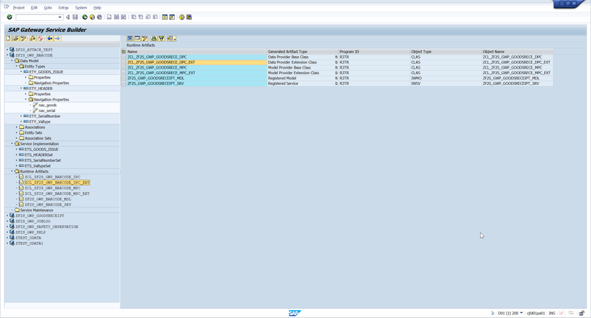

Goods Issue vs. Goods Receipt in sap

In SAP, Goods Issue (GI) and Goods Receipt (GR) are two fundamental inventory movements that serve opposite purposes in the supply chain.

 Here's a clear breakdown:

📦 Goods Receipt (GR)
Definition: Inbound movement of goods into the warehouse or plant.

Purpose: Increases stock levels.

Common Scenarios:

Receiving materials from a vendor (linked to a Purchase Order).

Receiving finished goods from production (linked to a Production Order).

SAP Movement Type: Typically 101.

Impact:

Updates inventory quantities.

Triggers accounting entries (e.g., inventory valuation).

May initiate quality inspection or putaway processes.

🚚 Goods Issue (GI)
Definition: Outbound movement of goods from the warehouse or plant.

Purpose: Decreases stock levels.

Common Scenarios:

Delivering goods to a customer (linked to a Sales Order).

Issuing materials to production (linked to a Production Order).

Transferring stock to another location or cost center.

SAP Movement Type: Typically 261 (for production), 601 (for delivery).

Impact:

Reduces inventory.

Posts cost of goods sold or internal consumption.

May trigger delivery or billing processes.

🔁 Key Differences
Feature	  -   Goods Receipt (GR)	- Goods Issue (GI)  
 Direction 	-   Inbound (into inventory) -	Outbound (from inventory)  
Stock Effect	-  Increases inventory -	Decreases inventory  
Typical Reference	- Purchase Order, Production Order	  -  Sales Order, Cost Center, Project  
 Movement Type	101, 103, 105	   -   261, 601, 201  
  Financial Impact - 	Adds to asset value	- Posts expense or revenue. 

Material in SAP :

In SAP, a Material refers to anything that a company procures, produces, stores, or sells. It could be raw materials, semi-finished goods, finished products, packaging, or even services.

Every material is represented by a Material Master Record, which is the central source of truth for all modules – MM, SD, PP, WM/EWM, and FI/CO.

🏷️ Material Master in SAP
The Material Master integrates information across modules so that procurement, sales, production, storage, and finance all run on the same data.

 Structure or views of Material Master Data

Material Master is divided into views:
Basic Data → Description, unit, dimensions
Purchasing → Vendor, order unit, procurement data
Sales → Sales org, tax, distribution channel
Accounting → Valuation, G/L accounts
MRP → Reorder point, lot size, planning data
Warehouse/Storage → Storage conditions, bin info
Work Scheduling → Production-related info

 Material Types in SAP
Some common material types include:
ROH → Raw Materials
FERT → Finished Goods
HALB → Semi-Finished Goods
NLAG → Non-stock Materials
VERP → Packaging Material
SERV → Services

These types define number ranges, views, and control fields.

🛠️ Material Lifecycle
MM01 → Create Material
MM02 → Change Material
MM03 → Display Material

Materials flow through procurement (PO, GR, Invoice), sales (Order, Delivery, Billing), production (BOM, Routing), and valuation (Accounting, Inventory).

Why is Material Master Important?
-One single source of truth
-Eliminates duplication & errors
-Seamless integration across modules
-Backbone of logistics in SAP

 Real-World Example

Imagine a mobile phone company:
Raw materials (ROH) → Glass, metals, plastic
Semi-finished goods (HALB) → Circuit boards, display units
Finished goods (FERT) → The mobile phone itself
Packaging materials (VERP) → Boxes, covers
Services (SERV) → Repair, maintenance contracts

All these are defined as Materials in SAP, each with its own views and lifecycle, ensuring every department (procurement, production, sales, accounting) works seamlessly on one single source of truth.

### GI app

The SAP goods issue process involves recording the removal of materials from inventory, which reduces stock levels and creates both a material and an accounting document. A common method is using transaction code MIGO for unplanned issues or posting goods issue on an outbound delivery document for planned issues, such as shipping to a customer. The process can involve various scenarios, like issuing to a production order (movement type 261), a cost center (movement type 201), or for a stock transfer. 

#### Key steps and scenarios
Create document: This can be an outbound delivery for a customer order or a reservation for an internal consumption like a production order.  
Picking: The physical picking of the goods occurs based on the document. In more advanced systems like SAP EWM, this involves creating a warehouse task. 
Goods Issue posting: A material document is created to confirm the removal of goods from the warehouse, which can be done in the MIGO transaction for unplanned issues or directly on the delivery document.
Financial posting: The system automatically posts financial transactions to reflect the reduction in inventory value. 
##### Stock reduction:
 The physical inventory is reduced in the system, and the goods are now considered "out of stock" from the originating warehouse.  
Example: Goods issue to a production order  
##### Create a production order:
 In the Production Planning (PP) module, create a production order to manufacture a product. The system automatically reserves the raw materials needed for the order.  
Go to MIGO: Enter transaction code MIGO in the SAP system. 
Select action: Choose "Goods Issue" and "Production Order" as the reference document. 
Enter details: Enter the production order number. 
Post the goods issue: Press Enter and then "Save" or "Post" to confirm the goods issue. The system will create a material document and reduce the stock of the raw materials in the warehouse. 

The SAP goods issue process involves removing materials from inventory for a specific purpose, like a sales order, production order, or cost center. The process can be initiated through a transaction code like MIGO or VL02N, and often references a preceding document, such as an outbound delivery or production order. This posting decreases stock, updates reservations, and generates a material document that reflects the consumption. 

#### Key steps in the goods issue process

Trigger the process: Start the goods issue from a reference document (like an outbound delivery or production order) using the appropriate transaction code.  
For sales orders: Use transaction VL02N to post goods issue from an outbound delivery. 
For production orders: Use MIGO or MB1A with movement type 261.  
For cost centers/projects: Use MIGO with movement type 201.  
Enter reference document: If a reference document exists, enter the order or reservation number. This is crucial because the system will then suggest the components and quantities, which simplifies data entry and ensures accuracy. 
Enter quantities: The system will likely propose the full quantity required by the reference document. You can then enter the actual quantities being issued. 
Post the goods issue: Execute the posting. This will trigger various subsequent actions.  

### Example: Goods issue for a production order
Let's say you need to issue raw materials to a production order.  
Start in SAP: Open transaction MIGO.  
Select action: Choose Goods Issue and Goods and Services Movement.  
Enter reference: Enter the production order number in the relevant field. Press To Order to have the system propose the components from the production order. 
Enter quantities: The system will display the components with their required quantities. Enter the actual quantity of the material you are issuing from the warehouse. For example, if the order requires 10 units of "Raw Material X" and you are issuing 10, enter 10 in the "Quantity" field for "Raw Material X".  
Post: Click the Post button. This will:  
Decrease the stock of "Raw Material X".  
Update the production order and reduce the reservation quantity. 
Generate a material document that you can use to track the movement.  

/IWBEP/IF_MGW_APPL_SRV_RUNTIME~CREATE_DEEP_ENTITY	Instance Method	Public	                               	Execute a deep insert CREATE request (CreateRUD)

  METHOD /iwbep/if_mgw_appl_srv_runtime~create_deep_entity.
*----------------------------------------------------------------------*
*  Object Name         : CREATE_DEEP_ENTITY
*  Description         : Method to create movement order in S/4 system
*  Created By          : 
*  Created On          : 26-Nov-2018
*  Version             : S/4 HANA 1709
*  Purpose             : Odata method to create movement order in backend system
*  Project Name        : CJE
*  RICEFW              : F2SE029
*  Business Contact    : 
*  Transport Request   : DEV_F2SE029_OR-IM Barcode Enabled Goods Issue
*  Misc Notes          : NA
*----------------------------------------------------------------------*
*  Object Name         : CREATE_DEEP_ENTITY
*  Description         : Method to create movement order in S/4 system
*  Changed By          : 
*  Changed On          : 12-March-2019
*  Version             : S/4 HANA 1709
*  Purpose             : Include Serialization changes
*  Project Name        : CJE
*  RICEFW              : F2SE029
*  Business Contact    : 
*  Transport Request   : D01K902925
*  Misc Notes          : NA
*  Change Number       : 588958
*----------------------------------------------------------------------*

**Data declaration for item and serial data
    TYPES: ty_t_goods_issue  TYPE STANDARD TABLE OF zcl_zf2s_gwp_barcode_mpc=>ts_ety_goods_issue WITH DEFAULT KEY,
           ty_t_serialnumber TYPE STANDARD TABLE OF zcl_zf2s_gwp_barcode_mpc=>ts_ety_serialnumber WITH DEFAULT KEY.

**Deep Structure for header, item and serial data
    TYPES: BEGIN OF ty_deep_entity.
        INCLUDE TYPE zcl_zf2s_gwp_barcode_mpc=>ts_ety_header.
    TYPES: nav_goods  TYPE ty_t_goods_issue,
           nav_serial TYPE ty_t_serialnumber,
           END OF ty_deep_entity.

**Local constant declaration
    CONSTANTS: lc_code  TYPE bapi2017_gm_code VALUE '03',
               lc_check TYPE char1 VALUE 'X',
               lc_error TYPE char1 VALUE 'E'.

    DATA: lwa_finaldata        TYPE ty_deep_entity,
          lwa_item             TYPE bapi2017_gm_item_create,
          lwa_serial           TYPE bapi2017_gm_serialnumber,
          lit_item             TYPE STANDARD TABLE OF bapi2017_gm_item_create,
          lit_serial           TYPE STANDARD TABLE OF bapi2017_gm_serialnumber,
          lwa_nav_goods        TYPE  zmatdoc,
          lwa_nav_serial       TYPE  zmatdoc,
          lwa_head             TYPE bapi2017_gm_head_01,
          lv_doc_no            TYPE bapi2017_gm_head_ret-mat_doc,         " Material Document No.
          lit_bapiret2         TYPE STANDARD TABLE OF bapiret2,
          lv_spclstock         TYPE sobkz,
          lv_movementtype      TYPE bwart,
          lwa_bapiret2         TYPE bapiret2,
          lv_message           TYPE bapi_msg,
          lo_message_container TYPE REF TO /iwbep/if_message_container,
          lv_movement          TYPE mblnr,
          lv_date              TYPE char2,
          lv_month             TYPE char2,
          lv_year              TYPE char4,
          lv_itemno            TYPE numc3,
          lv_counter           TYPE numc4.

    TYPES: BEGIN OF ty_fi_indicator,
             matnr TYPE matnr,
             bdmng TYPE bdmng,
             rsnum TYPE rsnum,
             rspos TYPE rspos,
           END OF ty_fi_indicator.

DATA : lit_fi_indicator TYPE TABLE OF ty_fi_indicator,
           lwa_fi_indicator TYPE ty_fi_indicator.

**Read data sent from UI
    io_data_provider->read_entry_data( IMPORTING es_data = lwa_finaldata ).

**Get required quantity for all materials based on order number
    SELECT matnr bdmng rsnum rspos INTO TABLE lit_fi_indicator
                       FROM resb
                       WHERE aufnr = lwa_finaldata-zorder_no.
    IF sy-subrc = 0.
    ENDIF.
    lv_spclstock = lwa_finaldata-zsobkz.
    lv_movementtype = lwa_finaldata-zbwart.
**Pass all item data sent from UI into local internal table
    LOOP AT lwa_finaldata-nav_goods INTO lwa_nav_goods.
      lwa_item-s_ord_item = lwa_nav_goods-zzeile.
      lwa_item-material = lwa_nav_goods-zmatnr.
      lwa_item-entry_qnt = lwa_nav_goods-zerfmg.
      lwa_item-entry_uom = lwa_nav_goods-zerfme.
      lwa_item-plant = lwa_nav_goods-zwerks.
      lwa_item-stge_loc = lwa_nav_goods-zlgort.
      lwa_item-val_type = lwa_nav_goods-zlbbsa.
      lwa_item-spec_stock = lv_spclstock.
      lwa_item-move_type = lv_movementtype.
      lwa_item-orderid = lwa_nav_goods-zorder_no.

**If Final Issue Indicator is checked ( Complete GI ), pass its value to backend.
      IF lit_fi_indicator IS NOT INITIAL.
**Comment added as part of review process
        READ TABLE lit_fi_indicator INTO lwa_fi_indicator WITH KEY matnr = lwa_nav_goods-zmatnr."No binary search needed due to less entries.
        lwa_item-reserv_no = lwa_fi_indicator-rsnum.
        lwa_item-res_item  = lwa_fi_indicator-rspos.
        IF lwa_nav_goods-zkzear IS INITIAL.
          IF lwa_nav_goods-zerfmg >= lwa_fi_indicator-bdmng.
            lwa_item-withdrawn = lc_check.
          ENDIF.
        ELSE.
          lwa_item-withdrawn = lwa_nav_goods-zkzear.
        ENDIF.
      ENDIF.

      IF lwa_nav_goods-zcheck IS NOT INITIAL.
        APPEND lwa_item TO lit_item.
      ENDIF.
      CLEAR: lwa_nav_goods,
             lwa_item,
             lwa_fi_indicator.
    ENDLOOP.
*** Start of change for Serial number change : CR 588958
**Read serial number data sent for serialized materials from UI
    LOOP AT lwa_finaldata-nav_serial INTO lwa_nav_serial.
**Comment added as part of review process
      READ TABLE lit_item INTO lwa_item WITH KEY material = lwa_nav_serial-zmatnr. "Binary search not needed as there will be less entries
      IF sy-subrc = 0.
        IF lwa_nav_serial-zqtychange NE lc_check.
          IF lwa_nav_serial-zzeile NE lv_itemno.
            lv_itemno = lwa_nav_serial-zzeile.
            lv_counter = lv_counter + 1.
          ENDIF.

          lwa_serial-matdoc_itm = lv_counter.
          lwa_serial-serialno = lwa_nav_serial-zserialnumber.

          APPEND lwa_serial TO lit_serial.
        ENDIF.
      ENDIF.
      CLEAR: lwa_nav_serial,
             lwa_serial,
             lwa_item.
    ENDLOOP.
*** End of change for Serial number change : CR 588958

**Pass UI Header data into local header structure
    lwa_head-pstng_date = lwa_finaldata-zbudat.
    lwa_head-doc_date = lwa_finaldata-zbldat.
    lwa_head-header_txt    = lwa_finaldata-zbktxt.
    lwa_head-pr_uname      = sy-uname.
    lwa_head-ref_doc_no_long = lwa_finaldata-zmtsnr.

    IF lwa_head-pstng_date IS NOT INITIAL AND lwa_head-doc_date IS NOT INITIAL.

      lv_year = lwa_head-pstng_date+4(4).
      lv_month = lwa_head-pstng_date+0(2).
      lv_date = lwa_head-pstng_date+2(2).
      CONCATENATE   lv_year lv_month lv_date INTO lwa_head-pstng_date.

      CLEAR : lv_year , lv_month , lv_date.

      lv_year = lwa_head-doc_date+4(4).
      lv_month = lwa_head-doc_date+0(2).
      lv_date = lwa_head-doc_date+2(2).
      CONCATENATE   lv_year lv_month lv_date INTO lwa_head-doc_date.

      IF sy-subrc = 0.
***Call BAPI to do the document posting and create a Material Document Number
        REFRESH lit_bapiret2.
        CALL FUNCTION 'BAPI_GOODSMVT_CREATE'
          EXPORTING
            goodsmvt_header       = lwa_head
            goodsmvt_code         = lc_code
          IMPORTING
            materialdocument      = lv_doc_no
          TABLES
            goodsmvt_item         = lit_item
            goodsmvt_serialnumber = lit_serial
            return                = lit_bapiret2.

        IF lv_doc_no IS NOT INITIAL.

          CALL FUNCTION 'BAPI_TRANSACTION_COMMIT'
            EXPORTING
              wait = abap_true.
        ENDIF.

        lwa_finaldata-zmblnr = lv_doc_no. "Material document Number

        IF lv_doc_no IS  INITIAL.

** Read BAPI return table for any BAPI error's
**Comment added as part of review process
          READ TABLE lit_bapiret2 INTO lwa_bapiret2  WITH KEY type = lc_error."Binary search not needed due to less entries
          IF sy-subrc = 0.
            lwa_finaldata-zerror = lwa_bapiret2-message.
            copy_data_to_ref( EXPORTING is_data = lwa_finaldata
                                  CHANGING  cr_data = er_deep_entity ).
          ENDIF.

        ELSEIF lv_doc_no IS NOT INITIAL.
**Success Message passed to UI when successful posting is done
          CONCATENATE lwa_finaldata-zmblnr TEXT-001 INTO lv_message SEPARATED BY space.
          lwa_finaldata-zsuccess = lv_message.
          copy_data_to_ref( EXPORTING is_data = lwa_finaldata
                               CHANGING  cr_data = er_deep_entity ).

        ELSEIF lv_doc_no IS INITIAL AND lit_bapiret2 IS INITIAL.
** When Material document not generated and BAPI return table doesnt have any
** error messages , pass custom error message to UI.
          lwa_finaldata-zerror = TEXT-003.
          copy_data_to_ref( EXPORTING is_data = lwa_finaldata
                               CHANGING  cr_data = er_deep_entity ).

        ENDIF.

      ELSE.
**Error message passed to UI when date fields are blank
        lv_message = TEXT-002.
        lwa_finaldata-zerror = lv_message.
        copy_data_to_ref( EXPORTING is_data = lwa_finaldata
                       CHANGING  cr_data = er_deep_entity ).
      ENDIF.
    ENDIF.

REFRESH : lit_bapiret2 , lit_item , lit_serial.
  ENDMETHOD.

ETS_GOODS_ISSUE_GET_ENTITYSET	Instance Method	Protected	                               	Related EntitySet Name: ETS_GOODS_ISSUE

  METHOD ets_goods_issue_get_entityset.
*----------------------------------------------------------------------*
*  Object Name         : ETS_GOODS_ISSUE_GET_ENTITYSET
*  Description         : Method to read data from S/4 system
*  Created By          : Shallu Chhabra
*  Created On          : 26-Nov-2018
*  Version             : S/4 HANA 1709
*  Purpose             : Odata method to read data from backend system
*  Project Name        : CJE
*  RICEFW              : F2SE029
*  Business Contact    : 
*  Transport Request   : DEV_F2SE029_OR-IM Barcode Enabled Goods Issue
*  Misc Notes          : NA
*----------------------------------------------------------------------*
*  Object Name         : ETS_GOODS_ISSUE_GET_ENTITYSET
*  Description         : Method to read data from S/4 system
*  Changed By          : Shallu Chhabra
*  Changed On          : 12-March-2019
*  Version             : S/4 HANA 1709
*  Purpose             : Include Serialization changes
*  Project Name        : CJE
*  RICEFW              : F2SE029
*  Business Contact    : 
*  Transport Request   : D01K902925
*  Misc Notes          : NA
*  Change Number       : 588958
*----------------------------------------------------------------------*

**Local constant declaration
    CONSTANTS: lc_orderobject TYPE bapi_pp_order_objects VALUE 'XXXXXXXX',
               lc_order       TYPE string VALUE 'ZorderNo',
               lc_error       TYPE char10 VALUE 'Error',
               lc_closed      TYPE char5 VALUE 'I0046',
               lc_delet       TYPE char5 VALUE 'I0076',
               lc_deletflag   TYPE char5 VALUE 'I0013',
               lc_locked      TYPE char5 VALUE 'I0043',
               lc_techcmplt   TYPE char5 VALUE 'I0045',
               lc_released    TYPE char5 VALUE 'I0002',
               lc_bwtty       TYPE char1 VALUE 'Z',
               lc_check       TYPE char1 VALUE 'X',
               lc_checkneg    TYPE char1 VALUE '-',
**Code change start for Review Process
               lc_space       TYPE char1 VALUE ' '.
**Code change end for Review Process

    TYPES : BEGIN OF tt_valcat ,
              matnr TYPE matnr,
              bwtty TYPE bwtty_d,
              bwtar TYPE bwtar_d,
              plant TYPE bwkey,
            END OF tt_valcat,

            BEGIN OF tt_material,
              matnr TYPE matnr,
              bwkey TYPE bwkey,
            END OF tt_material,

            BEGIN OF tt_stoloc,
              plant TYPE werks_d,
              lgort TYPE lgort_d,
              lgobe type lgobe, " added to be in Sync with E028 Storage Location Changes
            END OF tt_stoloc,

            BEGIN OF tt_storageloc,
              lgort TYPE lgort_d,
              plant TYPE werks_d,
              lgobe TYPE lgobe, " added to be in Sync with E028 Storage Location Changes
            END OF tt_storageloc,

            BEGIN OF tt_serialcheck,
              matnr  TYPE matnr,
              plant  TYPE werks_d,
              serial TYPE serail,
            END OF tt_serialcheck.

    DATA : lv_temp                   TYPE aufnr,
           lv_order                  TYPE aufnr,
           lv_aufnr                  TYPE aufnr,
           lwa_keytab                TYPE /iwbep/s_mgw_name_value_pair,
           lit_position              TYPE TABLE OF bapi_order_item,
           lit_header                TYPE TABLE OF bapi_order_header1,
           lit_sequence              TYPE TABLE OF bapi_order_sequence,
           lit_component             TYPE TABLE OF bapi_order_component,
           lit_component_temp        TYPE TABLE OF bapi_order_component,
           lit_component_alm         TYPE TABLE OF bapi_alm_order_component_e,
           lit_component_alm_temp    TYPE TABLE OF bapi_alm_order_component_e,
           lwa_component             TYPE bapi_order_component,
           lwa_component_alm         TYPE bapi_alm_order_component_e,
           lwa_entityset             TYPE zmatdoc,
           lwa_filter_select_options TYPE /iwbep/s_mgw_select_option,
           lwa_select_options        TYPE /iwbep/s_cod_select_option,
           lit_return                TYPE TABLE OF bapiret2,
           lv_message                TYPE string,
           lv_objnr                  TYPE j_objnr,
           lv_stat                   TYPE j_status,
           lwa_header                TYPE ihttpnvp,
           lit_valcat                TYPE TABLE OF tt_valcat,
           lwa_valcat                TYPE tt_valcat,
           lit_valtype               TYPE TABLE OF tt_valcat,
           lwa_valtype               TYPE tt_valcat,
           lit_material              TYPE TABLE OF tt_material,
           lwa_material              TYPE tt_material,
           lit_stoloc                TYPE TABLE OF tt_stoloc,
           lwa_stoloc                TYPE tt_stoloc,
           lit_storageloc            TYPE TABLE OF tt_storageloc,
           lwa_storageloc            TYPE tt_storageloc,
           lv_storageloc             TYPE string,
           lit_serialcheck           TYPE TABLE OF tt_serialcheck,
           lwa_serialcheck           TYPE tt_serialcheck,
           lv_fi                     TYPE kzear,
           lv_valtype                TYPE string.

**Read data sent from UI (Order Number)
    IF NOT it_filter_select_options[] IS INITIAL.
      READ TABLE it_filter_select_options INTO lwa_filter_select_options WITH KEY property = lc_order."Binary search not needed due to less entries
      IF sy-subrc = 0.
        IF lwa_filter_select_options-select_options IS NOT INITIAL.
          READ TABLE lwa_filter_select_options-select_options INTO lwa_select_options INDEX 1."Binary search not needed due to less entries
          IF sy-subrc = 0.
            lv_temp = lwa_select_options-low.
          ENDIF.
        ENDIF.
      ENDIF.
    ENDIF.

**When reservation number is passed from UI , get order number first then proceed.
    SELECT SINGLE aufnr FROM resb
                        INTO lv_aufnr
                        WHERE rsnum = lv_temp.
    IF lv_aufnr IS NOT INITIAL.
      lv_temp = lv_aufnr.
    ENDIF.

    CALL FUNCTION 'CONVERSION_EXIT_ALPHA_INPUT'
      EXPORTING
        input  = lv_temp
      IMPORTING
        output = lv_order.

    SELECT SINGLE objnr FROM aufk
                        INTO lv_objnr
                        WHERE aufnr = lv_order.

**Check Order Status in the system for validation order status.
    IF lv_objnr IS NOT INITIAL.
      SELECT stat FROM jest
                         INTO TABLE @DATA(lit_stat)
                         WHERE objnr = @lv_objnr
**Code change start for Review Process : Removing hardcode
*                         AND   inact = ' '.
                         AND   inact = @lc_space.
**Code change end for Review Process
      IF sy-subrc EQ 0.
        SORT lit_stat.
      ENDIF.
    ENDIF.
    IF lit_stat IS NOT INITIAL.
      READ TABLE lit_stat ASSIGNING FIELD-SYMBOL(<fs_stat>)
        WITH KEY stat = lc_closed.
      IF sy-subrc EQ 0.
        CONCATENATE TEXT-010 lv_order TEXT-011 INTO lv_message SEPARATED BY space. "Message thrown when order is in closed status
      ELSE.
        READ TABLE lit_stat ASSIGNING <fs_stat>
        WITH KEY stat = lc_deletflag.
        IF sy-subrc EQ 0.
          CONCATENATE TEXT-006 lv_order TEXT-007 INTO lv_message SEPARATED BY space." Message thrown when order is deleted
        ELSE.
          READ TABLE lit_stat ASSIGNING <fs_stat>
          WITH KEY stat = lc_techcmplt.
          IF sy-subrc EQ 0.
            CONCATENATE TEXT-008 lv_order TEXT-009 INTO lv_message SEPARATED BY space."Message thrown when order is completed
          ELSE.
            READ TABLE lit_stat ASSIGNING <fs_stat>
            WITH KEY stat = lc_locked.
            IF sy-subrc EQ 0.
              CONCATENATE TEXT-010 lv_order TEXT-011 INTO lv_message SEPARATED BY space."Message thrown when order is locked.
            ELSE.
              READ TABLE lit_stat ASSIGNING <fs_stat>
              WITH KEY stat = lc_delet.
              IF sy-subrc EQ 0.
                CONCATENATE TEXT-006  lv_order TEXT-007  INTO lv_message SEPARATED BY space."Message thrown when order is deleted

ELSE.
                READ TABLE lit_stat ASSIGNING <fs_stat>
                WITH KEY stat = lc_released.
                IF sy-subrc NE 0.
**Code change start for Review Process : Removing Hard Code
*                  CONCATENATE TEXT-010 ' ' lv_order ' ' TEXT-011 INTO lv_message SEPARATED BY space.
                   CONCATENATE TEXT-010 lc_space lv_order lc_space TEXT-011 INTO lv_message SEPARATED BY space.
**Code change end for Review Process : Removing Hard Code
                ENDIF.
              ENDIF.
            ENDIF.
          ENDIF.
        ENDIF.
      ENDIF.
    ENDIF.

**Pass the message back to UI
    IF lv_message IS NOT INITIAL.
      lwa_header-name            = lc_error.
      lwa_header-value           = lv_message.
      /iwbep/if_mgw_conv_srv_runtime~set_header( lwa_header ).

    ELSE.

** Call BAPI to get order detail based on order number
      CALL FUNCTION 'BAPI_PRODORD_GET_DETAIL'
        EXPORTING
          number        = lv_order
          order_objects = lc_orderobject
        TABLES
          component     = lit_component.

      IF lit_component IS NOT INITIAL.
***Code change start for Storage location F4 help : CR 588958
        lit_component_temp = lit_component.
        SORT lit_component_temp BY prod_plant.
        DELETE ADJACENT DUPLICATES FROM lit_component_temp COMPARING prod_plant.

        SELECT werks lgort lgobe FROM t001l INTO TABLE lit_stoloc
          FOR ALL ENTRIES IN lit_component_temp
          WHERE werks = lit_component_temp-prod_plant.
        IF sy-subrc = 0.
          SORT lit_stoloc BY plant lgort.
        ENDIF.

***Code change end for Storage location F4 help : CR 588958

        LOOP AT lit_component INTO lwa_component.
          lwa_material-matnr = lwa_component-material.
          lwa_material-bwkey = lwa_component-prod_plant.
          APPEND lwa_material TO lit_material.
          CLEAR: lwa_component ,
                 lwa_material.
        ENDLOOP.

**Get valuation category based on material
        SELECT matnr bwtty bwtar bwkey FROM mbew  INTO TABLE lit_valcat
                            FOR ALL ENTRIES IN lit_material
                            WHERE matnr = lit_material-matnr
                            AND   bwkey = lit_material-bwkey.
        IF sy-subrc = 0.
          SORT lit_valcat BY matnr plant.
        ENDIF.

*** Code change start for Serial number field enable/disable : CR 588958

        SELECT matnr werks sernp FROM marc INTO TABLE lit_serialcheck
                            FOR ALL ENTRIES IN lit_material
                            WHERE matnr = lit_material-matnr.
        IF sy-subrc = 0.
          SORT lit_serialcheck BY matnr plant.
        ENDIF.

*** Code change end for Serial number field enable/disable : CR 588958

***Code change start for FI indicator- qty field should be blank when FI is checked: CR 588958

        SELECT aufnr, kzear, matnr FROM resb
                                 INTO TABLE @DATA(lit_fi)
                                 FOR ALL ENTRIES IN @lit_component
                                 WHERE rsnum = @lit_component-reservation_number
                                  AND    aufnr = @lit_component-order_number.

        IF sy-subrc = 0.
          SORT lit_fi BY matnr.
        ENDIF.
***Code change end for FI indicator-qty field should be blank when FI is checked: CR 588958

**Pass item details to structure which will be passed to UI
        LOOP AT lit_component INTO lwa_component.
          lwa_entityset-zorder_no = lwa_component-order_number.
          lwa_entityset-zmatnr = lwa_component-material.
          lwa_entityset-zzeile = lwa_component-item_number.
          IF lwa_component-withdrawn_quantity IS INITIAL.
            lwa_entityset-zerfmg = lwa_component-req_quan.
            lwa_entityset-zerfmg_final = lwa_component-req_quan.
          ELSE.
            lwa_entityset-zerfmg = lwa_component-req_quan - lwa_component-withdrawn_quantity.
            lwa_entityset-zerfmg_final = lwa_component-req_quan - lwa_component-withdrawn_quantity.
          ENDIF.

          lwa_entityset-zerfme = lwa_component-base_uom.
          lwa_entityset-zwerks = lwa_component-prod_plant.
          lwa_entityset-zlgort = lwa_component-storage_location.
          READ TABLE lit_valcat INTO lwa_valcat WITH KEY matnr = lwa_component-material
                                                         bwtty = lc_bwtty
                                                         BINARY SEARCH."Binary search added as part of Review Process
          IF sy-subrc = 0.
            lwa_entityset-zvalcatcheck = lc_check.
            LOOP AT lit_valcat INTO lwa_valcat WHERE matnr =   lwa_component-material
                                               AND   plant = lwa_component-prod_plant
                                               AND    bwtar IS NOT INITIAL.

              lwa_valtype-plant = lwa_valcat-plant.
              lwa_valtype-matnr = lwa_valcat-matnr.
              lwa_valtype-bwtar    = lwa_valcat-bwtar.
              lwa_valtype-bwtty = lwa_valcat-bwtty.
              APPEND lwa_valtype TO lit_valtype.
              CLEAR: lwa_valtype,
                    lwa_valcat.
            ENDLOOP.

***Convert the data into json format to pass it to UI for F4 help
            CALL METHOD cl_hress_odata_ui5_utils=>convert_table_to_json
              EXPORTING
                it_data = lit_valtype
              IMPORTING
                ev_json = lv_valtype.

            IF lv_valtype IS NOT INITIAL.
              lwa_entityset-zvaltype = lv_valtype.
            ENDIF.
            CLEAR lv_valtype.
            REFRESH: lit_valtype.
          ELSE.
            lwa_entityset-zvalcatcheck = lc_checkneg.
          ENDIF.
*** Code change start for serial number field enable/disable : CR 588958
          IF lit_serialcheck IS NOT INITIAL.
            READ TABLE lit_serialcheck INTO lwa_serialcheck WITH KEY matnr = lwa_component-material
                                                                     plant = lwa_component-prod_plant
                                                                     BINARY SEARCH.
            IF lwa_serialcheck-serial IS NOT INITIAL.
              lwa_entityset-zserialcheck = lc_check.
ELSE.
              lwa_entityset-zserialcheck = lc_checkneg.
            ENDIF.
          ENDIF.
*** Code change end for serial number field enable/disable : CR 588958

*** code change start for storage location : CR 588958
          LOOP AT lit_stoloc INTO lwa_stoloc WHERE plant = lwa_component-prod_plant.
            lwa_storageloc-lgort = lwa_stoloc-lgort.
            lwa_storageloc-plant = lwa_stoloc-plant.
            lwa_storageloc-lgobe = lwa_stoloc-lgobe. " added for, to be in Sync with E028 Storage loc changes
            APPEND lwa_storageloc TO lit_storageloc.
            CLEAR : lwa_stoloc,
                    lwa_storageloc.
          ENDLOOP.

***Convert the data into json format to pass it to UI for F4 help
          CALL METHOD cl_hress_odata_ui5_utils=>convert_table_to_json
            EXPORTING
              it_data = lit_storageloc
            IMPORTING
              ev_json = lv_storageloc.

          IF lv_storageloc IS NOT INITIAL.
            lwa_entityset-zstoloc = lv_storageloc.
          ENDIF.
*** code change end for storage location : CR 588958

          READ TABLE lit_fi INTO DATA(lwa_fi) WITH KEY matnr = lwa_component-material
                                              BINARY SEARCH.
          IF sy-subrc IS INITIAL.
            lv_fi = lwa_fi-kzear.
          ENDIF.

          IF lwa_entityset-zerfmg GT 0.
***code change start fi indicator qty blank : CR 588958
            IF lv_fi IS NOT INITIAL.
              lwa_entityset-zfichange = lc_check.
              CLEAR lwa_entityset-zerfmg .
              APPEND lwa_entityset TO et_entityset.
***code change end fi indicator qty blank : CR 588958
            ELSE.

              APPEND lwa_entityset TO et_entityset.
            ENDIF.
          ENDIF.
          CLEAR: lwa_entityset ,
                lwa_component,
                lwa_storageloc,
                lwa_stoloc,
                lwa_storageloc,
                lwa_fi,
                lv_fi,
                lv_storageloc.

          REFRESH : lit_storageloc.
        ENDLOOP.

      ELSE.

**It could be a Plant maintainance order
        CALL FUNCTION 'BAPI_ALM_ORDER_GET_DETAIL'
          EXPORTING
            number        = lv_order
          TABLES
            et_components = lit_component_alm
            return        = lit_return.

        IF lit_component_alm IS NOT INITIAL.
***Code change start for valuation type : CR 588958
          LOOP AT lit_component_alm INTO lwa_component_alm.
            lwa_material-matnr = lwa_component_alm-material.
            lwa_material-bwkey = lwa_component_alm-plant.
            APPEND lwa_material TO lit_material.
            CLEAR: lwa_component ,
                   lwa_material.
          ENDLOOP.

**Get valuation category based on material
          SELECT matnr bwtty bwtar bwkey FROM mbew  INTO TABLE lit_valcat
                              FOR ALL ENTRIES IN lit_material
                              WHERE matnr = lit_material-matnr
                            AND   bwkey = lit_material-bwkey.
          IF sy-subrc = 0.
            SORT lit_valcat BY matnr plant.
          ENDIF.
***Code change end for valuation type : CR 588958

***Code change start for Storage location F4 help : CR 588958
          lit_component_alm_temp = lit_component_alm.
          SORT lit_component_alm_temp BY plant.
          DELETE ADJACENT DUPLICATES FROM lit_component_alm_temp COMPARING plant.

          SELECT werks lgort lgobe FROM t001l INTO TABLE lit_stoloc
            FOR ALL ENTRIES IN lit_component_alm
            WHERE werks = lit_component_alm-plant.
          IF sy-subrc = 0.
            SORT lit_stoloc BY plant lgort.
          ENDIF.

***Code change end for Storage location F4 help : CR 588958

*** Code change start for Serial number field enable/disable : CR 588958

          SELECT matnr werks sernp FROM marc INTO TABLE lit_serialcheck
                              FOR ALL ENTRIES IN lit_material
                              WHERE matnr = lit_material-matnr.
          IF sy-subrc = 0.
            SORT lit_serialcheck BY matnr plant.
          ENDIF.

*** Code change end for Serial number field enable/disable : CR 588958

***Code change start for FI indicator- qty field should be blank when FI is checked: CR 588958

          SELECT aufnr, kzear, matnr FROM resb
                                   INTO TABLE @lit_fi
                                   FOR ALL ENTRIES IN @lit_component_alm
                                   WHERE rsnum = @lit_component_alm-reserv_no
                                    AND    aufnr = @lit_component_alm-orderid.

          IF sy-subrc = 0.
            SORT lit_fi BY matnr.
          ENDIF.
***Code change end for FI indicator-qty field should be blank when FI is checked: CR 588958

**Pass Item data to structure which will be passed to UI
          LOOP AT lit_component_alm INTO lwa_component_alm.
            lwa_entityset-zorder_no = lwa_component_alm-orderid.
            lwa_entityset-zmatnr = lwa_component_alm-material.
            lwa_entityset-zzeile = lwa_component_alm-item_number.
            IF lwa_component_alm-withd_quan IS INITIAL.
              lwa_entityset-zerfmg = lwa_component_alm-requirement_quantity.
            ELSE.
              lwa_entityset-zerfmg = lwa_component_alm-requirement_quantity - lwa_component_alm-withd_quan.
            ENDIF.
            lwa_entityset-zerfme = lwa_component_alm-requirement_quantity_unit.
            lwa_entityset-zwerks = lwa_component_alm-plant.
            lwa_entityset-zlgort = lwa_component_alm-stge_loc.

***Code change start for Valuation type : CR 588958
            READ TABLE lit_valcat INTO lwa_valcat WITH KEY matnr = lwa_component_alm-material
                                                           bwtty = lc_bwtty BINARY SEARCH. "Binary search added as part of Review Process
            IF sy-subrc = 0.
              lwa_entityset-zvalcatcheck = lc_check.
              LOOP AT lit_valcat INTO lwa_valcat WHERE matnr =   lwa_component-material
                                             AND   plant = lwa_component-prod_plant
                                             AND    bwtar IS NOT INITIAL.

                lwa_valtype-plant = lwa_valcat-plant.
                lwa_valtype-matnr = lwa_valcat-matnr.
                lwa_valtype-bwtar    = lwa_valcat-bwtar.
                lwa_valtype-bwtty = lwa_valcat-bwtty.
                APPEND lwa_valtype TO lit_valtype.
                CLEAR: lwa_valtype,
                      lwa_valcat.
              ENDLOOP.

***Convert the data into json format to pass it to UI for F4 help
              CALL METHOD cl_hress_odata_ui5_utils=>convert_table_to_json
                EXPORTING
                  it_data = lit_valtype
                IMPORTING
                  ev_json = lv_valtype.

              IF lv_valtype IS NOT INITIAL.
                lwa_entityset-zvaltype = lv_valtype.
              ENDIF.
              CLEAR lv_valtype.
              REFRESH: lit_valtype.

            ELSE.
              lwa_entityset-zvalcatcheck = lc_checkneg.
            ENDIF.
***Code change end for valuation type : CR 588958

*** Code change start for serial number field enable/disable : CR 588958
            IF lit_serialcheck IS NOT INITIAL.
              READ TABLE lit_serialcheck INTO lwa_serialcheck WITH KEY matnr = lwa_component_alm-material
                                                                       plant = lwa_component_alm-plant
                                                                       BINARY SEARCH.
              IF lwa_serialcheck-serial IS NOT INITIAL.
                lwa_entityset-zserialcheck = lc_check.
              ELSE.
                lwa_entityset-zserialcheck = lc_checkneg.
              ENDIF.
            ENDIF.
*** Code change end for serial number field enable/disable : CR 588958

*** code change start for storage location : CR 588958
            LOOP AT lit_stoloc INTO lwa_stoloc WHERE plant = lwa_component_alm-plant.
              lwa_storageloc-lgort = lwa_stoloc-lgort.
              lwa_storageloc-plant = lwa_stoloc-plant.
              lwa_storageloc-lgobe = lwa_stoloc-lgobe.
              APPEND lwa_storageloc TO lit_storageloc.
              CLEAR : lwa_stoloc,
                      lwa_storageloc.
            ENDLOOP.

***Convert the data into json format to pass it to UI for F4 help
            CALL METHOD cl_hress_odata_ui5_utils=>convert_table_to_json
              EXPORTING
                it_data = lit_storageloc
              IMPORTING
                ev_json = lv_storageloc.

            IF lv_storageloc IS NOT INITIAL.
              lwa_entityset-zstoloc = lv_storageloc.
            ENDIF.
*** code change end for storage location : CR 588958

            IF lwa_entityset-zerfmg GT 0.
***code change start fi indicator qty blank : CR 588958
              IF lv_fi IS NOT INITIAL.
                lwa_entityset-zfichange = lc_check.
                CLEAR lwa_entityset-zerfmg .
                APPEND lwa_entityset TO et_entityset.
***code change end fi indicator qty blank : CR 588958
              ELSE.
                APPEND lwa_entityset TO et_entityset.
              ENDIF.
            ENDIF.
            CLEAR: lwa_entityset ,
                  lwa_component.
          ENDLOOP.
        ENDIF.
      ENDIF.
    ENDIF.
  ENDMETHOD.

ETS_VALTYPESET_GET_ENTITYSET	Instance Method	Protected	                               	Related EntitySet Name: ETS_ValtypeSet

## GR App
https://fioriappslibrary.hana.ondemand.com/sap/fix/externalViewer/#/detail/Apps('F0843')/S23OP
