https://fioriappslibrary.hana.ondemand.com/sap/fix/externalViewer/#/detail/Apps('F0773')/S23OP

https://help.sap.com/docs/SAP_S4HANA_ON-PREMISE/3cb1182b4a184bdd93f8d62e3f1f0741/340f87546ccd9c62e10000000a445394.html?version=2021.002

Custom Fiori Tile is being created to provide additional fields into Clear Incoming Payments Fiori App. To achieve this need to enhance the OData service FAR_MANUAL_CLEARING and to add missing field ZZ1_XREF6_COB of corresponding structure FAC_S_ACCDOC_ITM_ODATA into FinsPostingAPARItem entity.

The OData service FAR_MANUAL_CLEARING is not done via SEGW project, but via /IWBEP/REG_SERVICE transaction. When trying to extend it with SEGW project, some entities/entity sets are being automatically disabled, when generating the project. Thus some functionality is broken.

Requirement :

We need to add the below additional selection parameters to the tile to fetch the new fields in the output report.
 Add Reference Key Fields (1, 2, 3, 6) to below section of Clear Incoming Payments screen. User will key data into these fields and on the new posted document these data fields would be populated.

 
 
AXX-200 testing screen shots :

Test 1

Test 2 - 

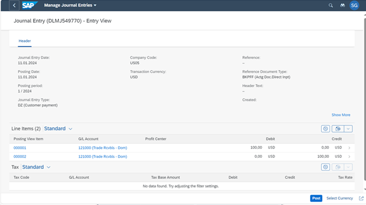

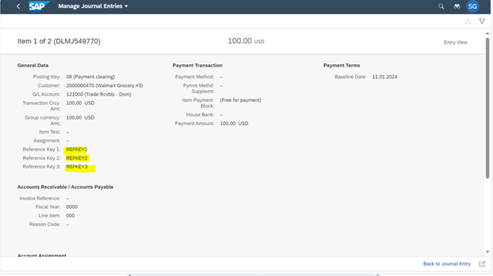

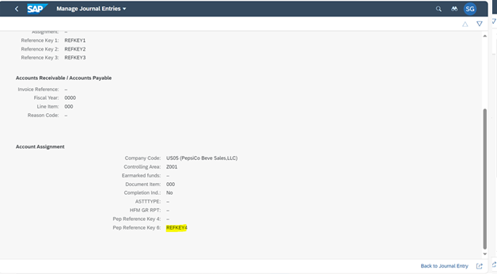

Journal posted successfully:

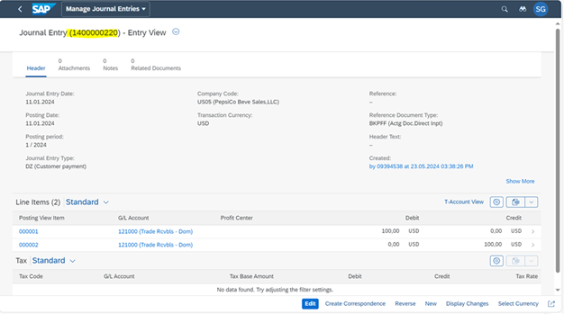

Journal posted successfully has the values for below reference key populated :

Tcode FB03 :

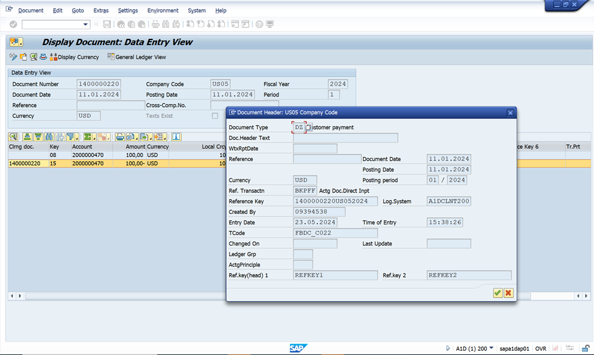

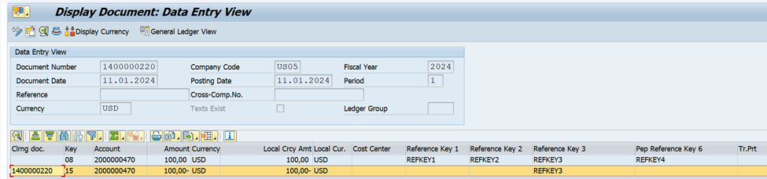

Test 3 :

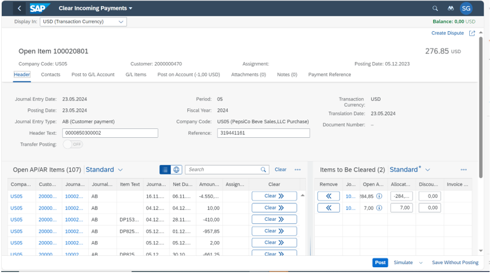
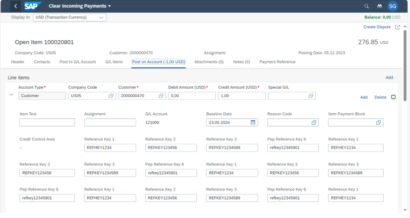

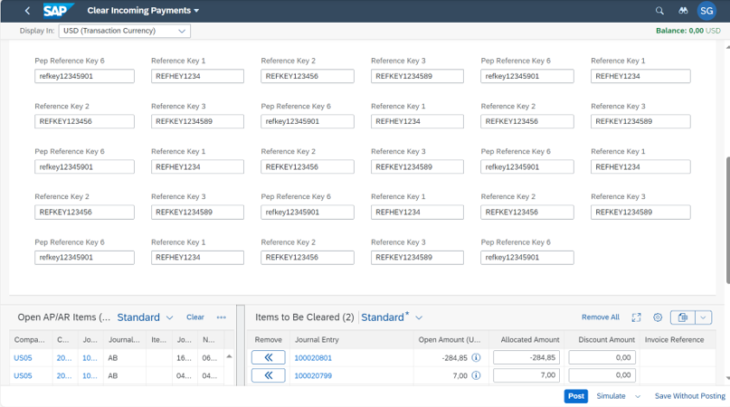

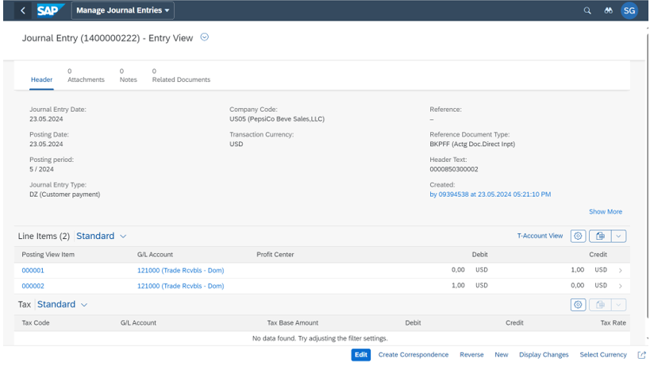

FB03 display journal to view the reference key value update :

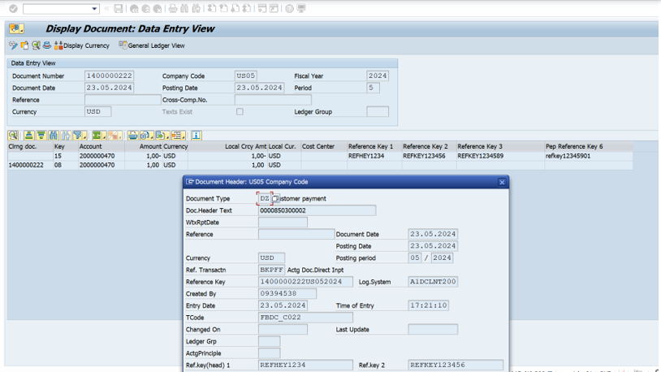

Extend the original OData Service FAR_MANUAL_CLEARING and add the necessary properties Zz1Xref6Cob, Zz1Xref6Cobf into the Entity FinsPostingAPARItem.

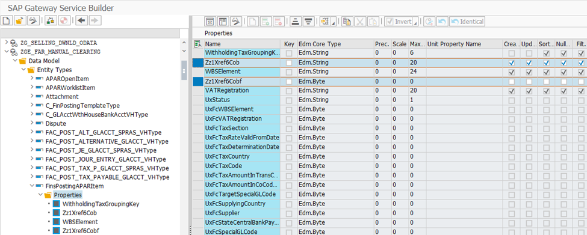

Remove ZGE_FAR_MANUAL_CLEARING project from SEGW. Delete classes ZGCL_GE_FAR_MANUAL_CLE_DPC_EXT
ZGCL_GE_FAR_MANUAL_CLE_MPC_EXT
ZGCL_GE_FAR_MANUAL_CLE_DPC
ZGCL_GE_FAR_MANUAL_CLE_MPC

Recreate class ZGCL_GE_FAR_MANUAL_CLE_DPC_EXT and put CL_FAR_MANUAL_CLEARING_DPC_EXT as superclass for it

Recreate class ZGCL_GE_FAR_MANUAL_CLE_MPC_EXT and put CL_FAR_MANUAL_CLEARING_MPC_EXT as superclass for it

Create new method CREATE_NEW_ARTIFACTS to add missing properties in metadata.

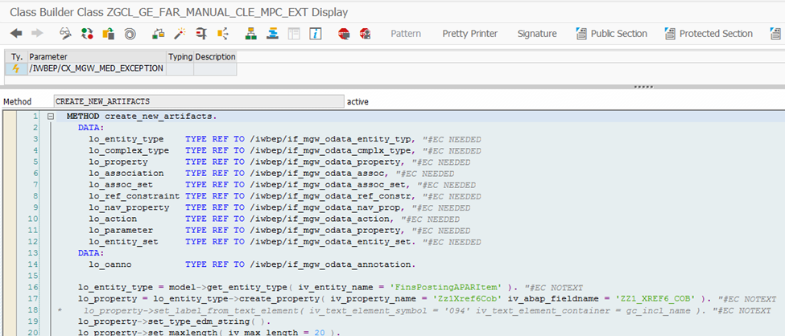

Redefine method DEFINE to call method CREATE_NEW_ARTIFACTS.
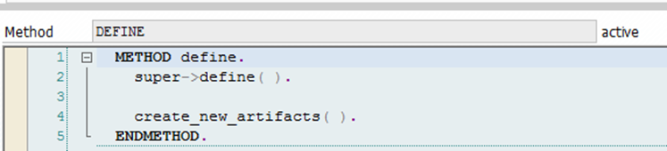

Run tcode /IWBEP/REG_SERVICE to ensure the config is done properly.

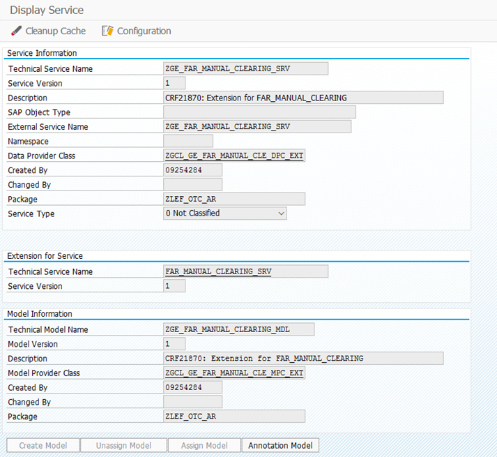

