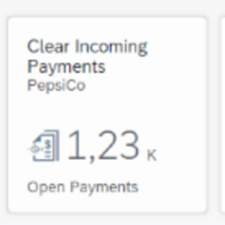
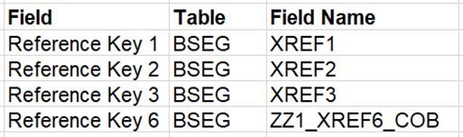
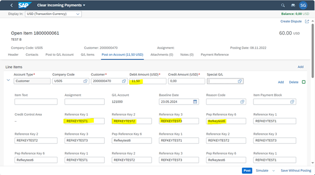
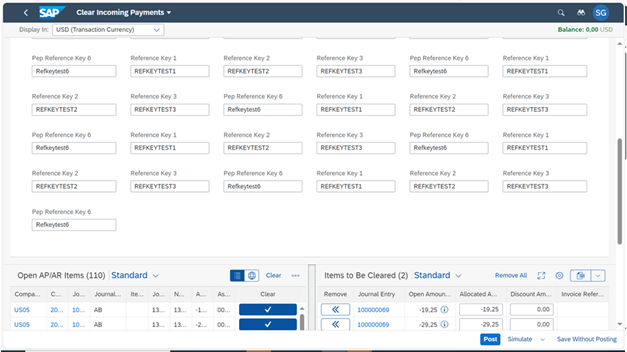
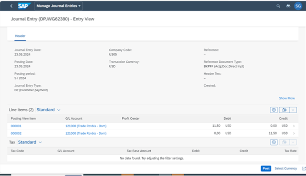
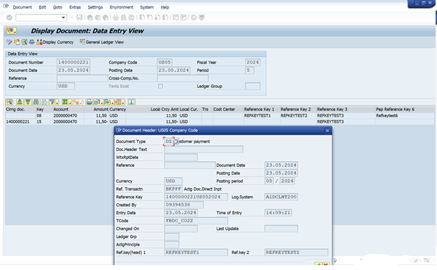
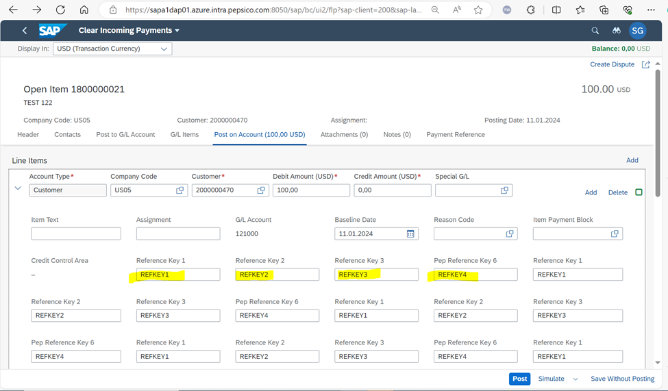

https://fioriappslibrary.hana.ondemand.com/sap/fix/externalViewer/#/detail/Apps('F0773')/S23OP

https://help.sap.com/docs/SAP_S4HANA_ON-PREMISE/3cb1182b4a184bdd93f8d62e3f1f0741/340f87546ccd9c62e10000000a445394.html?version=2021.002

Custom Fiori Tile is being created to provide additional fields into Clear Incoming Payments Fiori App. To achieve this need to enhance the OData service FAR_MANUAL_CLEARING and to add missing field ZZ1_XREF6_COB of corresponding structure FAC_S_ACCDOC_ITM_ODATA into FinsPostingAPARItem entity.

The OData service FAR_MANUAL_CLEARING is not done via SEGW project, but via /IWBEP/REG_SERVICE transaction. When trying to extend it with SEGW project, some entities/entity sets are being automatically disabled, when generating the project. Thus some functionality is broken.

Requirement :

We need to add the below additional selection parameters to the tile to fetch the new fields in the output report.
 Add Reference Key Fields (1, 2, 3, 6) to below section of Clear Incoming Payments screen. User will key data into these fields and on the new posted document these data fields would be populated.

 
 
AXX-200 testing screen shots :

Test 1

Test 2 - 

