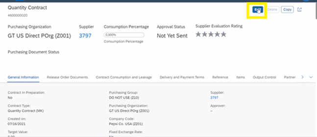
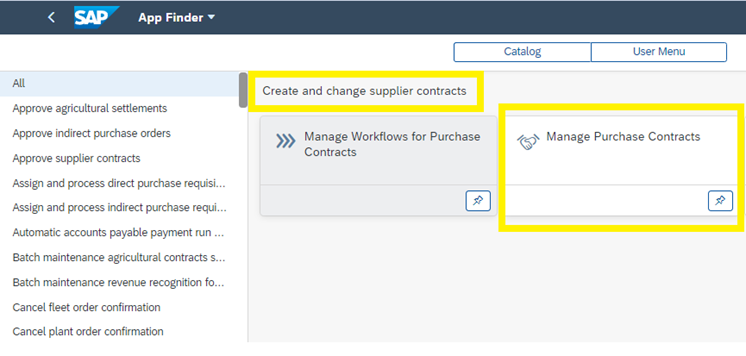
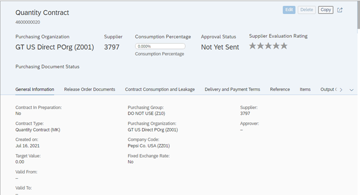
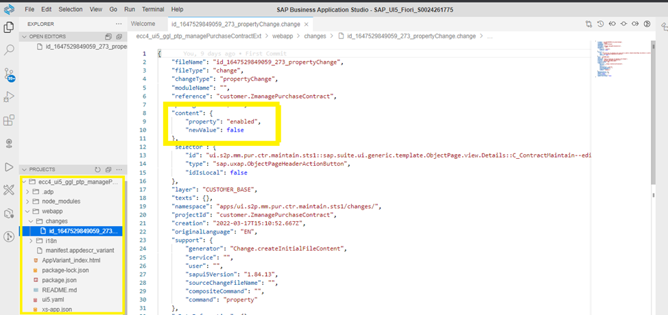
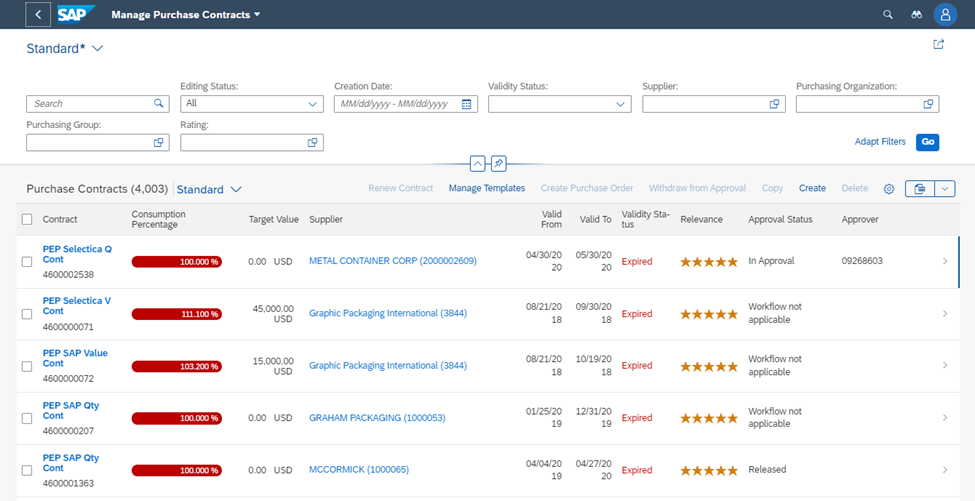
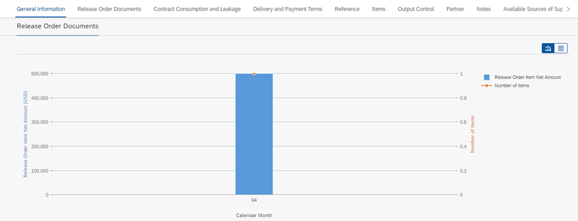
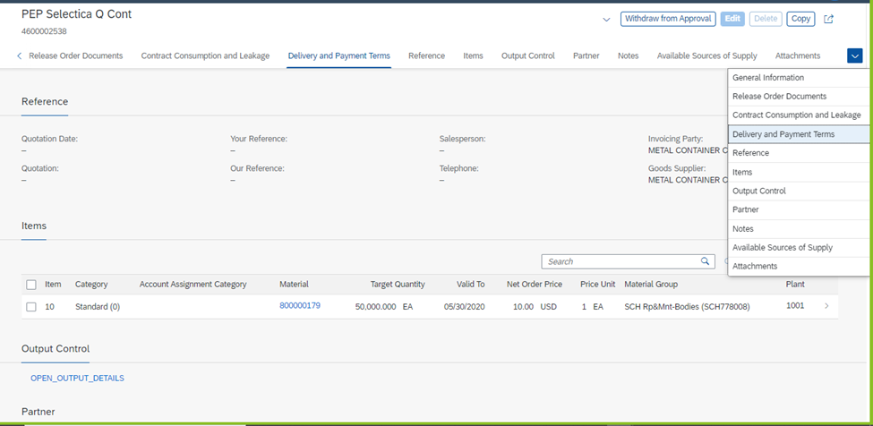
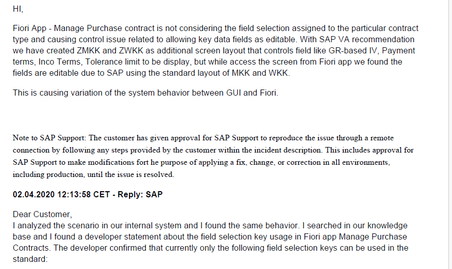
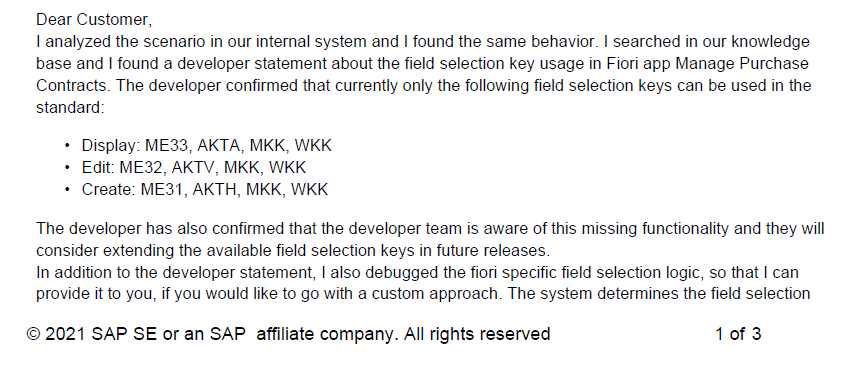
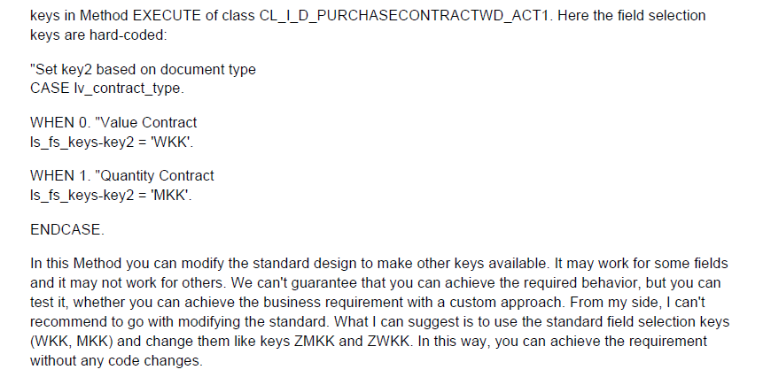

The business needs to use the manage purchase contract fiori app for contracts processing and administration. However global controls have flagged risks with the standard app provided by SAP. Key control fields such as Payment terms, tolerances etc. are open to the user for editing. The limitation of this app is that these fields cannot be amended to ‘display’ option via configuration.

The app was subsequently disabled for PGT. However due to changes introduced by the latest SAP upgrade, we have had to re-add the app  to PTP catalogue whilst putting some mitigating factors in place as an interim measure.

The business requirements is to disable the EDIT functionality in the standard Fiori App.

The requirement was to do a view level extension for the Standard Fiori Application Manage Purchase Contracts. There is a Edit button to be disabled in the Object Page Header in second screen of the Application.

Option	Pros	Cons
Create a Adaption Project 
From the Existing Standard App
(Manage Purchase Contract )
Component.

	As we are using SAP BAS (Business Application Studio for development Fiori apps ) , in this IDE
SAP has provided this feature to do extensions  	N/A
Classical SAPUI5 Application	Develop the app freely with flexibility.	More efforts to develop.

Proposed approach will be  -

•	Create Adaption of a Project from the Template and extend Object page. Changing the 
             Value of the Enabled Property of the Edit Button. The changes are made in SAP UI5
	Visual editor.

•	Then deploy the changes in the same package. 

Click on any line Item to navigate to next screen

The Edit button is disabled

apps/ui.s2p.mm.pur.ctr.maintain.sts1/appVariants/customer.ZmanagePurchaseContract/

This is a extension of Standard App 

Fiori team have confirmed they can create extensions to standard Fiori apps without modifying using UI Adaptation (Standard extensions given by SAP). UI changes are applied on top of the standard Fiori application. 

