SAPUI5 PROGRAMMING STANDARDS AND BEST PRACTICES
 
https://github.com/airbnb/javascript

Contents
0	Document Information	6
0.1	Revision History	6
0.2	Open questions	6
0.3	Pending Updates	6
1	Purpose of this SAPUI5 Programming Standards and Best Practices	8
2	 SAPUI5 Application Design and Development Best Practices	8
2.1	General SAPUI5 Application Design and Development Best Practices	9
2.1.1	Use Right SAPUI5 technologies for the requirement	9
2.1.2	Use OData Model over JSON Model in the Application	10
2.1.3	Use SAPUI5 Smart Controls	10
2.1.4	Push Business Logic to the backend	10
2.1.5	Use SAPUI5-way of message handling	10
2.1.6	Properly use SAPUI5 application descriptors	11
2.1.7	Keep your code clean and readable	11
2.1.8	Use ES6/ES7 and even ES8 JavaScript features	11
2.1.9	Extract Business Logic from controllers to helper classes	11
2.1.10	JSDoc	11
2.1.11	Prepare mock-data and mock-server and automated test for your application	12
3	Naming Conventions	12
3.1	Acronyms used in Naming Convention	12
3.2	SAPUI5 application objects naming	12
3.3	JavaScript Variables naming convention	14
3.4	SAPUI5 Fiori-Elements Naming	14
3.5	Fiori Launchpad Naming	15
3.6	Naming Convection Appendixes	15
3.6.1	Appendix A – Table of Country Codes:	15
3.6.2	Appendix B – Table of Process Areas – PPP	16
3.6.3	Appendix C – L2 Sub Process Area	16
4	SAPUI5 development guidelines	17
4.1	Plain JavaScript Coding Standards	17
4.1.1	Source File Basics	18
4.1.2	Source File Structure	18
4.1.3	Formatting	18
4.1.4	Language Features	19
4.1.5	Naming	26
4.1.6	JSDoc	30
4.1.7	Comments in the code and Readme application information	32
4.1.8	.yaml Files	34
4.2	SAPUI5 Freestyle Applications Programming Standards and Best Practices	34
4.2.1	SAPUI5 Version	34
4.2.2	Application Architecture	34
4.2.3	Extending Apps	37
4.2.4	Internationalization (i18n)	39
4.2.5	Data types Formatting Parsing and Validations	39
4.2.6	Message Processing	42
4.2.7	Application templates	42
4.2.8	Third-party libraries	43
4.2.9	Logging	43
4.2.10  Reusable Application Components	43
4.2.11	Destinations	43
4.3	SAPUI5 Fiori Elements Application Programming Standards	45
4.3.1	Fiori Elements application assets	45
4.3.2	CDS Annotations for Fiori-Elements Applications	45
4.3.3	Fiori Elements List Report & Object Page Template	47
4.3.4	Other Fiori Elements Application Templates	48
4.4	Coding issues to avoid	48
4.4.1	Avoid using input with select dialog and suggestion	48
4.4.2	Avoid creating own CSS styling if is not absolutely necessary	48
4.5	Mock Data and Testing	49
4.5.1	Mock-Server and Mock-Data	49
4.5.2	Unit Testing with QUnit	49
4.5.3	Integration Testing with Opa5	49
4.6	Performance requirements	49
4.6.1	UI response time	49
4.6.2	Memory Consumption and Memory Leaks	50
4.6.3	Unsubscribe events	50
4.7	SAP Hybrid Mobile Apps with Kapsel Plugins	50
4.8	Other JS Front-End Frameworks	50
5	SAP WDA/FPM development guidelines	52
6	SAP Fiori Design Guidelines	52
6.1	 Custom UI Theme	52
6.2	Custom icons and pictures repository	52
7	SAPUI5 Application environment	53
7.1	ABAP Application Packages for SAPUI5 applications	53
7.1.1	S/4 Landscape	53
7.1.2	Non S/4 Landscape	53
7.2	Usage statistics	53
7.2.1	Detailed metering data	53
7.2.2	Aggregated data	53
7.2.3	Application log	53
7.2.4	Error log	53
7.2.5	Jobs behind the scene	53
7.3	Logging tools (under construction)	54
7.4	 Environment and System Landscape	54
7.5	Interacting with Backend Services (S/4, SCP, Others)	54
8	Fiori Launchpad Configuration and Extension	55
8.1	Custom Target Mappings	55
8.2	Other Objects and Attributes	55
9	Application development tools and process	55
9.1	Local IDE development	55
9.2	Overview of tools and process	56
9.2.1	SAP BAS (Cloud)	56
9.3	Code Analyzer	56
9.4	Code Version Control	56
9.4.1	Azure DevOps (VSTS) Repository in SAP BAS.	56
9.4.2	GIT Best Practices	59
9.5	Code Review	60
9.6	Build Review Email from Developer to TSO Team	60
9.7	QA Check List	61
9.7.1	SDR Review QA Checklist	61
9.7.2	TSD Review QA Checklist	61
9.7.3	Build Review QA Checklist	63

 

0.2	Open questions
#	Summary of Changes	Revised By
		
		
		
		

			

 
1	Purpose of this   SAPUI5 Programming Standards and Best Practices
The purpose of this document is to define SAPUI5 Front-End development and UI/UX design standards and Best Practices in SAP S/4, SAP Cloud Platform, Hybrid Mobile environments at  . These standards are to be followed throughout the project life cycle. This helps to increase consistency, readability, and maintainability among development efforts. Additionally, these standards prevent the overwriting of custom objects during future upgrades of the SAP.
  fully relies on Development and Design Standards provided by SAP (for SAPUI5 and Fiori), this document contains references to these resources. Beside SAP guidelines this document contains topics not covered (or not fully covered) by SAP and   specifics. 
For plain JavaScript coding this document takes a lot from Google JavaScript Style Guide (but not all):
https://google.github.io/styleguide/jsguide.html
 
For TypeScript:
https://google.github.io/styleguide/tsguide.html
Abiding by these standards is required for development work to be transported to the quality assurance and production environments. Failing to adhere to it might result in the loss of development work during an upgrade, high applications development and maintenance costs.
If you have any doubts, please reach QA team.
2	  SAPUI5 Application Design and Development Best Practices
This section contains   SAPUI5 Best Practices, ignoring these principles will led to refusal of Application Solution Design Review or Build Review.
  absolute goal is to deliver fast-to-build easy-to-maintain and easy-to-enhance Fiori applications. During solution design review and build review most attention would be used to reduce / simplify codebase via:
•	The less code the better – maximizing usage of SAPUI5 out-of-the-box functionalities instead of writing custom code doing same.
•	Push business logic to the backend.
•	DRY: Do not Repeat Yourself. Logically common functionality encapsulated into separate UI5 modules (e.g. MessageUtils.js, ExcelService.js, ODataService.js, xml fragments functionality encapsulated into corresponding <fragmentName>.js file, etc…
•	KISS: Keep It Simple. Avoid hacks and weird logic in the code. Code is well-structured, clear and easy for reading and maintenance.
•	MVC pattern compliance by separating data model, view controls and events logic into separate modules/blocks with accurate independent APIs.
•	Same user experience recommended by SAP for Fiori apps: FilterBar, Search Helps, Footer Messages List Popover, Object Page Navigation from Table Row Action, etc…
•	Well documented code so other developers do not need to read through every line of code to understand what a method does.  
•	Retouch for custom app and extension of standard app instead of copying the app into the new one.
•	For complex logics, for all odata calls, for data conversion, etc.. exception handling should be implemented and appropriate messages must be generated. Standard MessageManager object should be used to retrieve and store messages.
•	Excel Upload processing must be done at backend, Excel Download should be done with standard UI5 library or at backend.
•	Rely on SAPUI5 guidelines described in SAPUI5 SDK Documentation for appropriate SAPUI5 version: https://sapui5.hana.ondemand.com/#/topic
•	Use latest JavaScript language features, which reduce and simplify codebase.
Beside mentioned above points general code quality is very important part of build review, below issues will lead failure of build review:
•	Improper / non-meaningful naming for classes, variables, functions, files
•	Wrong decomposition of code to classes and/or functions (too big functions or classes, or putting logic in the places when it’s not expected due to design SAPUI5 patterns)
•	Drafty code which was written on-the-fly and after that not reviewed and cleaned-up
•	Poor modularization and dependent interfaces: js modules dependent on other custom js modules implementation; methods taking specific controller or view instance as a parameter, etc...
•	Huge more than 500 rows js modules, containing mixed functionality not divided logically into smaller reusable objects / classes
•	Json models, template objects, configs, constants declared directly in controller/helper files instead of model folder
•	Same variables declared across different methods instead of define once as attributes in onInit method of the controller.
•	Not worked out UI Layout – no useful Search Helps, no Messages List Popover, Fields are not validated on Save, hard-coded specific Date / Time / Currency formats, Not Sortable, Not Filterable, Not Personalizable tables, No Excel Download, App-Specific not configurable CSS styles and UI formats, etc…
•	The custom app is not enhanceable for other Project or for additional functionality.
2.1	General SAPUI5 Application Design and Development Best Practices
2.1.1	Use Right SAPUI5 technologies for the requirement
SAPUI5 is JavaScript-based front-end framework and it includes various technology layers, lower levels allow to develop custom-sapui5 controls with own HTML5/CSS rendering logic and higher layer (Fiori Elements) allows to build complex code-free applications. The power of SAPUI5 is that one application could combine different technology layers – for example Fiori Elements application could contain custom XML Fragment with Custom Controls.
For each new requirement we should start with Fiori Elements implementation option and only in case if requirements could not be met at this level, we should go with enhancements or even non-Fiori-Elements based apps development.
Fiori Elements is technology that available in S/4 and non-S4 and even non-ABAP landscapes, thus it does not contain any serious backend-system limitations. 

  
2.1.2	Use OData Model over JSON Model in the Application
Application design should be done the way that application data-screens should be bounded to the OData model directly. This is clear direction where SAP is moving with SAPUI5, ignoring this principle and introducing interim JSON models for backend data will led to significant code overhead.
2.1.3	Use SAPUI5 Smart Controls
Smart controls are number one choice for the Fiori Application, they will cover data conversion and validation according to the backend data. Smart controls will also follow backend data-changes without need to update front-end code. Make sure that you have very strong arguments when not using smart-controls.
2.1.4	Push Business Logic to the backend
Application should be designed the way that it’s business logic should be on the backend:
•	Defaulting values for the new entries
•	Business validation of entered data
•	Enabling\Disabling fields and controls (this could be done with special UX_* attributes in ODataModel which drives visibility of certain screen elements)
The only exception when some pieces of business logic accepted on the front-end are:
•	Offline-mobile scenario, here we obviously do not have backend while we are offline
•	Non-Hana-based backend system, here backend system has a lag in HTTP request processing due to the database performance, for performance reasons most frequently called logic could be done on the front-end 
2.1.5	Use SAPUI5-way of message handling
Validation messages generated on backend and on the front-end should be processed via standard SAPUI5 MessageManager and MessageModel. Both Front-end and Back-end generated messages could have a link to data-attribute that cause the error. Use hooks to pre-process backend message if it’s really required on the front-end but avoid any home-build solutions for messaging in SAPUI5.
2.1.6	Properly use SAPUI5 application descriptors
manifest.json file is the place where:
•	All data-sources and all global OData / Json models are defined
•	All routes and views are defined
•	All dependencies are defined (including third-party ones)
neo-app.json file is the place where:
•	All proxied application aliases (for odata or third-party services) to be defined here
2.1.7	Keep your code clean and readable
•	Use proper (meaningful) names for classes, functions and files
•	Make sure that your functions are small (not more than 100 rows), bigger ones are decomposed to smaller ones (with proper names)
•	Make sure that your classes/modules are small (not more than 500 rows) and have single responsibility, which means that should only one reason when logic in the class is changes. Also, this means that you need to avoid one big class doing everything.
•	Avoid global variables
2.1.8	Use ES6/ES7 and even ES8 JavaScript features
•	async / await instead of callbacks and promises
•	lambda (arrow) functions instead of function(), at lease for the cases when we have one-line returning functions 
•	const should be used for all variables, except those which would be re-defined, here use let, var is not allowed.
•	… to copy json objects
•	.? to avoid exceptions, ensuring object is defined.
If needed, project configuration should be done with special babel plugin, that transpile the code to ES5 compatible format.
2.1.9	Extract Business Logic from controllers to helper classes
Controller is place where we process events from the View or Model and redirect them to business-logic layer, we should limit controller “logic” only to UI-related functions, like navigation between screens, opening dialogs, showing messages etc, if we have some part of business-logic on the front-end it should be excluded from controller and placed in special helper-classes (in /helper folder) that  are responsible certain business-logic details. 
Helper classes should not contain any UI-manipulation logic, like message-boxes, opening dialogs or directly accessing view controls, instead helper class should modify OData / UI models and/or return statuses/messages. Controller class based on return from Helper class should make required UI actions (show message box, open new dialog etc.).
Well-designed Helper class allows easily to create unit-test, with clear input and output data.
2.1.10	JSDoc
JSDoc annotations are recommended in the code, JSDocs are treated as part of TSD document.
2.1.11	Prepare mock-data and mock-server and automated test for your application
3	Naming Conventions
3.1	Acronyms used in Naming Convention
Current landscape for S/4 systems:
 
Acronyms: 
•	A – First letter of originating system according to current landscape (X/G/B/A/H)
•	CC - Country Code (See Appendix A – Table of Country Codes:)
•	PPP - Process Area
3.2	SAPUI5 application objects naming
SAPUI5 Artefact	Naming Convention	Example
SAPUI5 BSP Application Name	ZACCPPP<APPNAME> / ZACC<APPNAME>, 

Length: 15 Characters, 
First character is always a “Z”

A, CC, PPP – UPPERCASE

<APPNAME> - UPPERCASE without undescore, keep it as short as possible since it’s limited to 8 symbols
	•	ZBGLOTCOCUSTCRT
•	ZBGLOPENCUSTCRT
SAPUI5 Application package	com. .acc.ppp.<appName>.<extensionSuffix>, appName – lowerCamelCase,

In case of extension of standard SAP application reuse <appName> from standard application and add .ext at the end

In case if global app adopted for market use country code:
com. .CC.PPP.<appName>,

acc, ppp – lower caser
	•	com. .ggl.otc.customerCreate
•	com. .ggl.mtd.materialCreate
•	com. .lmx.mtd.materialCreate
SAPUI5 Application GIT repository	<systemPrefix>-<technologyPrefix>-<acc>-<ppp>-<app-name>-<tecnologySuffix>-<extensionSuffix>

acc, ppp – lower caser

systemPrefix:
•	eccs4 – SAP s/4 HANA ECC 
•	ecc – Non-S4 SAP ECC
•	sol – Solution Manager

technologyPrefix:
•	ui5 – SAPUI5 technologies, including hybrid apps

tecnologySuffix:
•	kapsel – Fore Hybrid SAP UI5 apps

All SAP-related GIT repositories are in a single SAP project on Azure DevOps:

https:// it.visualstudio.com/SAP

Project name	Recommended keep same name as for GIT repository	

BAS Adaptation Project name	zz.<BSP app name>.<RICEF/ADO/Def prefix><number>
Lowercase alphanumeric values only allowed!
Ricef already has prefix R/U in the number, so no explicit letter prefix. 	•	For the standard app MMIM_PIDOCS1 adaptation within the RICEF U005050 it would be: 
zz.mmimpidocs1.u005050
Global Models (JSON, OData, etc.) naming for *.setModel()	Use full-size name with lowerCamelCase notation (starting with lowercase letter)	•	viewModel
•	i18n 
•	settings
•	transportationList
JSON model Nodes and Parameters (Attributes) naming	Use a full-size name with UpperCamelCase notation (starting with Uppercase Letter). 
Do not use type prefixes as for variables names (not use Hungarian notation).	General idea that we need to follow the OData Model naming Convention for Nodes and Parameters, so that data could be easily transferred from OData Model to JSON Model and vice-versa.

Examples:
this._oViewModel = new JSONModel({
   CustomerDetails: {
      BusinessPartner: “”,
      Name1: “”,
      Name2: “”,
      Tax1: “”
   },
   SalesOrderItems: []
});

XML View & Controller Name	Use full-size name with UpperCamelCase notation (starting from uppercase), singulars.	•	SalesOrder (not SalesOrders)
•	SalesOrderItem
•	TransportationOrder
•	ScheduleLine
XML Controls Id	Use full-size name with lowerCamelCase notation (starting from lowercase).	<Button id=”createButton”/>
<SmartForm id=”productCreateDialog”>

I18n symbols	Use full-size name with lowerCamelCase notation (starting from lowercase).	<Label text=”salesOrderNumber”/>
<Button text=”submit”/>
<Button text=”createSalesOrder”/>

CSS Styles	Use full-size name with lowerCamelCase notation (starting from lowercase).	.locationPlacemarkHint {
}
.highlightedText {
}
Routes config in manifest.json	Keep, Route and Target names according to View Name - CamelCase notation (starting with uppercase Letter), singular.
Keep Pattern path also according to the View Name.

	…
“routes”: [
   {
       “pattern”: “/SalesOrder/{ObjectPath}”,
       “name”: “SalesOrder”,
       “target”: “SalesOrder”
   }, {
       “pattern”: “/SalesOrderItem/{ObjectPath}”,
       “name”: “SalesOrderItem”,
       “target”: “SalesOrderItem”
   }
],
“targets”: {
   “SalesOrder”{
       “ViewName”: “SalesOrder”,
   }, 
   “SalesOrderItem” {
        “SalesOrderItem”: “SalesOrderItem”,
   }
}

3.3	JavaScript Variables naming convention
Sample	Type
sId	string
oDomRef	object
$DomRef	jQuery object
iCount	int
mParameters	map / assoc. array
aEntries	array
dToday	date
fDecimal	float
bEnabled	boolean
rPattern	RegExp
fnFunction	function
vVariant	variant types

3.4	SAPUI5 Fiori-Elements Naming
SAPUI5 Artefact	Naming Convention	Example
Qualifier for Annotations	Name<PostFix>, 
where <PostFix> is equals to UI Annotation class:
•	Chart
•	Facet
•	FieldGroup
•	HeaderInfo
•	etc.	•	SalesByPeriodChart
•	MainDataFacet
Page name in manifes.json	<PageType>|<EntitySet or NavigationProperty>	•	ListReport|SalesOrder
•	ObjectPage|SalesOrder
Card name for Overview Page	card<nn>	•	card00
•	card01
•	card02
•	etc.

3.5	Fiori Launchpad Naming
SAPUI5 Artefact	Naming Convention	Example
Fiori Launchapd Catalogs and Groups
Currently should be provided by Value Streams!	
Element	Short	Naming Schema
Business Catalog Group	BCG	ZACC_PPP_BCG_<topic>
Business Catalog	BC	Z1CC_BC_PPP_<topic>
Technical Catalog	TC	ZACC_PPP_TC_<topic>
	
Fiori Launchpad Sematic Object	Zacc<CustomSemanticObject>	•	ZgglWorkOrder
•	ZlruEmployeeProfile
Fiori Launchpad Sematic Action	zacc<CustomAction> / standard	•	zhglPostAccruals
•	zlinArchivePostiions
•	manage

3.6	Naming Convection Appendixes
3.6.1	Appendix A – Table of Country Codes:
For latest updates refer to   ABAP Programming Standards / Appendix A.
 
3.6.2	Appendix B – Table of Process Areas – PPP
For latest updates refer to   ABAP Programming Standards / Appendix B.
Identifier	Process Area
RTR	Record to Report
PTP	Procure to Pay
OTC	Order to Cash
MTD	Make to Deploy
HTR	Hire to Retire
EAM	Enterprise Assset Management
FPA	Financial Planning & Analysis
DEV	Development Objects (here we put cross-applications components, templates and reference apps)

3.6.3	Appendix C – L2 Sub Process Area
Identifier	Process Area
Master Data Governance	MD
Asset Planning	AS
Fleet Maintenance	FM
Plant Maintenance	PM
Advertising & Marketing	AD
Capital Projects	CP
COGS & Manufacturing	CM
General & Administrative	GA
Profit & Loss	PL
Selling & Distribution	SD
Top Line	TL
Hire to Retire Connectivity	HR
Inventory Management	IM
Production Execution	PE
Production Planning	PP
Quality Management	QM
Warehouse Operations	WM
Customer Information and Master Data	CI
Direct Store Delivery	DD
Invoicing & Price Corrections	IC
Logistics	LG
Order and Contract Management	OM
Pricing and Rebates	PR
Returns Management	RM
Contract Manufacturing	CT
Direct Procurement	DP
Indirect Procurement	IP
Supplier Management	SM
Accounting and Close Operations	GL
Accounts Payable	AP
Accounts Receivable	AR
Assets Management	AM
Bank and Cash Management	BK
FI & CO Master Data	CO
Project Accounting	PS
Revenue and Cost Accounting	RA
Tax	TX
4	SAPUI5 development guidelines
4.1	Plain JavaScript Coding Standards
For Plain JavaScript Coding   borrows from Google JavaScript Style Guidelines where SAP does not provide their guidelines. 
SAPUI5 JavaScript Coding Guidelines:
https://sapui5.hana.ondemand.com/#/topic/eded636b85584cd586b1fe231d2b5dac
4.1.1	Source File Basics
4.1.1.1	File Name
File names should be lowerCamelCase depending based on SAPUI5 framework Folder & File Structure recommendation. Each class should be defined in dedicated file. Filename should be the same as Class name.
See 5.1.2.1
4.1.2	Source File Structure
4.1.2.1	Folder structure
Follow folder structure provided by SAPUI5 framework Folder & File Structure recommendation.
https://sapui5.hana.ondemand.com/#/topic/003f755d46d34dd1bbce9ffe08c8d46a.html
 
4.1.2.2	Modules
All modules definitions and their imports to be done with sap.ui.define([]):
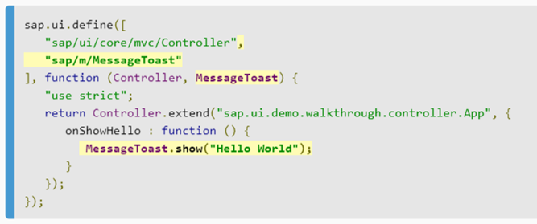
 
For TypeScript ES6 modules (i.e. the export and import keywords) should be used.
4.1.3	Formatting
Follow SAP recommended code format guidelines:
•	Add a semicolon after each statement, even if optional
•	No spaces before and after round braces (function calls, function parameters), but…
•	…use spaces after if/else/for/while/do/switch/try/catch/finally, around curly braces, around operators and after commas
•	Opening curly brace (functions, for, if-else, switch) is on the same line
•	Use "===" and "!==" instead of "==" and "!="; see the ESLint docu for special cases where "==" is allowed
•	Use tabs for indentation. Inner block should be more indented then outer!
•	The code should therefore look like this:
 
•	Use IDE Code Beautifier for js files and also for XML view and JSON files
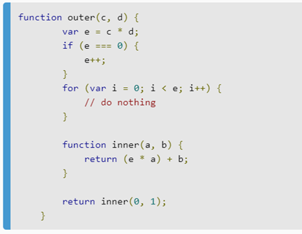
4.1.4	Language Features
4.1.4.1	Local variable declarations
4.1.4.1.1	Use const and let
Declare all local variables with either const or let. Use const by default, unless a variable need to be reassigned. The var keyword must not be used.
4.1.4.1.2	One variable per declaration
Every local variable declaration declares only one variable: declarations such as let a = 1, b = 2; are not used.
4.1.4.1.3	Declared when needed, initialized as soon as possible
Local variables are not habitually declared at the start of their containing block or block-like construct. Instead, local variables are declared close to the point they are first used (within reason), to minimize their scope.
4.1.4.2	Object literals
As general recommendation follow SAPUI5 approach for creating and managing JS Objects.
4.1.4.2.1	Do not mix quoted and unquoted keys
Object literals may represent either structs (with unquoted keys and/or symbols) or dicts (with quoted and/or computed keys). Do not mix these key types in a single object literal.
Illegal:
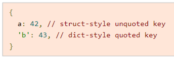

 
4.1.4.2.2	Enums
Enumerations are defined by adding the @enum annotation to an object literal. Additional properties may not be added to an enum after it is defined. Enums must be constant, and all enum values must be deeply immutable.
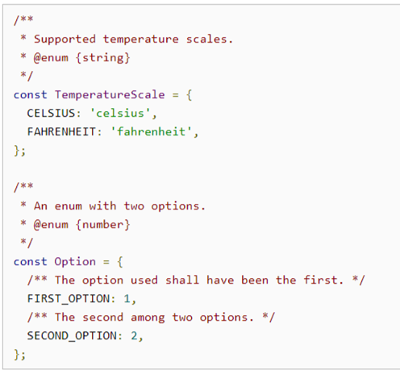
 
4.1.4.3	Classes
Follow SAPUI5 rules and guidelines for classes (they are pretty specific):
•	Each class should be defined in dedicated file. Filename should be the same as Class name.
•	Initialize and describe instance fields in the constructor function: this._bReady = false; // ready to handle requests
•	Define instance methods as members of the prototype of the constructor function: MyClass.prototype.doSomething = function(){...
•	Define static members (fields and functions) as members of the constructor function object itself: MyClass.doSomething = function(){...
•	Start the name of private members with an underscore: this._bFinalized
•	Combine constructor + methods + statics in a single JS source file named and located after the qualified name of the class; this is a precondition for class loading
•	Static classes do not have a constructor but an object literal; there is no pattern for inheritance of such classes. If inheritance is needed, use a normal class and create a singleton in the class.
•	Do not use SuperClass.extend(…) for subclasses. If no base class exists, the prototype is automatically initialized by JavaScript as an empty object literal and must not be assigned manually. Consider inheriting from sap.ui.base.Object
•	Subclasses call (or apply) the constructor of their base class: SuperClass.apply(this, arguments);
•	Example of SAPUI5 class definition:
sap.ui.define(["jQuery.sap.global", "sap/ui/base/Object", "sap/ui/model/json/JSONModel"], function (jQuery, BaseObject, JSONModel) {
 
    // declare and document the constructor function
 
    /**
     * Some short sentence that summarizes the functionality of the class.
     *
     * A more detailed explanation of the class that might consist of multiple sentences
     * and paragraphs. It is <i>possible</i> to use <code>XHTML</code> <b>markup</b>
     * but this should be used only rarely, as it makes the doclet harder to read
     * in the JS editor.
     *
     * Paragraphs that are separated by empty lines will be formatted as separate
     * paragraphs in the final JSDOC documentation. This makes the addition of
     * 
 or   tags unnecessary.
     *
     * It is possible to reference members of this class (like {@link #ownMethod})
     * or even of other classes (like {@link sap.ui.Object#destroy}). But be careful:
     * in contrast to JavaDoc, the signature (parameters) of a method must not be
     * included with the @link tag, only the name of the method (as !JavaScript does not support
     * method overloading).
     *
     * @class (mandatory) Marks the function as a constructor (defining a class).
     * @param {string} sId Documentation of constructor parameters.
     * @param {object} [mProperties=null] For optional parameters, the name is enclosed
     *                  in square brackets.
     *                  A default value can be appended with a '='.
     * @param {string} [mProperties.text] Even members of a configuration parameter
     *                 can be configured.
     * @see (optional, multiple) Fully qualified HTTP links to external documentation
     *                 are also possible.
     *
     * @public|@private - (optional) Declares the class as public or private (default).
     * @author (optional, multiple) Author is referenced by user Id, not by name.
     *                              Multiple authors are possible, order is
     *                              significant (first named author is the default
     *                              contact).
     * @since (optional) When the class/function has been introduced.
     * @extends sap.ui.base.Object Documents the inheritance relationship.
     * @name foo.bar.MyClass (Mandatory when defining a class with extend).
     */
    var Foo = BaseObject.extend("foo.bar.MyClass", /** @lends foo.bar.MyClass */ {
 
      constructor: function(sId, mProperties) {
 
        // init and document members here
        /**
         * The ID of a MyClass.
         *
         * @private
         */
        this.mId = sId || Utils.createGUID();
      },
     
      // now add further methods to that prototype
      /**
       * Again a summary in one sentence.
       *
       * More details can be documented, when the method is more complex.
       * @param {string} sMethod The same mechanism as above can be used to
       *                         document the parameters.
       * @param {object} [oListener] An optional parameter. If empty, the
       *                             <code>window</code> is used instead.
       * @experimental Since 1.24 Behavior might change.
       * @public
       */
      ownMethod: function(sMethod, oListener) {
     
        // ... impl
      },
 
      /**
       * A private method.
       *
       * Every member with a doc comment is included in the public JSDOC.
       * So we explicitly declare this as a private member:
       *
       * Additionally, using an underscore prefix prevents this method
       * from beeing added to the public facade.
       *
       * @private
       */
      _myVeryPrivateMethod: function() {
      }
     
    });
 
    // return the module value, in this example a class
    return Foo;
});

4.1.4.4	Functions
4.1.4.4.1	Arrow functions
Arrow functions provide a concise syntax and fix a number of difficulties with this. Prefer arrow functions over the function keyword, particularly for nested functions.

Prefer using arrow functions over f.bind(this). Avoid writing const self = this. Arrow functions are particularly useful for callbacks, which sometimes pass unexpected additional arguments.
The right-hand side of the arrow may be a single expression or a block. Always use parentheses even for single-argument arrows, since the code may still parse reasonably (but incorrectly) if the parentheses are forgotten when an additional argument is added.
4.1.4.4.2	Function Parameters
Function parameters must be typed with JSDoc annotations in the JSDoc preceding the function’s definition, except in the case of same-signature @overrides, where all types are omitted.
In case of any questions refer to SAP standard library and check how JSDoc used there, good example could be v4.ODataModel, which is pretty modern:

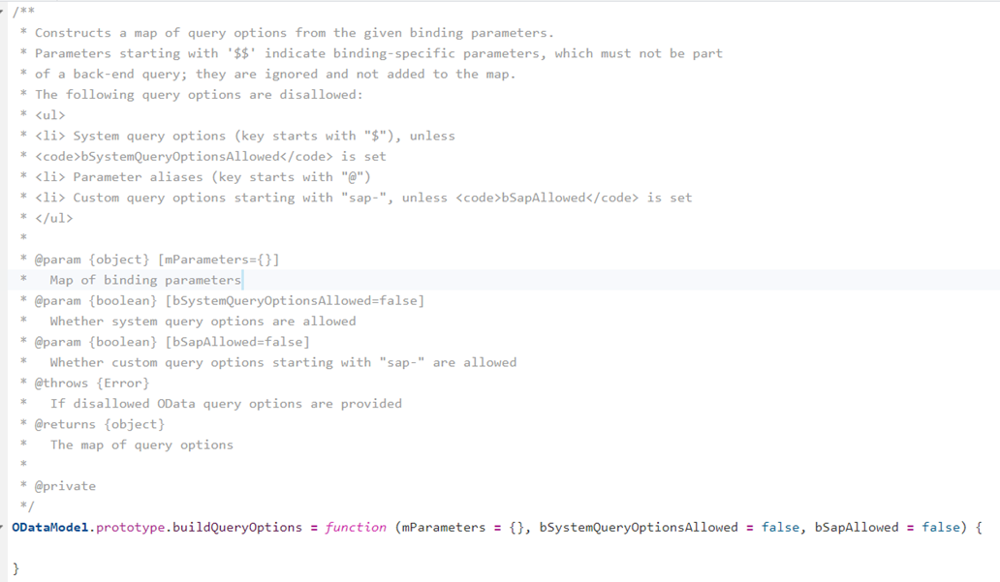

 

Parameter types may be specified inline, immediately before the parameter name (as in (/** number */ foo, /** string */ bar) => foo + bar). Inline and @param type annotations must not be mixed in the same function definition. 

4.1.4.4.2.1	Default parameters
Optional parameters are permitted using the equals operator in the parameter list. Optional parameters must include spaces on both sides of the equals operator, be named exactly like required parameters (i.e., not prefixed with opt_), use [] brakets in their JSDoc name to highlight that these are optional params. Do not use initializers that produce observable side effects. All optional parameters must have a default value in the function declaration, even if that value is undefined.
Example:
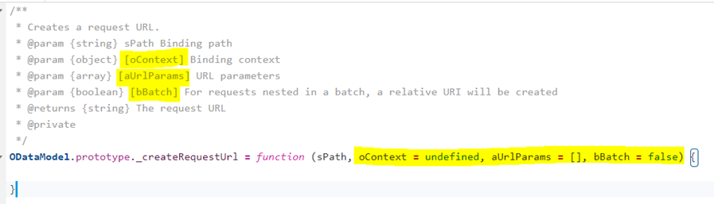
 
Use default parameters sparingly. Prefer Function Parameters Destructuring to create readable APIs when there are more than a small handful of optional parameters that do not have a natural order.
4.1.4.4.2.2	Functional Parameters Destructuring
Object destructuring patterns may be used on the left-hand side of an assignment to perform destructuring and unpack multiple values from a single object.
Destructured objects may also be used as function parameters but should be kept as simple as possible: a single level of unquoted shorthand properties. Deeper levels of nesting and computed properties may not be used in parameter destructuring. Specify any default values in the left-hand-side of the destructured parameter ({str = “some default”} = {}, rather than {str} = {str: “some default”}), and if a destructured object is itself optional, it must default to {}. The JSDoc for the destructured parameter may be given any name (the name is unused but is required by the compiler).
Example:

 
Illegal:
 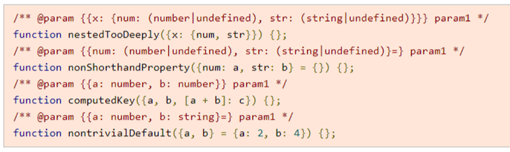
4.1.4.5	String literals
4.1.4.5.1	Use double quotes
Ordinary string literals are delimited with double quotes ("), rather than single quotes (').
Tip: if a string contains a double quote character, consider using a single quotes or template string to avoid having to escape the quote.
Ordinary string literals may not span multiple lines.
4.1.4.5.2	Template Strings
Use template strings (delimited with `) over complex string concatenation, particularly if multiple string literals are involved. Template strings may span multiple lines.
If a template string spans multiple lines, it does not need to follow the indentation of the enclosing block, though it may if the added whitespace does not matter.
Example:

 
4.1.4.5.3	No line continuations
Do not use line continuations (that is, ending a line inside a string literal with a backslash) in either ordinary or template string literals. Even though ES5 allows this, it can lead to tricky errors if any trailing whitespace comes after the slash, and is less obvious to readers.
Illegal:

 
Instead, write:

 
4.1.4.6	Control structures
4.1.4.6.1	For loops
With ES6, the language now has three different kinds of for loops. 
for of loops are preferred. 
forEach not allowed.
for in loops may only be used on dict-style objects (see Do not mix quoted and unquoted keys in Objects), and should not be used to iterate over an array. Object.prototype.hasOwnProperty should be used in for-in loops to exclude unwanted prototype properties. Prefer for-of and Object.keys over for-in when possible.
4.1.4.6.2	Exceptions

Exceptions are an important part of the language and should be used whenever exceptional cases occur. Always throw Errors or subclasses of Error: never throw string literals or other objects. Always use new when constructing an Error.
Custom exceptions provide a great way to convey additional error information from functions. They should be defined and used wherever the native Error type is insufficient.
Prefer throwing exceptions over ad-hoc error-handling approaches (such as passing an error container reference type, or returning an object with an error property).
Implement appropriate exception handling for:
•	network calls (for example OData), 
•	operation with device resources (offline stores, files, camera etc.),
•	data conversions (casting from String to Date etc.),
•	other possible places.
Prefer handling error on top possible level instead of handling for each operation, centralized error handler for whole application is a good option.
Do not use exceptions for handling business logic, for example when Finance Document is not posted due to closed period it's not exception, exception is when Finance Document not posted due to lost connection.

 
4.1.4.6.3	Asynchronous Programming
Avoid using callbacks and use of async/await (for old code Promises are still applicable, but not for the new code). All odata calls must be wrapped in promise and use await/async instead of .then.
Do (async/await):
someFunction1: async function() {  
    const asyncResult2 = await this.asyncFunction2();  
    return await this.asyncFunction3(asyncResult1);  
}

Don’t (callbacks):
someFunction1: function ({
    success = undefined,
    error = undefined,
}) {
    const that = this;
    this.asynFunction2({
        success: function (asyncResult2) {
            that.asynFunction3({
                success: function (asyncResult3) {
                    success(asyncResult3);
                },
                error: function (oError) {
                    error(oError);
                }
            });
        },
        error: function (oError) {
            error(oError);
        }
    })
};

4.1.5	Naming 
4.1.5.1	Rules Common to All Identifiers
Identifiers use only ASCII letters and digits, and, in a small number of cases noted below, underscores and very rarely (when required by frameworks) dollar signs.
Give as descriptive a name as possible, within reason. Do not worry about saving horizontal space as it is far more important to make your code immediately understandable by a new reader. Do not use abbreviations that are ambiguous or unfamiliar to readers outside your project, and do not abbreviate by deleting letters within a word.
oSalesOrderHeader      	// No abbreviation.
iNumErrors             	// "num" is a widespread convention.
iNumDnsConnections    // Most people know what "DNS" stands for.

Illegal:
n                     		// Meaningless.
nErr                  	// Ambiguous abbreviation.
nPurOrds           	// Ambiguous abbreviation.
wgcConnections        	// Only your group knows what this stands for.
pcReader              	// Lots of things can be abbreviated "pc".
cstmrId               	// Deletes internal letters.

4.1.5.2	Rules by identifier type
4.1.5.2.1	Package names
Package names are all lowerCamelCase. For example, my.exampleCode.deepSpace, but not my.examplecode.deepspace or my.example_code.deep_space. 
All   custom code should be created under com. .* namespace (package).
4.1.5.2.2	Class Names
Class, interface, record, and typedef names are written in UpperCamelCase. Unexported classes are simply locals: they are not marked @private and therefore are not named with a trailing underscore.
Type names are typically nouns or noun phrases (prefer singulars). For example, Request, ImmutableList, or VisibilityMode. Additionally, interface names may sometimes be adjectives or adjective phrases instead (for example, Readable).
4.1.5.2.3	Method Names
Method names are written in lowerCamelCase. Private methods’ names must end with a heading underscore.
Method names are typically verbs or verb phrases. For example, sendMessage or _stop. Getter and setter methods for properties are never required, but if they are used they should be named getFoo (or optionally isFoo or hasFoo for booleans), or setFoo(value) for setters.
Underscores may also appear in JsUnit test method names to separate logical components of the name. One typical pattern is test<MethodUnderTest>_<state>, for example testPop_emptyStack. There is no One Correct Way to name test methods.
4.1.5.2.4	Constants Names
Constant names use CONSTANT_CASE: all uppercase letters, with words separated by underscores. There is no reason for a constant to be named with a trailing underscore, since private static properties can be replaced by (implicitly private) module locals.
4.1.5.2.4.1	Local Aliases
Local aliases should be used whenever they improve readability over fully-qualified names. Aliases may also be used within functions. Aliases must be const.
Examples:
const oStaticHelper = importedNamespace.staticHelper;
const fnReadFile = ImportedClass.readFile;
const CONSTANT_NAME = ImportedClass.CONSTANT_NAME;

4.1.5.2.5	Local Variables Naming Convention
Follow SAP recommended variable naming convention:
•	https://sapui5.hana.ondemand.com/#/topic/eded636b85584cd586b1fe231d2b5dac
use Hungarian notation for local variables
Sample	Type
sId	string
oDomRef	object
$DomRef	jQuery object
iCount	int
mParameters	map / assoc. array
aEntries	array
dToday	date
fDecimal	float
bEnabled	boolean
rPattern	RegExp
fnFunction	function
vVariant	variant types

4.1.5.2.6	Function Parameter Names
Parameter names are written in lowerCamelCase (with Hundgarian notation). Note that this applies even if the parameter expects a constructor.
One-character parameter names should not be used in public methods.
4.1.5.2.7	Non-constant fields
Non-constant field names (static or otherwise) are written in lowerCamelCase (with Hundgarian notation), with a heading underscore for private fields.
These names are typically nouns or noun phrases. For example, iComputedValues or _iIndex.

4.1.5.2.8	Camel case: defined
Sometimes there is more than one reasonable way to convert an English phrase into camel case, such as when acronyms or unusual constructs like IPv6 or iOS are present. To improve predictability, Google Style specifies the following (nearly) deterministic scheme.
Beginning with the prose form of the name:
•	Convert the phrase to plain ASCII and remove any apostrophes. For example, Müller's algorithm might become Muellers algorithm.
•	Divide this result into words, splitting on spaces and any remaining punctuation (typically hyphens).
	Recommended: if any word already has a conventional camel case appearance in common usage, split this into its constituent parts (e.g., AdWords becomes ad words). Note that a word such as iOS is not really in camel case per se; it defies any convention, so this recommendation does not apply.
•	Now lowercase everything (including acronyms), then uppercase only the first character of:
	… each word, to yield upper camel case, or
	… each word except the first, to yield lower camel case
•	Finally, join all the words into a single identifier.
	Note that the casing of the original words is almost entirely disregarded.
Examples:
Prose form	Correct	Incorrect
XML HTTP request	XmlHttpRequest	XMLHTTPRequest
new customer ID	newCustomerId	newCustomerID
inner stopwatch	innerStopwatch	innerStopWatch
supports IPv6 on iOS?	supportsIpv6OnIos	supportsIPv6OnIOS
YouTube importer	YouTubeImporter	YoutubeImporter*
*Acceptable, but not recommended.
Note: Some words are ambiguously hyphenated in the English language: for example nonempty and non-empty are both correct, so the method names checkNonempty and checkNonEmpty are likewise both correct.
 

4.1.6	JSDoc
For documenting JavaScript, SAPUI5 uses the JSDoc3 toolkit which mimics JavaDoc. For an explanation of the available tags, see the JSDoc3 Toolkit Homepage.
•	Document the constructor with @class, @author, @since, and so on.
•	For subclasses, document the inheritance by using an @extends tag in their constructor doclet.
•	Document at least public and protected methods with JSDoc, mark them as @public/@protected.
•	When you also document private methods with JSDoc, mark them with @private. This is currently the default in SAPUI5, but not in JSDoc, so it is safer to explicitly specify it. "Protected" is not clearly defined in a JavaScript environment, in SAPUI5 it means: Not for use by applications, but might be used even outside the same class or subclasses, but only in closely related classes.
•	Document method parameters with type (in curly braces) and parameter name (in square brackets if optional).
•	Use @namespace for static helper classes that only provide static methods.
•	JSDoc is used on all classes, fields, and methods, except controller and component classes whether this is optional.
4.1.6.1	General form
The basic formatting of JSDoc blocks is as seen in this example:

 
or in this single-line example:
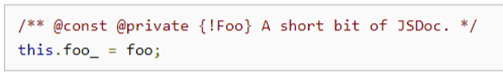
 
If a single-line comment overflows into multiple lines, it must use the multi-line style with /** and */ on their own lines.
Many tools extract metadata from JSDoc comments to perform code validation and optimization. As such, these comments must be well-formed.
4.1.6.2	Class Comments
Refer to SAP example of defining class:
sap.ui.define(["jQuery.sap.global", "sap/ui/base/Object", "sap/ui/model/json/JSONModel"], function (jQuery, BaseObject, JSONModel) {
 
    // declare and document the constructor function
 
    /**
     * Some short sentence that summarizes the functionality of the class.
     *
     * A more detailed explanation of the class that might consist of multiple sentences
     * and paragraphs. It is <i>possible</i> to use <code>XHTML</code> <b>markup</b>
     * but this should be used only rarely, as it makes the doclet harder to read
     * in the JS editor.
     *
     * Paragraphs that are separated by empty lines will be formatted as separate
     * paragraphs in the final JSDOC documentation. This makes the addition of
     * 
 or   tags unnecessary.
     *
     * It is possible to reference members of this class (like {@link #ownMethod})
     * or even of other classes (like {@link sap.ui.Object#destroy}). But be careful:
     * in contrast to JavaDoc, the signature (parameters) of a method must not be
     * included with the @link tag, only the name of the method (as !JavaScript does not support
     * method overloading).
     *
     * @class (mandatory) Marks the function as a constructor (defining a class).
     * @param {string} sId Documentation of constructor parameters.
     * @param {object} [mProperties=null] For optional parameters, the name is enclosed
     *                  in square brackets.
     *                  A default value can be appended with a '='.
     * @param {string} [mProperties.text] Even members of a configuration parameter
     *                 can be configured.
     * @see (optional, multiple) Fully qualified HTTP links to external documentation
     *                 are also possible.
     *
     * @public|@private - (optional) Declares the class as public or private (default).
     * @author (optional, multiple) Author is referenced by user Id, not by name.
     *                              Multiple authors are possible, order is
     *                              significant (first named author is the default
     *                              contact).
     * @since (optional) When the class/function has been introduced.
     * @extends sap.ui.base.Object Documents the inheritance relationship.
     * @name foo.bar.MyClass (Mandatory when defining a class with extend).
     */
    var Foo = BaseObject.extend("foo.bar.MyClass", /** @lends foo.bar.MyClass */ {
 
      constructor: function(sId, mProperties) {
 
        // init and document members here
        /**
         * The ID of a MyClass.
         *
         * @private
         */
        this.mId = sId || Utils.createGUID();
      },
     
      // now add further methods to that prototype
      /**
       * Again a summary in one sentence.
       *
       * More details can be documented, when the method is more complex.
       * @param {string} sMethod The same mechanism as above can be used to
       *                         document the parameters.
       * @param {object} [oListener] An optional parameter. If empty, the
       *                             <code>window</code> is used instead.
       * @experimental Since 1.24 Behavior might change.
       * @public
       */
      ownMethod: function(sMethod, oListener) {
     
        // ... impl
      },
 
      /**
       * A private method.
       *
       * Every member with a doc comment is included in the public JSDOC.
       * So we explicitly declare this as a private member:
       *
       * Additionally, using an underscore prefix prevents this method
       * from beeing added to the public facade.
       *
       * @private
       */
      _myVeryPrivateMethod: function() {
      }
     
    });
 
    // return the module value, in this example a class
    return Foo;
});

https://sapui5.hana.ondemand.com/#/topic/f6fba4c6e1cb49c7b355319ac9c8d1cd
4.1.7	Comments in the code and Readme application information
4.1.7.1	README.md details
Each project should contain README.md in the root folder with application details.
Refer to github formatting rules:
https://docs.github.com/en/github/writing-on-github/basic-writing-and-formatting-syntax
Preview of README.md
 

4.1.7.2	Comments in the code
Prefer self-explanatory code over commenting, comments to be used only when it’s really necessary (for example long and specific business logic, calling external API, technical workarounds, etc.).
For example, instead adding comment what next n lines of code are doing:
 
Put these n lines inside the function with an explanatory name and call it:
	 
The complex code chunks should contain meaningful comments any case.
4.1.7.3	File logical sections
Inner logical sections should be maintained and wrapped with comments (like 
///// Getters/Settters /////, 
///// Message Handling /////, 
etc...).
4.1.7.4	Change Specific Comments
After the app gets into Prod, the following changes should be thoroughly documented in ReadMe.md and in the code.
Change Specific code blocks should be wrapped into 
Begin <MOD/RITM/CRF/RICEF number>
	//Some code
End <MOD/RITM/CRF/RICEF number> 
Each <MOD/RITM/CRF/RICEF number> should be thoroughly described in ReadMe.md file.
4.1.8	.yaml Files
For each next change in ui5-deploy.yaml the row with previous transport request should be commented. The row with new transport request should be added above.
 
4.2	SAPUI5 Freestyle Applications Programming Standards and Best Practices
4.2.1	SAPUI5 Version
•	Projects deployed to S/4 Hana systems: SAPUI5 version 1.96.25.
•	Projects deployed to PVx gateway systems: SAPUI5 version 1.71.47

4.2.2	Application Architecture
4.2.2.1	Model View Controller Concept

Follow MVC concept for SAPUI5 applications:
https://sapui5.hana.ondemand.com/#/topic/91f233476f4d1014b6dd926db0e91070
MVC for low complexity applications (UI logic is inside the controller):

 

MVC for medium and high complexity applications (business logic is in special Service Layer):

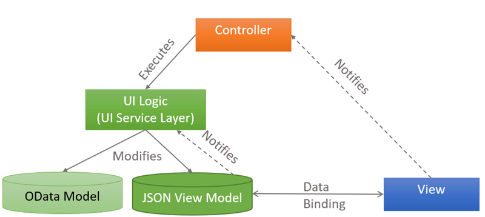
 

For medium and high-complexity applications avoid business logic in controllers, instead put it in the appropriate UI Service-layer classes (also could be referenced as helper-, manager- classes for business entities), a good starting point to have one Service class for each business object. These Service classes should be fully responsible for:
•	Fetching Data from the Backend and preparing JSON view model
•	Processing Create / Update / Delete Operations for business entity
•	Processing Business Logic (status changes, recalculations, dependent fields derivations)
•	Reacting on view model state changes and updating dependent properties
Controller in this scheme is responsible only for reacting on UI events and redirecting them appropriate Service classes.
Do:
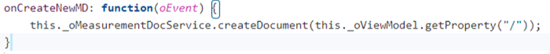
 
Don’t:
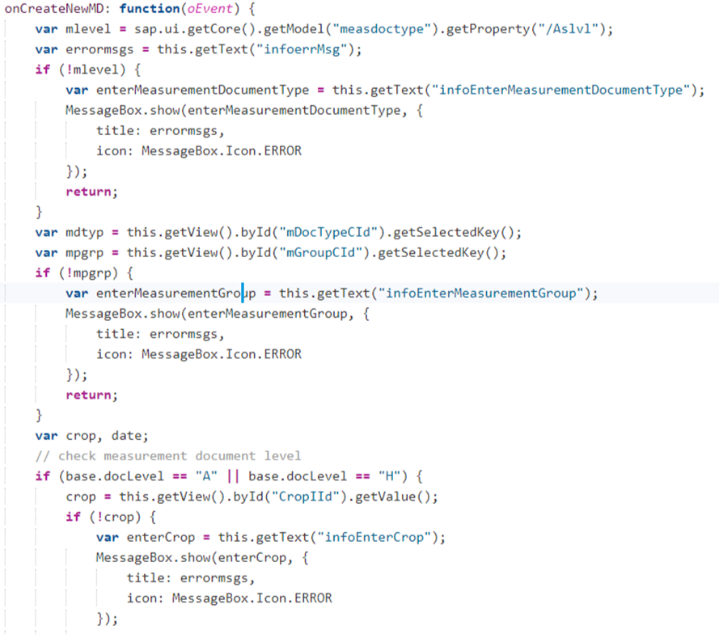
 
…	
    …
}
4.2.2.2	Binding View to the View Model
•	View UI Controls should 100% be bound to View Model Properties (JSON or OData) including visibility, editability and other states of UI controls. Changing of View Model properties will dynamically update View and vice-versa. 
•	In case if OData Model does not have properties for binding certain UI Controls values or state like filters, message logs, visibility, editability, etc, then these properties should be created in JSON View Model and UI Controls should be bound to JSON Model properties.
•	Accessing UI Controls by their Id from controller for their data/state should be avoided 
o	Two-way data binding is core feature of SAPUI5 framework and it should be used at 100% 
Do:
 
Don’t:
 
4.2.2.3	Setting up View Models
General rules for setting up View Models:
•	Option 1: View UI Controls 100% fits OData Model Properties, this preferable option
o	Bind View to OData Model directly
•	Option 2: View fits OData Model, but there are some additional controls (or control states) on the View which could not be bound to OData Model (for example filter parameters, message logs, controls visibility, editability)
o	Bind View to OData Model directly
o	Create side-by-side JSON Model, which holds these additional properties, and bind View controls to this JSON Model
o	Specify JSON Model properties in the code with JSDoc
•	Option 3: View does not fit OData Model at all, and it’s not possible to adopt OData Model (this option only possible after governance approval)
o	Create JSON Model
o	Create standalone Repository class responsible for:
	Reading data:
•	Converting OData Model to JSON Model 
	Writing data
•	Converting JSON Model to OData Model (when data should be updated on backend) 
o	Bind View to JSON Model
	But feel free to bind lookup values directly to OData Model
o	Specify JSON Model properties in the code with JSDoc
As general rule, reduce number of JSON models, prefer creation of single JSON Model per logical screen with root property nodes inside for different screen logical blocks.
4.2.3	Extending Apps
When standard Fiori App need to be extended choose the approach of minimal intervention:
	Try to use Flexibility Services UI Adaptation to add new controls without code changes.
	If Flexibility Services does not work, then use Component Configuration extension.
	Finally, if none of the above methods not possible, then create a custom application as a copy of the standard application. But this require additional approval.
Always implement   enhancement user-exit strategy in the extension so that extension code will be effective only if extension is activated (for certain market, sector, order type etc). Make sure that all new controls are hidden, and no logic is executed if user-exit strategy is not active (no impact to standard application when enhancement is deactivated).
Do not use standard apps extension techniques in custom apps!
4.2.3.1	  Enhancement User-exit strategy (Experimental approach)
  Enhancement User Exit Strategy is a tool that makes code effective for certain Market, Sector, Order Type etc refer to
“  Int'l ABAP Programming Standards and Best Practices_S4” for more details on this technology (it widely used for enhancing ABAP code).
To implement   Enhancement User Exit Strategy use UserExitStrategy class from package com. .core.sap.netweaver.utils.UserExitStrategy (refer to section “  Reusable Application Components”, for details how to include com. .core to the project).
•	Create instance of UserExitStrategy class (it will take as parameter array of user exits Ids effective for this application):
 
•	Call User Exit Strategy (in asynchronous mode, for the first call, for next calls that would be synchronous call):
o	before calling UserExitStrategy.exec() we need to init() it
	init() will load user exits data from backend (based on IDs provided in constructor)
o	exec() method parameters are:
	sUserExitId – ID of Enhancement
	sFieldValue1 – Parameter Field 1 for Enhancement
	sFieldValue2 – Parameter Field 2 for Enhancement
	…
	sFieldValue5 – Parameter Field 5 for Enhancement
	oHandler – Object which contains implementation of Enhancement Method:
•	Method name will be fetched from the backend using sUserExitId
•	Method will be called from oHandler object
	oData – Data Object which will be passed to Enhacement Method
 
•	When you need synchronous call of User Exit Strategy call init() method before calling exec():
o	Calling init() (for example in UIComponent.init() or in Controller.onInit()):
 
o	Checking deferred init object, and then executing exec() (if init is not finalized, then it would be asynchronous call, but once init finished it would be synchronous call):
 
4.2.4	Internationalization (i18n)
Use internationalization for all application labels and messages. Primary application language should be English.
4.2.5	Data types Formatting Parsing and Validations
Data types in SAPUI5 are used as a mechanism to validate user input (“hello” isn’t an acceptable value for order quantity, for example) and also to ensure that data is formatted and displayed appropriately on the UI (like displaying 1234567 as 1,234,567 where required). When used in conjunction with a data model that supports 2-way binding – which is the best way to use them – data types ensure that the data in the model gets updated only if the user provides a valid value.
4.2.5.1	OData types Formatting Parsing and Validations
Work with REST service creator to follow the OData Best Practices, by correctly identifying data types.  SAP Data types should map to an Edm data type inside of the OData mapping.  Client-side code should utilize SAPUI5 supported simple type associated with the OData, and the metadata that comes with the OData.  The goal for using OData is the less custom code the better.  Utilize the standard SAPUI5 data presentation and validation for standard OData elements.  
Edm.Boolean	sap.ui.model.odata.type.Boolean 
Edm.Byte	sap.ui.model.odata.type.Byte 
Edm.DateTime	sap.ui.model.odata.type.DateTime 
Edm.DateTimeOffset	sap.ui.model.odata.type.DateTimeOffset
Edm.Decimal	sap.ui.model.odata.type.Decimal 
Edm.Double	sap.ui.model.odata.type.Double (read-only) 
Edm.Float	sap.ui.model.odata.type.Single
Edm.Guid	sap.ui.model.odata.type.Guid
Edm.Int16 	sap.ui.model.odata.type.Int16 
Edm.Int32 	sap.ui.model.odata.type.Int32
Edm.Int64 	sap.ui.model.odata.type.Int64 
Edm.SByte 	sap.ui.model.odata.type.SByte 
Edm.Single	sap.ui.model.odata.type.Single (read-only) 
Edm.String 	sap.ui.model.odata.type.String 
Edm.Time	sap.ui.model.odata.type.Time

4.2.5.2	Non-OData types Formatting Parsing and Validations
The SAPUI5 framework comes with some commonly needed data types that can be used in applications. These include Boolean, Date and Float. The behavior of bindings that use data types can be tweaked by specifying constraints and format options. Constraints (like minimum and maximum for Float) can be used to restrict the range of values that are considered valid. Any user input that violates a constraint is considered to be invalid input, and the corresponding path in the model will not be updated. Format options on the other hand, are specified to configure how a particular value should be displayed on the UI (like groupingSeparator and decimalSeparator for Float). The value at the corresponding path in the model is formatted according to the type’s format options before being displayed.
The following simple types are currently available for data binding in SAPUI5: 
•	sap.ui.model.type.Float 
•	sap.ui.model.type.String 
•	sap.ui.model.type.Boolean 
•	sap.ui.model.type.Date 
•	sap.ui.model.type.Time 
•	sap.ui.model.type.DateTime 
Binding types define the data type of the properties used in the model. 

The values of these properties are automatically formatted for display in the UI. In addition to this, the input values in UI controls are parsed and converted back to the defined type in the model. If an error occurs during formatting or parsing, the following exception occurs: sap.ui.model.FormatException / sap.ui.model.ParseException. 
For most requirements, using standard data types (sap.ui.model.type.*) with suitable constraints and format options will suffice. But there can be some requirements which cannot be satisfied with constraints on standard data types. In these cases, we will need to develop our own data types. We will now look at what all goes into creating a custom data type, along with an example – A custom data type for handling credit card numbers.
To get started with creating a custom data type, we extend the sap.ui.model.SimpleType class and override 3 methods defined in the SimpleType parent class – parseValue, validateValue and formatValue 
Example:  A sap.ui.model.type.Float type is created with the formatting options minimum/maximum fraction digits equals 2 and a maximum value constraint of 10: 
	// creating of a float type with 2 format options and one constraint				var oFloat = new sap.ui.model.type.Float(
  		{
     			minFractionDigits: 2,
    			 maxFractionDigits: 2    		
  		},
  		{
     			maximum: 10
  		}
	);

	For non-standard data types we can create a type based on SimpleType:
	(function() { 
	    ‘use strict’;
                        sap.ui.define([
	          “sap/ui/model/SimpleType”, “sap/ui/model/ValidateException”
	   ], function(SimpleType, ValidateException){
		Return SimpleType.extend(“type.NewTypeName”, {
			formatValue: function (sValue, sInternalType) {
//This method receives the parsed value (internal value) as a parameter and must return a formatted //value (that is, a corresponding external value). This formatted value is displayed on the UI.
			},
			parseValue: function (sValue, sInternalType) {
//This method receives the user’s input as a parameter. This method’s job is to convert the user’s //value (external value) into a suitable internal representation of the value (internal value).
			},
			validateValue: function (sValue, sInternalType) {
//This method receives the parsed value (that is, the internal representation of the value as //determined by the parseValue method) and must decide whether or not the value is valid. If the //input is determined to be invalid, an exception of type sap.ui.model.ValidateException should be //thrown from within this method.
}

		 });
	     });
	})()”;

To use the defined data type for the binding, proceed as follows: 
	// specify the binding and the type directly in the control constructor
	var oText = new sap.ui.commons.TextField({value: {path: "/sliderValue", type: oFloat}});
	// or alternatively do it afterwards
	oText.bindValue("/sliderValue", oFloat);

Input parsing and output formatting are now carried out automatically. If, for example, the float value in the model is 2.3345, the text field displays the value 2.33. A user enters a value which is validated after user entry. To be valid, the entered value must be lower than 10. 

4.2.6	Message Processing
4.2.6.1	OData Message Processing:
For OData errors message processing, prefer to use standard SAP approach:
•	Add event listener for OData Messages and unset technical error flag (for all or certain messages), so that these messages are processed by MessageManager and shown to user:
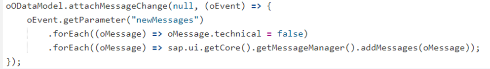
 
•	Set global messageLog JSON model based on MessageModel:
o	this.setModel(sap.ui.getCore().getMessageManager().getMessageModel(), "messageLog");
•	Bind message popover to messageLog JSON model
4.2.6.2	Business Logic Message Processing:
To handle business logic messages use:
•	sap.ui.getCore().getMessageManager().addMessages(…)
•	put proper ‘target’ property in the message, so that relevant control would be highlighted with error message (in ‘target’ we could put model property path, that cause the error)
4.2.7	Application templates
Create new applications with   / SAP applications templates, in case if it matches to-be application logic, but deleted unused code generated by template application. 
4.2.7.1	  
4.2.8	Third-party libraries
Preference is not to use third party libraries unless required.  Use standard SAP UI5 libraries where possible.
Include approved for usage third-party JavaScript resources when needed.  
To add new library to approved list, contact QA team for validation.
Use this blog reference for including external library into SAPUI5 application:
https://blogs.sap.com/2017/04/30/how-to-include-third-party-libraries-modules-in-sapui5/

4.2.8.1	Approve for usage third-party JavaScript resources
Name	Version	URL	Comment
			
			
			
			

4.2.9	Logging
Use jQuery.sap.log.* for logging detailed information for exceptions and other issues. Do not use console.log().

4.2.10	  Reusable Application Components
During functional\technical specification review potential reusable components should be identified and during coding they should be decoupled into   reusable component library.
  core reusable components located in the package:
•	com. .core

On the gateway system   reusable components deployed under the path:
•	/sap/bc/ui5_ui5/sap/zdevcore

To register module path com. .core add following line in the beginning of Component.js or *.controller.js:
•	jQuery.sap.registerModulePath("com. .core", "/sap/bc/ui5_ui5/sap/zdevcore");

After that it’s possible to use any modules of com. .core as normal SAP module:
 

4.2.11	Destinations
Destinations created in Cloud Platform Cockpit to connect WebGUI to backend systems.
WebIDEUsage:   odata_abap,ui5_execute_abap,dev_abap,dev_gen,bsp_execute_abap
 
 

4.3	SAPUI5 Fiori Elements Application Programming Standards
Fiori Elements is first option for   custom development projects. Fiori Elements is highly-opinionated framework, and it usually gives one way of doing things. The only concern with Fiori elements, is that before doing any extension make sure that it’s not possible to have it done with standard way.

4.3.1	Fiori Elements application assets
Fiori Elements application in many cases is code-free, and its logic expressed declaratively in the below artefacts:
Artefact	Comment	Best Practice
manifest.json	This is UI5 application descriptor, which is similar to classical UI5 application, but has additional Fiori-Elements-specific sections.	Follow SAP recommendations.
Local OData annotations	OData annotations which are maintained in WebIDE. 	For Non-CDS/SADL based Fiori Elements Applications:
•	Use only local annotations, it is way clearer then managing them in ABAP OData Service *MPC* class or special annotation service

For CDS/SADL based Fiori Elements Applications:
•	Keep UI annotations inside Consumption CDS View.

External OData annotations	These OData annotations which are maintained on the backend. 
•	For CDS/SADL-based OData Services these annotations maintained directly in CDS View or CDS Metadata Extension
•	For classical SEGW OData projects these annotations are maintained directly in the code of *MPC* class, or in special linked annotations project.	

4.3.2	CDS Annotations for Fiori-Elements Applications
Consumption CDS View shouldn’t contain any calculations, but annotations for the frontend part. If calculations are necessary, use the interface CDS Views, which are utilized by Consumption CDS views.
If possible do not use CDS MDE (Metadata extension) as it’s not explicit separate artifact. 
Same is related to CDS DCL (data control language) files. The authorization checks should be managed in code.

4.3.2.1	CDS Naming Convention
Should be aligned with latest   ABAP Guidelines.
VDM View Type	Private	CDS Name Prefix	SQL Name Prefix
#CONSUMPTION		ZGGL_PPP_CVC_	ZGGLPPPC_C
#CONSUMPTION	X	ZGGL_PPP_CVP_	ZGGLPPPC_P
#COMPOSITE		ZGGL_PPP_CVI_	ZGGLPPPC_I
#COMPOSITE	X	ZGGL_PPP_CVP_	ZGGLPPPC_P
#BASIC		ZGGL_PPP_CVI_	ZGGLPPPC_I
#BASIC	X	ZGGL_PPP_CVP_	ZGGLPPPC_P
#EXTENSION		ZGGL_PPP_CVE_	ZGGLPPPC_E

 

•	Use well-known business terminology for all new CDS Artefacts (Views, Element Aliases, Association Aliases) – avoid acronyms and abbreviations. In case if underlaying CDS View or Table does not have whole-word names, then create aliases for such elements.

 
•	Always re-use SAP names for all new CDS Artefacts, for example when adding element to the existing CDS View review other SAP-delivered views where same element could exist and take name from there.
•	Association aliases should start with _
•	Avoid changing standard SAP-delivered CDS Views, use CDS extend view instead
•	When extending standard SAP-delivered CDS Views make sure that you re-use name entity name in the extended view
•	Preferred split of UI annotations:
o	Back-End CDS Annotations:
	UI.fieldGroup.*
	UI.lineItem.*
o	Front-End Annotations:
	UI.Facets.*
	UI.HeaderFacets.*
	com.sap.vocabularies.Common.v1.SideEffects
•	Follow the layering:
o	DB Table
o	Basic CDS View
o	Interface View with ObjectModel association
o	Consumption
•	For Transactional-based services do not rename objects on CDS ObjectModel layer (if select from DB, then keep same names as in DB, if select from Basic View, then keep as in basic view)
•	CDS properties should be named with camel case starting with capital letter, e.g. FunctionalLocation.
https://blogs.sap.com/2017/06/29/sap-s4hana-embedded-analytics/
4.3.3	Fiori Elements List Report & Object Page Template
4.3.3.1	SmartFilterBar Custom Controls
•	For the custom filter control additional property should be added into metadata rather than using manifest UI extension with custom fragment.
•	The allowed filter field types are enumerated in the documentation for sap.ui.comp.smartfilterbar.ControlType. 
https://sapui5.hana.ondemand.com/sdk/#/api/sap.ui.comp.smartfilterbar.ControlType%23properties
Use of other control types is not recommended. 
•	CheckBox is not implied for SmartFilterBar. DropDown list is generated by default for appropriate CDS annotations and it should be utilized by default.
@Consumption.filter: { selectionType : #SINGLE, multipleSelections: false }
cast('' as boole_d) as Processed
•	Though it’s not recommended, the following code shows the approach for custom control type of SmartFilterBar filter.
sap.ui.comp.smartfilterbar.ControlType.CheckBox = 'CheckBox';	
let oCheckBox = new CheckBox({ selected:'{filt3rM0d3l>/Processed}'});
let oConf = oSmartFilterBar.getControlConfiguration()[this.getIndexOfProcessed()];   oConf.setCustomControl(oCheckBox); 
•	The SmartFilterBar controls values should not be changed by code. In case of custom filter controls, the binding should be adjusted in appropriate controller lifecycle method before making OData request. In Fiori list template it’s onBeforeRebindTableExtension method.
onBeforeRebindTableExtension: function (oEvent) {
  let oBindingParams = oEvent.getParameter("bindingParams");
  let oProcessedFilter = new Filter("Processed", FilterOperator.EQ, true)
  oBindingParams.filters.push(oProcessedFilter);
}

4.3.4	Other Fiori Elements Application Templates
4.3.4.1	Worklist Template
4.3.4.2	Analytical List Page Template
4.3.4.3	Overview Pages (OVP) Template

4.4	Coding issues to avoid
Follow standard SAP Coding issues to avoid:
https://sapui5.hana.ondemand.com/
4.4.1	Avoid using input with select dialog and suggestion
Inputs with SelectDialog and Suggestions bloats up controller the code, consider using SmartField, ComboBox (if it’s less then 200 items), or build custom control with embedded select dialog logic. 
Reach QA team for more details.
4.4.2	Avoid creating own CSS styling if is not absolutely necessary
Avoid creating own CSS styles for changing fonts, colors etc. Styling should be done thru applying appropriate theme.
Try to not apply CSS style classes directly to controls as it could break flexibility when changing FLP theme

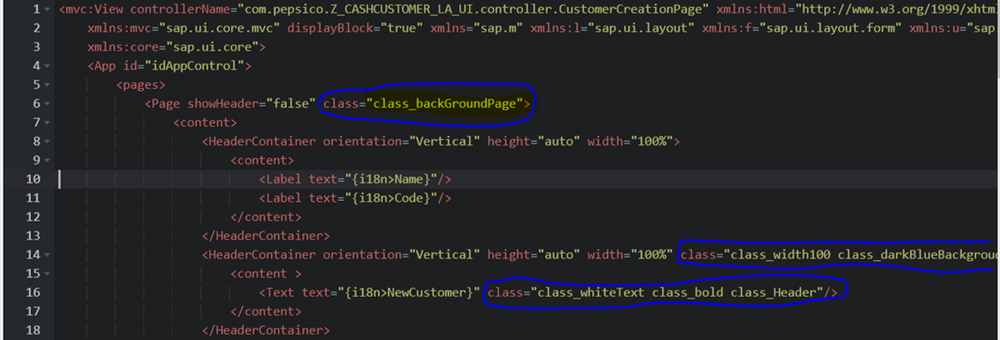
 
Do (for web application deployed on Fiori Launchpad):
	Use Fiori Theme designer and / or special URL parameter (sap-ui-theme=sap_belize).
https://sapui5.hana.ondemand.com/#/topic/e9fc648661d84ed89360bbec3ae02611
Do (for mobile applications):
	Apply theme via index.html:
  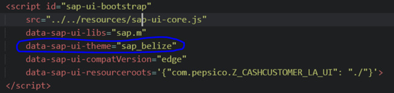
 
Or directly from JS:

 

4.5	Mock Data and Testing 
Mock-Data, Mock-Serer, QUnit and OPA5 tests are requirement for custom SAPUI5 applications, with only exception to simple Fiori Elements applications (to be confirmed by QA team).
4.5.1	Mock-Server and Mock-Data
Follow relevant SAP guidelines https://sapui5.hana.ondemand.com/#/topic
4.5.2	Unit Testing with QUnit
Follow relevant SAP guidelines https://sapui5.hana.ondemand.com/#/topic
4.5.3	Integration Testing with Opa5
Follow relevant SAP guidelines https://sapui5.hana.ondemand.com/#/topic

4.6	Performance requirements
4.6.1	UI response time
If special details are not provided in Functional specification, then stick to the UX categorization of a user interaction as in the table below:
•	the End-to-End Response time KPIs 
•	the number of sequential roundtrips on the critical path 

UIS Category 	End-to-End Response Time [ms] 	# 
Round-trips 	Description 
Instant Feedback 	< 150 	0 	Typically no WAN request is possible e.g.: processing on the front-end: mouse over, highlighting of fields, validations and determinations without server requests 
Simple 	< 1000 	1 	Majority of user interaction where the application server has to be involved are expected in this category 
Complex 	< 3000 	2 	Less than 20% of user interactions are expected in this category e.g.: analytics, planning 
Exceptionally Complex 	KPI has to be set individually by Product Owner. Typically end user expects an interaction pattern which signals continuously the progress (e.g. via progress indicator) and which (optionally) allows to push the running execution to background (being asynchronously informed afterwards) 
In exceptionally cases the simple interactions “Open application” and “Save operation” may take up to 2000ms. The End-to-End Response times are defined for a desktop browser with LAN-Connectivity (minimum latency). 
End-to-End Response times and number of Roundtrips shall be met under the assumption that all caches (Client caches, intermediate caches, server caches, and database caches) are filled. In environments with latency the KPIs are increased with n * latency [ms] (n = # of Roundtrips). 

4.6.2	Memory Consumption and Memory Leaks
The application should consume reasonable memory on the client side (limit here is 1 Gb on client), avoid requesting and storing on the client side huge data-sets, which are not required for business needs. 
The application should not contain memory leaks, effective usage of the application during the business day should not result in any visible additional memory consumption (limit here 100 Mb for business day).

4.6.3	Unsubscribe events
When subscribing to certain events, consider unsubscribing from them when they are not required any more.

4.7	SAP Hybrid Mobile Apps with Kapsel Plugins
https://developers.sap.com/mena/tutorials/hcpms-create-hybrid-app.html 
Please refer to Getting Started with Kapsel – Part 1 | SAP Blogs
4.8	Other JS Front-End Frameworks
It is hard to compare SAPUI5 technology to other JavaScript framework such as Angular, React or Ember, because this library was made with the purpose of building Enterprise level Business Applications. There are a lot of components like controls and widgets built in SAPUI5 core library. That is not the case with Angular, React, etc. The common feature of UI5 and Angular is that they are both easy to learn and use and they both can be used for PC as well as for mobile apps. Also, Angular brings server-side to client-side web application. Still, many programmers prefer UI5, because SAPUI5 has more controls, fitted to the use case of SAP (think of it like a modern jQuery Mobile). SAPUI5 is a full-fledged opinionated Framework.

 
https://blogs.sap.com/2017/03/04/side-by-side-sapui5-vs.-react-angular2/
5	SAP WDA/FPM development guidelines 
•	General ABAP:
o	ABAP Development Guidelines are fully applicable for WDA / FPM / SPI / BOPF and should be 100% followed.
o	Reuse ABAP Development naming conventions for all ABAP Objects.
o	Since typical FPM Enhancements contains many spots (could be 10++), create a composite enhancement implementation, that will group them all.
o	Implement user-exit-strategy in each enhancement spot, so that extension could be completely disabled by configuration.
•	WDA / FPM Layer:
o	Standard WDA/FPM component configurations should be extended only via enhancement and not via customizing.
o	In case if new FreeStyle WDA Component is developed follow WDA Development Guidelines.
o	Naming Convention for new WDA/FPM application component configuration:
	ZACC_XXXXXXXXXX
•	For example: ZGCC_FLEET_TECH_DETAILS
o	All new UI Components in enhancement should be invisible by default and being activated (set visible) by program logic inside the user-exit-strategy (if user-exit-strategy is disable user will see standard screen of the application).
•	Service Provide Infrastructure (SPI) Layer:
o	Follow SPI/FPM Guidelines: https://wiki.scn.sap.com/wiki/display/SPI/Guidelines+and+Best+Practices
o	Follow recommendations for SPI/FPM enhancements https://wiki.scn.sap.com/wiki/display/SPI/Enhancements
o	Avoid implicit enhancements and implement the changes via enhancement spot /PLMB/ES_SPI, that provides all required hooks
o	When implement /PLMB/ES_SPI try to create one implementing class even for different BADIs.

6	SAP Fiori Design Guidelines
During application design refer to SAP Fiori Design Guidelines and choose appropriate UI Elements and Layouts:
•	https://experience.sap.com/fiori-design-web/
6.1	  Custom UI Theme
As stated in the Compatibility Rules, the HTML and CSS generated by OpenUI5 is not part of the public API and may change in patch and minor releases. As such, SAP Fiori launchpad apps should not override styles.  Development should rely on the SAP Theme and no custom CSS rules should be used in development.
6.2	Custom icons and pictures repository
All graphics used in development should be approved by   QM before use.  Standard   graphics should be used wherever possible.
6.2.1.1	Approve for usage of graphics
Name	Version	Location	Comment
			
			
			
			

7	SAPUI5 Application environment
7.1	ABAP Application Packages for SAPUI5 applications
7.1.1	S/4 Landscape
For S/4 Enterprise First, the ABAP team is using package structure with First Level by Functional Area, then by L2 Functional Area.  UI development will use same package naming for Fiori BSP applications deployment.

7.1.2	Non S/4 Landscape
System 	Business Suite System(OData)  	Gateway system	Application Component	Package Name#
SQ1	Yes	N/A	OPU-BSC	Z_G_ODATA_GLOBAL_PACKAGE
DV1	N/A	Yes	OPU	Z_G_FIORI_GLOBAL_PACKAGE
SV1	N/A	Yes	OPU	Z_G_FIORI_GLOBAL_PACKAGE

7.2	Usage statistics 
7.2.1	Detailed metering data
By executing report /IWFND/R_METERING_VIEW through SE38 you will be able to get all ODATA calls information by user & date range.
7.2.2	Aggregated data
Table /IWFND/D_MET_AGR will show you 2 important metrics:
•	Usage per CRUD call (create / read / update / delete)
•	Number of active users per month
7.2.3	Application log
You can also use the application log to see errors & execution times in case you wish to analyze errors / loads of your ODATA services by launching SAP Gateway Application Log Viewer through  transaction /n/IWFND/APPS_LOG
7.2.4	Error log
All failed ODATA requests are written into error log, which is available through transaction /IWFND/ERROR_LOG 
7.2.5	Jobs behind the scene
Once you activate the SAP NetWeaver Gateway you are automatically scheduling 2 standard jobs:
•	SAP_IWFND_METERING_AGG
This job is scheduled daily and updates the aggregation summaries
•	SAP_IWFND_METERING_DEL
This job is also scheduled daily, it cleans up aggregation data older than 2.5 years back, and also cleans up the data from  /IWFND/L_MET_DAT on monthly level.

7.3	Logging tools (under construction)
Under construction (check Splunk option with Amit and Naimesh)
7.4	  Environment and System Landscape
	*Note:  They are looking to change the systems after January to all have Fiori embedded so this list may need to change.
System 	Business Suite System(OData)  	Gateway system	Description

7.5	Interacting with Backend Services (S/4, SCP, Others)
SAPUI5 can exchange data using XML HTTP Request object to call complete datasets from the backend systems. However, the controls used within SAPUI5 are highly optimized to exchange data using the open data OData protocol.
SAP has specifically chosen OData as the de facto method of connectivity for all SAP solutions. It is possible to integrate SAPUI5 with non-SAP systems using various JavaScript libraries and protocols without much difficulty. Utilizing the REST API with UI5 is preferred where oData is not available.

8	Fiori Launchpad Configuration and Extension
8.1	Custom Target Mappings
For tracking purposes for all custom target mappings developers have to fill Information field in appropriate format. Value naming convention is   <App Origin> - <App Type> - <RICEF/CRF/RITM/ADO>. Enumerations for App Origin and App Type are provided below:
App Origin
Custom
Standard
App Type (according to standard choice)
LPD_CUST
SAPUI5
Transaction
URL
WebDynpro

Samples:
Object Sample	Information field value:
  <App Origin> - <App Type> - <RICEF/CRF/RITM/ADO>
Custom UI5 / Adaptation Project	  Custom - SAPUI5 - U005051
Standard GUI tcode	  Standard - Transaction - CRF12345

 

8.2	Other Objects and Attributes
Refer to FIORI LAUNCHPAD & PORTAL GUIDELINES, NAMING STANDARDS AND USER GUIDE.
9	Application development tools and process
9.1	Local IDE development

ui5-codecompletion install
$ npm install -g ui5-schemas
$ ui5-schemas

npm install --save-dev sapui5-runtime
npm install --save-dev ui5-middleware-servestatic 
npm install --save-dev ui5-middleware-livereload 
https://blogs.sap.com/2019/11/05/end-to-end-setup-of-local-development-environment-with-ui5-tooling-part-2/

9.2	Overview of tools and process
9.2.1	SAP BAS (Cloud)
  uses SAP BAS for development. Other IDE could be used in case if they could support required code formatting rules. 
9.2.1.1	SAP BAS Project settings for SAPUI5 Applications
9.2.1.1.1	Beautifier / JavaScript
Make sure your beautifier settings done as below:
https://community.sap.com/t5/technology-blogs-by-members/sap-business-application-studio-how-to-beautify-xml-and-javascript-code/ba-p/13508886
9.2.1.1.2	Code Checking JavaScript
For now default rules validation is enabled in BAS by default. Use standard ESLint enabling requires more investigation.
https://community.sap.com/t5/technology-q-a/javascript-validation-in-sap-business-application-studio/qaq-p/12451398
9.2.1.1.3	Automated transpiling ES6 to ES5 with Babel
If needed, configure BAS as per link below for transpiling ES6 to ES5 (same way as it was done for Web IDE):
https://blogs.sap.com/2017/11/01/next-generation-javascript-in-ui5-using-sap-web-ide/
9.2.1.2	Destination settings
9.3	Code Analyzer
  using BAS built-in ESlint.
9.4	Code Version Control 
  uses AzureDev Ops GIT Repositories as version control system for SAPUI5 applications:
https:// it.visualstudio.com/SAP

9.4.1	Azure DevOps (VSTS) Repository in SAP BAS.
More detail to uses Azure DevOps Repositories as version control system for SAPUI5 applications:
https://docs.microsoft.com/en-us/azure/devops/repos/git/gitworkflow?view=vsts 
GIT Repo is commonly created by Fiori TSO team and provided with SDR approval email.
1.	Create new Repository in VSTS :
 
Fill the Repository name according to   SAPUI5 azure_devops_for_SAP_v2.5.pptx:

 
Click button for copy clone URL : 
 

2.	(Continue from previous picture) Generate the Token, and fill the Password field :
 
 
Create a Personal access Token :  
 

Click ‘+ New Token’ button :
 

Fill the token name, organization, scopes :
 
Copy the Token to clipboard
 

3.	Use Repo from BAS: 
Ctrl + Shift + P, print Git clone and follow the instructions.
Don’t forget to do push/pull before starting the day work! In general only developer is working on the app. There should not be merges in app history.
9.4.2	GIT Best Practices
•	master – the branch with current stable version (as in production system)
•	For bug fixing do not change directly master branch of applications that are in production, create/re-use separate branch with name containing RITM/RICEF/CRF number.
•	In specific change branch keep your commits small and frequent, once you have finished one feature/bug-fix/code-clean-up and before starting other activity make a commit with short message what was done. It’s ok that later you can come-back to the same feature/bug-fix/code-clean-up and add something, in this case just put same commit message and add part #2, part #3, etc. at the end.
•	Try to do only one pull request into master branch for each new change. 
•	Build Review could be done by TSO team for commit in master branch in case of new app or for change specific branch in case of continuous changes. In second case pull request into master should be approved by TSO team.
•	GIT commit message should satisfy the following template: <RITM/RICEF/CRF number>: <Description>.
9.5	Code Review
Code review took place in before commit pushed to master branch.
OData TSD must reviewed beofre/in parallel with Fiori TSD to avoid rework.
9.6	Build Review Email from Developer to TSO Team
The developer should make up a build review email according to the following format and sample.
Email subject template: 
<RICEF number> - Build Ready For Review [ - <INC/RITM number> ]
Email subject sample:
U006007 - Build Ready For Review - INC08882318 - INC10827670
The email should contain the description of changes and necessary info for the reviewer. TSD link and GIT link should be placed. Then the following form should be filled. The sample email body:
Hi Fiori team.
 
 
Latest version of TS document uploaded in SOLMAN (Yes/No)	Yes
TSD Status	Build Ready For Review
Provide Transport and Task/s submitted for review.	
Tasks: 
If Task(TR) under review is released, provide reason.	Released to ensure working fine in A1Q / 500
Was the SDR approved by the Technical Solution Owner Team (Only for CRF change)?	Yes
Comments	
TSD Solman details for Dummy:
Original RICEF# TSD Status	NA
If Original TSD status not set to ‘Ready for Build review’ mention the reason	NA
High Priority Review: (This section is to be filled for High Priority review only)
Is this High Priority Review(Yes/No)?	NA
If yes, then provide reason for High Priority.	NA
Specify if change is big or small with brief summary.	Medium Change. Display mode enabled in SM30F. Custom BAdI was added. SM30 Maintenance event routine was adjusted.

9.7	QA Check List
Checklists are based on solution design principles and thus could be extended if some principles are ignored.
9.7.1	SDR Review QA Checklist
9.7.1.1	SDR Review QA Checklist – Enhancement

Step #	Description	Comments
1	High level business requirement is clearly documented  	
2	Technical requirements are clearly interpreted based on the functional design	
3	Possible Technical approaches to fulfill the business requirements are listed	
4	Pros & Cons for each technical approach must be clearly documented	
5	Proposed technical approach chosen must be provided with a detailed rationale	
6	Detailed information on any existing technical objects re-used/copied is provided	

9.7.2	TSD Review QA Checklist
9.7.2.1	TSD Review QA Checklist - Enhancement

Step #	Description	Comments
1	Object modification list is provided listing all modified SAPUI5 app files and extensibility service objects.	
2	Technical Overview of standard Fiori application screens and OData services provided (with flow). Places with extensions are shown.	
3	If applicable, technical flow diagram is showing the place of extended Fiori application in the overall process.	
4	If applicable security requirements are specified.	
5	SAPUI5 development artefacts and documentation follows naming convention.	
6	High level and/or difficult technical test criteria have been provided, to include how to verify results
Test Data requirements have been communicated and addressed.
How to verify results is specified.	
7	Depending on SAPUI5 extension type (Component Configuration, UI Adaptation etc.) all changes are documented according to TSD template with all required details (object names, extension points etc.)	

9.7.2.2	TSD Review QA Checklist – Custom SAPUI5 Application

Step #	Description	Comments
1	SAPUI5 development artefacts and documentation follows naming convention.	
2	If applicable, technical flow diagram is showing the place of extended Fiori application in the overall process.	
3	All OData and JSON Models provided in TSD. If required ER Diagram of Entities used in application provided.
TSD details accommodate the code and together explains all the implementation details.	
4	All application Views, Sub-Views and Fragments provided in TSD with flows. 
TSD details accommodate the code and together explains all the implementation details.	
5	Application Routes are provided in TSD	
6	Event Bus details provided in TSD	
7	Core App Uses Cases provided in TSD with reference to programming objects (Classes, Functions).
TSD details accommodate the code and together explains all the implementation details.	
8	Security details provided in the TSD	
9	Application codebase structure provided in TSD. For each application file there is short description of it’s purpose.	
10	High level and/or difficult technical test criteria have been provided, to include how to verify results
Test Data requirements have been communicated and addressed.
How to verify results is specified.	

9.7.3	Build Review QA Checklist

	1. Application Code Architecture	Comments
1.1	Code properly structured \ layered, easy-readable and understandable by other developer?	It’s easy to understand what each part of the code is doing, this achieved by using proper and up-to-date SAPUI5 application architecture. Classes, function and variable names express business and technical context of the application logic. 
For complex application extract business logic from controllers to specific helper classes.
Group methods in controller helper classes for ease of code reading (no need to jump from beginning to the end of file)
1.2	Repeated code-blocks are structured in functions, helper/service classes?	There are no obvious options to create re-used functions, helper/service classes, custom SAPUI5 controls, that significantly reduce codebase.
1.3	Code is using maximum of SAPUI5 standard functionalities?	There is no easy possibility to replace custom-code with SAPUI5 built-in functionalities
1.4	If callbacks are used instead of promises, then it’s done in a manner not affecting code readability?	Callbacks used where it’s necessary or call stack is just 1 level.
1.5	There are no other obvious options to reduce code-base significantly?	
1.6	All extensions done with user-exit strategy?	When user exits are deactivated application works 100% as standard.
Applicable only for local extensions.
1.7	All connections to services done via destinations?	Avoid direct http links. Use HTTP destinations, these destinations should emulate gateway odata services during development.
1.8	There is no JSON Data Objects, or JSON Models with undeclared data structure.	Data structure for JSON Objects / Models defined upfront with comments if required.
1.9	Number of JSON models is limited.	Avoid creating JSON Model for each use-case, instead create it for each application/business entity.
1.10	Avoid custom ABAP <=> JS data conversions / serializations	
	2. Visual Design	Comments
2.1	Does visual design align with SAP Fiori Design Guidelines?	 
2.2	Are all texts that are visible on the UI enabled for translation?	
 	3. Code Standards	Comments
3.1	Are files/folders and naming aligned with SAP UI5 Developer Guide?	File/Folder standards covered in SAP UI5 Developer Guide 
https://sapui5.hana.ondemand.com

3.2	Have performance requirements been addressed?	Performance standards covered in SAP UI5 Developer Guide
https://sapui5.hana.ondemand.com

3.3	Are naming conventions followed per guidelines?	Naming Conventions listed as Standards in the Fiori Standards doc
3.4	There are no hard coded values in the application (check for any hard coded values).	Hard code values should be avoided during development. If hard code values are used for any reason , it should be documented and verified.
Use constants instead, put business-domain specific constants in model folder.
3.5	Application does not contain syntax / linter errors (detected by ESLint in WebIDE)?	In case if syntax errors exist, then it should be documented and verified.
3.6	Unnecessary/commented code does not exist in the application.	Check unused/ commented code does not exist
3.7	Uncalled or unneeded procedures or any unreachable code does not exist in the application	Uncalled or unneeded procedures should be removed.
3.8	Is documentation complete/updated and uploaded to correct locations?	
3.9	Latest application code is on GIT repository	
3.10	Each old-school-named SAP field has property comment with s name.	
 	4. Logging	Comments
4.1	If needed, is logging done per instruction in UI5 Developer Guide?	
	5. Unit Testing	Comments
5.1	ODATA Services have passed Unit Testing and Documented	Perform unit testing with sample data and results need to be validated and documented in the solution manager ticket.
5.2	UI5 Application has passed Unit Testing and Results Documented	Unit testing of UI5 applications should be completed and properly documented in the solution manager ticket.
 	6. Security	Comments
6.1	Ensure that there is no Use of Unsecure Thirdparty Library that can compromise Data	
6.2	Application security created by security team following standards in Standards doc.	
6.3	All security assertions done on backend	
6.4	Application has tile configured in Fiori Launchpad with security following standards in Standards doc.	

